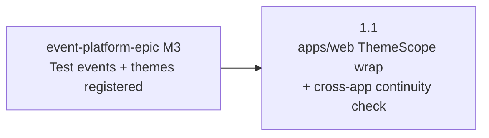

# M1 — apps/web ThemeScope Wiring

## Status

Proposed.

This milestone doc is the durable coordination artifact for M1:
restated goal, phase sequencing, cross-phase invariants worth
surfacing at milestone level, milestone-level risks, and the
doc-currency map M1 must collectively land. Per-phase
implementation contracts live in the phase plan(s) drafted by
the phase planning session(s) that follow this milestone session.

M1 is estimated as a single-phase milestone. Per AGENTS.md
"PR-count predictions need a branch test," that count is the
milestone-session estimate; the phase planning session re-derives
the real shape against merged-in code. If the phase planning
session decides the wrap surface justifies a per-route or
per-event split, the Phase Status table below grows additional
rows.

## Goal

Wire `<ThemeScope theme={getThemeForSlug(slug)}>` into the apps/web
event-route shells that do not yet wrap, so the per-event Themes
already registered in `shared/styles/themes/` (Harvest Block Party
and Riverside Jam, registered by event-platform-epic M3 phase 3.1
and 3.2) apply on apps/web routes under
`/event/:slug/*`. Today the per-event admin route at
`/event/:slug/admin` already wraps from event-platform-epic M2
phase 2.2 (`Verified by:`
[apps/web/src/App.tsx:24-31](/apps/web/src/App.tsx)); the three
remaining event-route shells —
`/event/:slug/game`, `/event/:slug/game/redeem`, and
`/event/:slug/game/redemptions` — render against apps/web's
warm-cream `:root` defaults (`Verified by:`
[apps/web/src/App.tsx:36-65](/apps/web/src/App.tsx)) per the
event-platform-epic "Deferred ThemeScope wiring" invariant. M1
closes that deferral for the test events.

After M1:

- the four apps/web event-route shells (game, admin, redeem,
  redemptions) all render under
  `<ThemeScope theme={getThemeForSlug(slug)}>` from a single
  apps/web routing dispatcher, not via per-page wrappers
- visiting `harvest-block-party` or `riverside-jam` on any apps/web
  event-route URL applies the per-event Theme that
  `getThemeForSlug` already returns from the shared registry; non-
  test slugs continue to render against the platform Sage Civic
  Theme via `getThemeForSlug`'s existing fallback
- the cross-app theme-continuity check originally deferred from
  event-platform-epic M3 phase 3.3 to M4 phase 4.1 is satisfied
  for the two test events (apps/site `/event/<slug>` and apps/web
  `/event/<slug>/game` render the same per-event Theme)
- the event-platform-epic "Deferred ThemeScope wiring" invariant
  is **partially** closed: the apps/web wrapping infrastructure
  ships and applies for any slug the registry resolves; the
  invariant remains open for non-test-event slugs (Madrona) until
  the future Madrona-launch epic registers a non-test-event Theme

M1 does not change apps/site rendering, the `getThemeForSlug`
contract, the theme registry, or the test-event allowlist that M3
of this epic introduces for the demo-mode auth bypass. M1 is
strictly a wrapping change at the apps/web routing layer.

## Phase Status

| Phase | Title | Plan | Status | PR |
| --- | --- | --- | --- | --- |
| 1.1 | apps/web event-route ThemeScope wrapping + cross-app theme-continuity check | [m1-phase-1-1-plan.md](/docs/plans/epics/demo-expansion/m1-phase-1-1-plan.md) | Proposed | _pending_ |

Phase planning resolved the phase as single-PR (scoping decision
1 in
[scoping/m1-phase-1-1.md](/docs/plans/epics/demo-expansion/scoping/m1-phase-1-1.md)
re-derived the count against the actual diff surface and the
M2 phase 2.2 admin-wrap precedent, with a fallback authorization
to split mid-flight if token-correction blast radius exceeds the
in-PR threshold). The phase planning session waived the
AGENTS.md "Spike before plan for novel mechanisms" gate because
the wrap pattern is not novel — the existing admin wrap on
[App.tsx:24-31](/apps/web/src/App.tsx) is the reference shape
the three new wraps mirror.

## Sequencing

Phase dependencies (`A --> B` means A blocks B / B depends on A):

Phase 1.1 is the only phase. Its only upstream dependency is
event-platform-epic M3, which has already landed
(`Verified by:` `harvest-block-party.ts` and `riverside-jam.ts`
registered in
[shared/styles/themes/index.ts](/shared/styles/themes/index.ts);
event-platform-epic M3 row marked `Landed`). M1 has no
intra-milestone dependencies because the milestone is single-
phase.

**Independence from sibling demo-expansion milestones.** M2 (home-
page rebuild in apps/site) and M3 (demo-mode auth bypass for
test-event slugs) do not depend on M1. M2 lives entirely in
apps/site and does not touch apps/web routing or theming. M3's
auth bypass shapes guard logic on test-event slugs and does not
depend on the Theme applying. The demo-expansion epic schedules
M1 first because the cross-app theme-continuity check is the
load-bearing visual-honesty gate the epic carries forward, and
its review attention reads cleanest as its own PR before M2's
larger home-page surface arrives. Phase planning may sequence M1
in parallel with M2 plan-drafting if separate attention is
available; the in-PR ordering is the only hard ordering this
milestone carries (M1's PR before M2's PR for review-attention
reasons, not technical dependency).

**Plan-drafting cadence.** Phase 1.1's scoping doc lands at the
start of its phase planning session per AGENTS.md "Phase Planning
Sessions"; plan-drafting cannot start until scoping has
substantive content. Because M1 is single-phase, there is no
just-in-time-against-prior-phase concern within M1; scoping and
plan-drafting can proceed as soon as this milestone doc lands.

## Cross-Phase Invariants

For a single-phase milestone, "cross-phase" invariants effectively
become "milestone-level" invariants — rules the phase plan is
expected to honor and self-review walks every changed surface
against. Listing them here keeps them in the durable record (the
phase plan deletes pressure may shrink contract restatements).

- **Centralized wrap site.** `<ThemeScope>` wrapping for the apps/
  web event-route shells lives in the apps/web routing dispatcher
  (currently
  [apps/web/src/App.tsx](/apps/web/src/App.tsx)'s
  `getPageContent` switch), not in per-page components. The
  existing per-event admin wrap is the precedent; the three new
  wrappings follow the same shape. No event-route page component
  imports `<ThemeScope>` directly. Self-review walks each new wrap
  against the existing admin wrap to confirm the shape matches.
- **`getThemeForSlug` is the only resolver.** Every wrap site
  passes the slug to
  [`getThemeForSlug`](/shared/styles/getThemeForSlug.ts) and
  consumes the returned `Theme`. No site inlines its own slug-to-
  theme map, no site special-cases test-event slugs, and no site
  pre-resolves the platform Sage Civic Theme as a fallback (the
  resolver's existing fallback handles non-registered slugs). This
  preserves the registry as the single source of truth and keeps
  the M3 demo-mode test-event allowlist (a different concern,
  declared once for auth bypass) from leaking into the theming
  surface.
- **Cross-app theme-continuity for the two test events.** After
  M1, `/event/<slug>` (apps/site) and `/event/<slug>/game`
  (apps/web) render the same per-event Theme for both
  `harvest-block-party` and `riverside-jam`. The phase plan owns
  the validation procedure that confirms this (manual production
  walk-through with capture pairs, automated visual diff, or a
  procedural check with a falsifier — see "Cross-Phase Decisions →
  Deferred to phase-time" below). The continuity check covers
  every apps/web event-route shell, not only `/game`, because all
  three newly-wrapped shells are reachable from the demo-expansion
  surface.
- **Token-classification bucket integrity.** Per-event Themes only
  override **themable** tokens (per
  [`docs/styling.md`](/docs/styling.md)). If self-review surfaces
  a component on the newly-wrapped routes that visually breaks
  under Harvest or Riverside because it consumes a hard-coded
  brand color or a structural token where a themable token was
  intended, the fix is a token-classification correction in
  `_tokens.scss` and `docs/styling.md`, not a per-event Theme
  override. The corrected classification ships in M1's PR if the
  fix is in-scope; otherwise it surfaces as a backlog item with
  rationale recorded in the phase plan's "Out Of Scope."
- **No URL changes; no auth-shape changes; no test-event allowlist
  introduction.** M1's diff stays inside the apps/web routing
  dispatcher and (potentially) within token-classification
  corrections to themed components. URL contract, auth shape,
  Vercel routing, and the M3 test-event allowlist are out of
  scope.

**Inherited from upstream invariants.** M1 also inherits the URL
contract, theme route scoping, and theme token discipline
invariants from
[event-platform-epic.md](/docs/plans/event-platform-epic.md), and
the test-event noindex + disclaimer banner invariant from
[m3-site-rendering.md](/docs/plans/m3-site-rendering.md). Self-
review walks them against the M1 diff even though the diff is not
expected to touch them; the discipline is "before banning the
surface, prove the no-X outcome is acceptable."

## Cross-Phase Decisions

### Settled by default

These decisions had a clear default that no scoping pressure
disputed. Recorded for completeness so the phase planning session
does not re-derive them.

- **Wrap site location.** Apps/web routing dispatcher in
  `App.tsx`'s `getPageContent`, not per-page wrappers (matches the
  existing admin wrap; satisfies the "Centralized wrap site"
  invariant above). The phase plan owns the exact JSX shape.
- **Resolver function.** `getThemeForSlug` from
  `shared/styles/getThemeForSlug.ts` (single existing resolver;
  no parallel resolver introduced).
- **Non-test-event behavior.** Non-test slugs continue to resolve
  to the platform Sage Civic Theme via `getThemeForSlug`'s
  existing fallback. M1 does not introduce per-event Theme
  registration for non-test events; that is the future Madrona-
  launch epic's M4 phase 4.1 inheritance from M1's wrapping
  infrastructure.
- **`/event/:slug/admin` re-wrap.** Not done. The admin route
  already wraps from event-platform-epic M2 phase 2.2; the M1
  diff does not modify that wrap. The epic enumeration of all
  four routes covers the contract surface, not the diff surface.

### Deferred to phase-time — resolved

These decisions deferred to the phase planning session per
AGENTS.md "Defer rather than over-resolve" and were resolved
during scoping / plan-drafting. Each entry below names the
resolution site so the audit trail survives the eventual
deletion of the scoping doc:

- **Per-route vs per-event vs single-PR split.** Resolved as
  single PR with mid-flight split fallback. See
  [scoping/m1-phase-1-1.md decision 1](/docs/plans/epics/demo-expansion/scoping/m1-phase-1-1.md)
  for the branch-test analysis and rejected alternatives;
  [m1-phase-1-1-plan.md §Commit Boundaries](/docs/plans/epics/demo-expansion/m1-phase-1-1-plan.md)
  for the in-PR commit shape.
- **Cross-app theme-continuity validation procedure.** Resolved
  as manual capture pairs against the PR's Vercel preview
  deployment + production apps/site (8 captures total: 6 in-app
  pairs + 2 cross-app pairs). See
  [scoping/m1-phase-1-1.md decision 2](/docs/plans/epics/demo-expansion/scoping/m1-phase-1-1.md);
  [m1-phase-1-1-plan.md §Validation Gate](/docs/plans/epics/demo-expansion/m1-phase-1-1-plan.md)
  for the in-PR procedure.
- **Token-classification correction scope.** Resolved as
  one-line corrections in PR; rule-shape ripple defers to a
  focused follow-up. See
  [scoping/m1-phase-1-1.md decision 3](/docs/plans/epics/demo-expansion/scoping/m1-phase-1-1.md).
- **Visual-review surface for review attention.** Resolved as
  per-pair match-assertion sentences attached to the PR body's
  Validation section. See
  [scoping/m1-phase-1-1.md decision 5](/docs/plans/epics/demo-expansion/scoping/m1-phase-1-1.md).
- **Self-review audit set.** Resolved as the empty set
  ([`docs/self-review-catalog.md`](/docs/self-review-catalog.md)
  audits scope to SQL / Edge Function / save-path / lifecycle /
  CI / runbook surfaces, none of which the M1 diff touches). See
  [m1-phase-1-1-plan.md §Self-Review Audits](/docs/plans/epics/demo-expansion/m1-phase-1-1-plan.md).

## Cross-Phase Risks

Risks that span the milestone or surface only at the milestone
level. Phase-level risks live in the phase plan's Risk Register.

- **Component-level token gaps surface as visual regressions.**
  M1 wires per-event Themes into apps/web event-route shells that
  have rendered against warm-cream `:root` defaults since the
  platform's start. Components on the wrapped routes may consume
  hard-coded colors or tokens classified into the wrong bucket
  (themable vs structural per
  [`docs/styling.md`](/docs/styling.md)) — the warm-cream defaults
  hid the misclassification because no per-event Theme was layered
  on top. Mitigation: the M1 PR is small enough to give per-
  component review attention focused on the wrapped surface; any
  surfaced classification gaps either ship as one-line
  `_tokens.scss` corrections in the same PR or surface as backlog
  items with rationale, per the "Token-classification correction
  scope" decision above. The epic Risk Register names this risk;
  the milestone restates it because mitigation lives in M1's PR
  shape.
- **Cross-app theme-continuity false positive from caching or
  CDN propagation.** If the validation procedure is a manual
  deployed walk-through, captures from a CDN-cached stale build
  could pass when the production build actually mismatches. AGENTS
  .md "Bans on surface require rendering the consequence" framing
  applies inverted here — the validation must run against a fresh
  deploy of both apps and confirm the two captures resolve against
  the intended Theme, not against either app's stale `:root`
  defaults. Mitigation: the phase plan's validation gate names
  the freshness check (e.g., a unique build-id assertion in each
  capture, or capture timestamps within N minutes of the latest
  apps/web and apps/site deploys); the AGENTS.md "Falsifiability
  check" gate enforces this at plan time.
- **Single-PR ambition vs review coherence.** If the wrap diff
  plus continuity capture pairs plus token corrections together
  push past the AGENTS.md "PR-count predictions need a branch
  test" thresholds (>5 distinct subsystems or >300 LOC of
  substantive logic), forcing the milestone into one PR for the
  visible-progress narrative would regress review quality.
  Mitigation: phase planning owns the split decision under the
  rule; the milestone doc explicitly authorizes a 1.1.1 / 1.1.2
  split if the branch test surfaces the threshold.
- **Madrona-launch inheritance assumption.** The epic's Backlog
  Impact records that M1's wrapping infrastructure unblocks the
  future Madrona-launch epic's M4 phase 4.1 inheritance.
  Mitigation: the M1 phase plan documents the wrap shape as the
  contract M4 phase 4.1 inherits, in
  [`docs/architecture.md`](/docs/architecture.md) or the wrap
  site's source comment, so the inheritance is explicit when the
  Madrona-launch epic drafts.
- **`docs/styling.md` drift from M1's wrap.** Today
  [`docs/styling.md`](/docs/styling.md) describes apps/web event
  routes as wrapping (admin) or not wrapping (game / redeem /
  redemptions) per the deferred-wiring invariant. M1 changes that
  state. Mitigation: M1's PR updates `docs/styling.md` so the
  state described matches what shipped, per the AGENTS.md "Doc
  Currency PR Gate"; the doc-currency map below names this
  explicitly.

## Documentation Currency

The doc updates the M1 set must collectively make. Each is owned
by phase 1.1 (single-phase milestone, so no per-phase
distribution). M1 is not complete until all are landed in the M1
PR(s).

- [`docs/styling.md`](/docs/styling.md) — apps/web event-route
  wrap state (game, redeem, redemptions now wrap; admin already
  wrapped) per the AGENTS.md Styling Token Discipline framing.
  Any token-classification corrections ship here too. **Owned by
  1.1.**
- [`docs/architecture.md`](/docs/architecture.md) — apps/web
  ThemeScope wiring described as fully landed for test events;
  the deferred-wiring narrative narrows from "apps/web event
  routes (game, redeem, redemptions) render against warm-cream
  defaults" to "apps/web event routes wrap; non-test slugs
  resolve to the platform Sage Civic Theme until the future
  Madrona-launch epic registers a non-test Theme." **Owned by
  1.1.**
- [`README.md`](/README.md) — capability set after M1 (touched
  only if the README's current capability description references
  the deferred-wiring state explicitly; phase planning re-derives
  by grepping the README for relevant prose). **Owned by 1.1.**
- [`docs/plans/event-platform-epic.md`](/docs/plans/event-platform-epic.md) —
  the "Deferred ThemeScope wiring" invariant gets a footnote or
  paragraph noting partial closure: the apps/web wrapping
  infrastructure shipped via demo-expansion epic M1; the
  invariant remains open for non-test-event slugs until the
  Madrona-launch epic. The event-platform-epic's M4 phase 4.1
  paragraph also notes that its ThemeScope-wiring scope shrinks
  to "Madrona Theme registration" because the wrapping ships in
  demo-expansion M1. **Owned by 1.1.**
- [`docs/plans/epics/demo-expansion/epic.md`](/docs/plans/epics/demo-expansion/epic.md) —
  the M1 row in the Milestone Status table flips from `Proposed`
  to `Landed` in the M1 PR. **Owned by 1.1.**
- This milestone doc — Status flips from `Proposed` to `Landed`
  in the M1 PR; the Phase Status row updates as the plan drafts
  and as the PR merges. **Owned by 1.1.**

[`docs/dev.md`](/docs/dev.md), [`docs/operations.md`](/docs/operations.md),
and [`docs/product.md`](/docs/product.md) are **not** expected to
need updates — M1 introduces no new local-dev workflow, no
operational concern, and no product-capability change beyond what
the home-page rebuild (M2) and demo-mode bypass (M3) will
describe. The phase planning session re-derives this expectation
against the actual diff surface.

[`docs/open-questions.md`](/docs/open-questions.md) and
[`docs/backlog.md`](/docs/backlog.md) are not knowingly touched by
M1. Per the epic's "Open Questions Resolved By This Epic," M1
does not knowingly resolve a `docs/open-questions.md` entry; per
the epic's Backlog Impact, M1's contribution is unblocking, not
closing. The phase plan owns the final call.

## Backlog Impact

- **Closed by M1.** The cross-app theme-continuity check
  deferred from event-platform-epic M3 phase 3.3 to M4 phase 4.1
  closes for the two test events. Closure is recorded in the M1
  PR via the
  [event-platform-epic.md](/docs/plans/event-platform-epic.md)
  M3 / M4 paragraph updates above; no separate backlog entry to
  flip.
- **Unblocked by M1.** The future Madrona-launch epic's M4 phase
  4.1 — the apps/web ThemeScope wiring infrastructure now exists,
  so the Madrona-launch epic inherits the wrap and focuses
  exclusively on Madrona's `Theme` registration plus content
  authoring. The phase plan documents the wrap shape as the
  inheritance contract.
- **Opened by M1.** None planned. Per the epic's "Open Questions
  Newly Opened," any unresolved decisions surfaced during phase
  planning are logged in
  [`docs/open-questions.md`](/docs/open-questions.md) in the same
  PR that surfaces them.

## Related Docs

- [`docs/plans/epics/demo-expansion/epic.md`](/docs/plans/epics/demo-expansion/epic.md) —
  parent epic; M1 paragraph at lines 180–198.
- [`docs/plans/event-platform-epic.md`](/docs/plans/event-platform-epic.md) —
  predecessor epic; "Deferred ThemeScope wiring" invariant at
  lines 152–165, M3 phase 3.3 cross-app verification deferral at
  the M3 paragraph below.
- [`docs/plans/m3-site-rendering.md`](/docs/plans/m3-site-rendering.md) —
  predecessor milestone doc; "ThemeScope wrapping discipline" at
  lines 183–213 records the partition between apps/site (wraps in
  M3) and apps/web (deferred until M4 / closed by demo-expansion
  M1).
- [`docs/plans/m3-phase-3-3-plan.md`](/docs/plans/m3-phase-3-3-plan.md) —
  cross-app navigation verification plan; the manual deployed
  walk-through pattern for cross-app verification is the
  precedent the phase 1.1 plan inherits or refines.
- [`shared/styles/ThemeScope.tsx`](/shared/styles/ThemeScope.tsx) —
  wrap component; existing source comment names "apps/site event
  landing wraps in M3 phase 3.1" as a wiring site. The phase 1.1
  plan extends the comment to record demo-expansion M1's wrapping
  of apps/web event-route shells.
- [`shared/styles/getThemeForSlug.ts`](/shared/styles/getThemeForSlug.ts) —
  resolver consumed at every wrap site; behavior unchanged in M1.
- [`docs/styling.md`](/docs/styling.md) — token-classification
  authority for any corrections that surface during M1 self-
  review.
- [`docs/self-review-catalog.md`](/docs/self-review-catalog.md) —
  audit-name source for phase 1.1's Self-Review Audits section.
- [`AGENTS.md`](/AGENTS.md) — milestone planning rules,
  Plan-to-PR Completion Gate, Doc Currency PR Gate, "PR-count
  predictions need a branch test."
