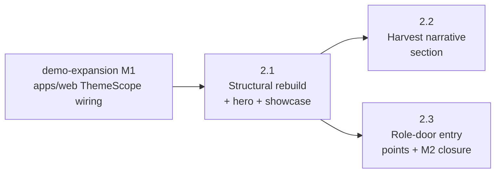

# M2 — Home-Page Rebuild

## Status

Proposed.

This milestone doc is the durable coordination artifact for M2:
restated goal, phase sequencing rationale, cross-phase invariants,
locked cross-phase decisions (with the rest deferred to phase
planning), milestone-level risks, and the doc-currency map. Per
AGENTS.md "Milestone Planning Sessions," it does **not** scope any
phase — phase scoping and plan-drafting belong to per-phase
planning sessions run just-in-time before each phase's
implementation, against actually-merged earlier phases. Per-phase
implementation contracts live in the phase plan(s) drafted by
those sessions.

## Goal

Rebuild [apps/site/app/page.tsx](/apps/site/app/page.tsx) from
today's 17-line stub (an `Open admin workspace` CTA on a
`landing-shell`) into the demo entry point internal partners land
on first when evaluating the platform. After M2:

- the home page is internal-partner-honest about what the platform
  is, what the surfaces show, and what is real vs. stubbed at this
  iteration boundary
- two test-event showcase cards (`harvest-block-party`,
  `riverside-jam`) preview both registered Themes side-by-side,
  exercising the multi-theme rendering capability
  event-platform-epic M3 delivered and demo-expansion M1 just
  extended onto apps/web event-route shells
- an end-to-end Harvest narrative walks the reader from "what is
  this event" through "how does an attendee play, an organizer
  author, a volunteer redeem" so a partner sees the platform's
  arc without having to assemble it themselves
- three role-door entry points (Attendee / Organizer / Volunteer)
  link out to live surfaces in apps/web; targets that require auth
  carry honest "sign in or wait for demo mode" framing until M3
  lands the demo-mode bypass for test-event slugs
- noindex stays in place on the home page (M2 ships no public
  marketing surface; the home page is a demo entry point for an
  internal-partner audience per the epic's invariants)

M2 does not introduce demo-mode auth bypass (M3's scope), does
not add new test events beyond Harvest and Riverside (epic's "Out
Of Scope"), does not register a non-test-event Theme (the future
Madrona-launch epic owns Madrona), and does not change apps/web
beyond what cross-app navigation requires (typically zero — links
target apps/web routes via hard navigation, no apps/web code
edits).

## Phase Status

Pre-implementation estimate per AGENTS.md "Plan content is a mix
of rules and estimates": likely 2–3 phases. The exact split, file
inventory, and PR shape are re-derived by each phase's planning
session against actually-merged earlier phases. Phase numbering
below reflects the recommended ship order; rows fill in as each
phase's plan drafts and as its PR merges.

| Phase | Title (estimate) | Plan | Status | PR |
| --- | --- | --- | --- | --- |
| 2.1 | Page structural rebuild + hero + two-event showcase | _pending_ | Plan-pending | _pending_ |
| 2.2 | End-to-end Harvest narrative section | _pending_ | Plan-pending | _pending_ |
| 2.3 | Three role-door entry points + M2 closure | _pending_ | Plan-pending | _pending_ |

The 3-phase split above is the milestone session's working
estimate; phase 2.1's planning session is responsible for
confirming or revising it against the actual scope tension
surfaced once 2.1 starts. Plausible alternative shapes the phase
planning session should consider:

- **2-phase shape.** Combine 2.1 + 2.3 (the structural rebuild,
  showcase cards, and role-door links share the same component
  family — sectioned cards with hero copy and outbound links —
  and may read more cohesively as one PR if the diff stays
  reviewable). 2.2 (Harvest narrative) stays separate because the
  narrative content is distinct from card-shaped surfaces and
  warrants its own review attention.
- **4-phase shape.** Split 2.3 (role-door entry points) into
  per-role sub-phases if any role's entry surface grows beyond a
  single card (for example, Volunteer's entry point may want
  honest demo-mode framing copy that benefits from focused
  review).

The phase planning session should run AGENTS.md "PR-count
predictions need a branch test" against the actual diff shape
once 2.1 starts; the milestone doc's estimate does not bind it.

## Sequencing

Phase dependencies (`A --> B` means A blocks B / B depends on A):

**Hard dependencies.** 2.2 and 2.3 each depend on 2.1 because
2.1 ships the page-level shell and section-composition idiom that
2.2 and 2.3's sections plug into. 2.2 and 2.3 are independent of
each other and could draft / implement in parallel if separate
attention is available; the recommended ship order puts 2.2
before 2.3 because 2.3 is the natural M2 closer (it carries the
M2 row's flip to `Landed` per AGENTS.md "Plan-to-PR Completion
Gate").

**Inherited M1 dependency.** M1 (apps/web ThemeScope wiring) is
not a strict dependency of M2 itself — M2 lives entirely in
apps/site and does not edit apps/web. The arrow above is
**recommended sequencing**: M2's two-event showcase cards and
role-door entries link to apps/web event-route shells, and the
"both apps render the same Theme for the same slug" capability
M1 enabled is the visual story M2's showcase carries forward.
Shipping M2 before M1 would have left a partner clicking from a
themed apps/site card into an unthemed apps/web shell, which
breaks the cross-app continuity check M1 just satisfied.

**Plan-drafting cadence.** Each phase's plan drafts just-in-time
before its implementation, not in batch. Per AGENTS.md
"Cross-phase coordination is thin," cross-phase assumptions get
written down at plan-drafting time and verified at sibling-merge
time rather than pre-coordinated to exhaustion. Exception: 2.2
and 2.3 are mutually independent and can plan-draft in parallel
once 2.1 lands.

## Cross-Phase Invariants

These rules thread through multiple phase diffs and break silently
when one phase drifts. Self-review walks each one against every
phase's actual changes. **2–4 invariants** per AGENTS.md
guidance.

- **Internal-partner honesty.** Every section every phase ships
  describes what the platform is **and** what is real vs. stubbed
  at this iteration boundary. No marketing-style aspirational
  copy ("the all-in-one platform for…") that overpromises against
  what M1–M3 actually deliver. The epic's
  [`Internal-partner audience`](/docs/plans/epics/demo-expansion/epic.md)
  invariant binds; M2 self-review walks copy on every section
  against it.
- **Two-theme exercise on showcase.** The two-event showcase ships
  Harvest **and** Riverside side-by-side, not just one. Both
  Themes must be visibly distinguishable in the captured
  validation pair (Harvest pumpkin vs. Riverside teal blue). A
  showcase that renders both cards against the same Theme — for
  example because a single shared card component reads
  `getThemeForSlug(featuredSlug)` once and propagates — would
  silently regress the multi-theme rendering capability. Phase
  planning owns the implementation pattern that satisfies this
  invariant; phases that ship showcase-adjacent components walk
  this invariant against their diff.
- **Role-door honesty against current auth state.** Until M3 lands
  demo-mode auth bypass for test-event slugs, role-door targets
  in apps/web (admin authoring, redemption booth, organizer
  monitoring) are auth-gated. M2 ships role-doors that link to
  these targets with honest copy naming the auth requirement
  (e.g., "Sign in or wait for demo mode"). Drift to "Try it
  now" / "Click to play" copy without an auth-gate caveat would
  mislead a partner into a sign-in dead-end. M3's PR is
  responsible for revising the copy when demo-mode bypass lands;
  M2's phase plans declare the copy as the contract M3 inherits.
- **Cross-app navigation uses hard navigation.** Any role-door,
  showcase card, or in-page link that targets apps/web (the
  `/event/:slug/{game,admin,game/redeem,game/redemptions}` paths)
  must use a real `<a href>` or equivalent hard-navigation seam,
  not Next.js `<Link>` / `useRouter().push()`. Per
  event-platform-epic M2 phase 2.3's "Cross-app destinations need
  hard navigation" trap and AGENTS.md
  "Cross-app destinations need hard navigation, not client-side
  navigation," soft navigation from apps/site to apps/web routes
  keeps the SPA on apps/site and the apps/web Vercel rewrite
  layer never fires. Self-review walks every outbound link's
  navigation seam against this rule.
- **No apps/web edits beyond the rewrite contract.** M2's diff
  stays inside apps/site. The `apps/web/vercel.json` rewrite
  contract that owns `/event/:slug/*` is unchanged; no new apps/
  web routes ship in M2; no apps/web copy or component edit
  ships in M2. If M2 phase planning surfaces an apps/web change
  that is genuinely required (a copy fix on a role-door target,
  for example), that change splits out as its own focused PR
  rather than landing inside an M2 phase.

**Inherited from upstream invariants.** M2 also inherits the URL
contract, theme route scoping, theme token discipline, in-place
auth, and trust-boundary invariants from
[`event-platform-epic.md`](/docs/plans/event-platform-epic.md);
the test-event noindex + disclaimer banner invariant from
[`m3-site-rendering.md`](/docs/plans/m3-site-rendering.md); and
the cross-app theme-continuity capability from
[`demo-expansion epic.md`](/docs/plans/epics/demo-expansion/epic.md).
Self-review walks each against every M2 phase's diff even though
the diffs are not expected to touch them.

## Cross-Phase Decisions

### Settled by default

These decisions had a clear default that no scoping pressure
disputed. Recorded for completeness so each phase planning session
does not re-derive them.

- **Framework.** Next.js (apps/site is already Next.js).
  `apps/site/CLAUDE.md` flags "This is NOT the Next.js you know"
  — phase planning sessions must read
  `node_modules/next/dist/docs/` before naming Next.js APIs in
  any contract, per the apps/site AGENTS.md rule. The home page
  is a server component by default; introducing `'use client'`
  is a phase-time decision driven by an actual interactivity
  need, not a default.
- **Root layout / typography / palette.** Unchanged. The home
  page renders inside [apps/site's root layout](/apps/site/app/layout.tsx)
  which already emits the platform Sage Civic Theme on `<html>`
  via `themeToStyle(platformTheme)` plus `next/font` for Inter
  (body) and Fraunces (heading). M2 does not register a new
  Theme, does not change `metadataBase` resolution, and does not
  modify `apps/site/app/globals.css`'s root rules. New
  page-specific styles are scoped under a new shell class (likely
  `.home-shell` or similar; phase 2.1 owns the exact name).
- **Event content shape.** Already authoritative at
  [`apps/site/events/<slug>.ts`](/apps/site/events/) via the
  `EventContent` type from
  [`apps/site/lib/eventContent.ts`](/apps/site/lib/eventContent.ts).
  Showcase cards and the Harvest narrative read this shape; they
  do **not** introduce a parallel home-page-only event-summary
  type. The "single source of truth for event content" rule from
  [event-platform-epic.md](/docs/plans/event-platform-epic.md)
  binds.
- **Theme resolution at the showcase / narrative level.** Each
  showcase card or narrative-fragment that needs per-event Theme
  rendering wraps its themed sub-tree in
  `<ThemeScope theme={getThemeForSlug(slug)}>` per the same
  centralized-wrap pattern apps/site `/event/[slug]` already
  uses. Phase planning owns the exact wrap shape; the contract
  is resolver-uniformity (same `getThemeForSlug` resolver used
  everywhere, no inlined slug→theme maps).
- **Out-of-band assets.** No new icon set, illustration, image,
  or video ships in M2. The home page is text-and-color first;
  any visual asset addition surfaces as a phase-time scoping
  decision and likely defers to a follow-up rather than landing
  inside M2.
- **Demo-overview content from the previous `/` route.** Did
  apps/web's pre-event-platform-epic `/` carry demo-overview
  content worth preserving? Yes —
  [event-platform-epic M2 phase 2.3](/docs/plans/event-platform-epic.md)
  migrated `/` from apps/web to apps/site and "preserved the
  demo-overview content (or a small platform landing page that
  subsumes it)." The current
  [apps/site/app/page.tsx](/apps/site/app/page.tsx) is the
  subsume-it outcome. M2 of demo-expansion is the next step:
  the page is rebuilt from this stub, not preserved-byte-for-byte
  from the pre-migration apps/web `/`.

### Deferred to phase-time

These decisions defer to the relevant phase planning session per
AGENTS.md "Defer rather than over-resolve." They are listed here
so phase planning has a complete picture of what is open at
milestone-start; the phase that owns each decision is named.

- **Two-event showcase rendering shape.** Whether the showcase is
  two side-by-side cards on a desktop viewport that stack on
  mobile, two stacked rows on every viewport, or a tabbed
  interface (Harvest tab / Riverside tab). The decision drives
  the JSX structure and SCSS / CSS surface. **Owned by phase 2.1.**
  Reality-check inputs: existing apps/site `globals.css` class
  inventory (`.landing-shell`, `.landing-intro`,
  `.landing-copy`, `.eyebrow`, `.primary-cta`) is currently flat
  and does not include a sectioned-card pattern; phase 2.1
  introduces one and decides the responsive behavior.
- **Showcase-card link target: apps/site or apps/web?** A
  showcase card for `harvest-block-party` could link to apps/site
  `/event/harvest-block-party` (the rich event landing already
  shipping from event-platform-epic M3) or to apps/web
  `/event/harvest-block-party/game` (the attendee gameplay
  surface). Each represents a different "what's behind this card"
  story. **Owned by phase 2.1.** Reality-check inputs: the
  existing
  [EventLandingPage](/apps/site/components/event/EventLandingPage.tsx)
  already includes hero + schedule + lineup + sponsors + CTA, and
  the CTA's target may itself be `/event/<slug>/game`; phase 2.1
  walks the existing event landing's link contract before
  deciding. The cross-app navigation invariant binds either way.
- **Harvest narrative section: in-page section or sub-route?**
  Whether the end-to-end Harvest narrative lives as a section on
  `/` or as a sub-route like `/tour/harvest`. The in-page section
  keeps everything on one URL but lengthens the home page; the
  sub-route shape gives the narrative its own scroll context but
  introduces a new navigation surface. **Owned by phase 2.2.**
  Reality-check inputs: the home-page length after 2.1 lands is
  the practical input (a 600-pixel-tall home page is fine; a
  3000-pixel-tall page-of-everything is not).
- **Role-door entry-point shape.** Whether the three role-doors
  render as a horizontal row of three cards, a stacked list, or
  another layout; whether each card carries a one-paragraph
  description plus a single primary link, or multiple links per
  role; whether the demo-mode-honest copy varies per role.
  **Owned by phase 2.3.** Reality-check inputs: the existing
  apps/web admin / redeem / redemptions surfaces' auth state
  copy at phase-2.3 plan-drafting time (M3's demo-mode bypass
  may land between 2.2 and 2.3 if scheduling allows; if so, copy
  contracts shift accordingly).
- **`featuredGameSlug` and home-page-only featured event.**
  Whether the home page surfaces a "featured event" at the top
  (today's `featuredGameSlug` in
  [`shared/game-config/constants.ts`](/shared/game-config/constants.ts)
  resolves to one slug — phase 2.1 walks whether that constant
  is the right input, or whether the home page picks an event
  itself, or whether both Harvest and Riverside get equal-weight
  placement). **Owned by phase 2.1.**
- **Validation procedure for the multi-theme exercise.** Whether
  the validation gate names a single capture pair (one screenshot
  of the showcase showing both Themes) or two capture pairs (one
  per Theme rendered in isolation). **Owned by phase 2.1.**
  Cross-app theme-continuity for both events is not in scope
  for M2 because M1 already satisfied it.

## Cross-Phase Risks

Risks that span the milestone or surface only at the milestone
level. Phase-level risks live in each phase plan's Risk Register.

- **Role-door copy drift between M2 and M3.** M2 ships role-door
  copy that names the current auth-gated state of the targets
  ("Sign in or wait for demo mode" or similar); M3 ships demo-
  mode bypass for test-event slugs and changes the auth state of
  exactly those targets. If M3's PR doesn't revise the copy at
  the same time the bypass lands, partners click a "wait for
  demo mode" door and find demo mode already works — confusing
  but not broken — or worse, a "click to play" door that still
  hits a sign-in wall on a non-test slug. Mitigation: M2's phase
  plans declare the copy as a contract that M3's plan-drafting
  must walk against M3's diff. M3's milestone planning session
  inherits this expectation from M2's milestone doc (this
  paragraph is the inheritance hook).
- **Cross-app navigation regressions from `<Link>` reflexes.**
  Next.js development reflexes pull authors toward `next/link`
  for any anchor; cross-app destinations need real `<a>` tags so
  the apps/web Vercel rewrite layer fires. The same trap shipped
  pre-merge bugs in event-platform-epic M2 phase 2.3
  (apps/site `/auth/callback` redirecting via `useRouter().replace`
  instead of `window.location`). Mitigation: the cross-phase
  invariant above names the rule, AGENTS.md
  "Cross-app destinations need hard navigation" frames the trap
  in repo-level guidance, and each phase plan's self-review walks
  every outbound link against the rule.
- **Page-length sprawl.** A home page that wants to be hero +
  showcase + Harvest narrative + role-doors can stretch into a
  scroll-tax document that buries each surface. Each phase ships
  its slice independently and a partner lands on the cumulative
  result; nobody reviewing phase 2.1 sees the post-2.3 page
  length. Mitigation: the phase planning session for the last
  shipped phase (likely 2.3) walks the cumulative page length
  per AGENTS.md "Bans on surface require rendering the
  consequence" — the consequence here is the after-this-phase
  rendered page, captured for review attention. If the page
  feels bloated, 2.3 may scope a layout refactor as part of its
  closure rather than ship a third section onto an
  already-overlong page.
- **Multi-theme rendering visible in showcase but broken in
  practice.** M1's "color-mix derived-shade pinning" finding
  applies to the showcase: a card that uses
  `var(--primary-surface)` for its background tint will render
  warm-cream regardless of the per-event Theme wrapping the
  card. The visible test for the multi-theme invariant must
  inspect tokens that *do* re-evaluate (`--primary`, `--accent`,
  `--secondary`, `--bg`), not derived shades. Mitigation: phase
  2.1's plan binds the validation procedure (which token's color
  gets eyeballed in the capture pair to confirm the per-event
  Theme is applying), and the same binding propagates to phases
  2.2 and 2.3 if they ship per-Theme rendering surfaces.
  Closure of the broader derived-shade-cascade gap is tracked at
  [`docs/plans/themescope-derived-shade-cascade.md`](/docs/plans/themescope-derived-shade-cascade.md);
  M2 does not depend on that follow-up landing first.
- **Demo-overview content loss from the M2-of-event-platform-epic
  subsume.** event-platform-epic M2 phase 2.3 subsumed the
  pre-migration apps/web `/` demo-overview into a stub admin-CTA
  page. Whatever editorial content the pre-2.3 `/` carried is
  not in the current `apps/site/app/page.tsx`. Mitigation: phase
  2.1's reality-check reviews
  [event-platform-epic.md M2 phase 2.3](/docs/plans/event-platform-epic.md)
  for what the pre-subsume content looked like (likely git
  history before commit `5bf9dd0`) and decides whether any of
  it is worth carrying forward. The expectation is "no, M2
  rebuilds from intent rather than from preservation," but
  recording the check is honest.

## Documentation Currency

Doc updates the M2 set must collectively make. Each owning phase
is named; M2 is not complete until every entry is landed in some
M2 phase's PR.

- [`README.md`](/README.md) — capability set after M2 ("rebuilt
  home page surfaces test events, frames the platform for an
  internal-partner audience"). **Owned by the M2-closing phase
  (2.3 or whichever ships last).**
- [`docs/architecture.md`](/docs/architecture.md) — apps/site
  responsibilities expanded to name the home page as the demo
  entry point with the section inventory at landed time (hero,
  showcase, Harvest narrative, role-doors). **Owned by the
  M2-closing phase.**
- [`docs/product.md`](/docs/product.md) — current capability
  description updated for the demo-expansion home page if the
  doc currently describes the platform's home-page surface
  ("today the home page is a stub admin CTA" or similar);
  phase planning re-derives by greping the doc. **Owned by the
  phase that lands the last visible home-page surface change.**
- [`docs/plans/epics/demo-expansion/epic.md`](/docs/plans/epics/demo-expansion/epic.md) —
  Milestone Status table M2 row flips `Proposed` → `Landed` in
  the M2-closing PR. **Owned by the M2-closing phase.**
- This milestone doc — Status flips from `Proposed` to `Landed`
  in the M2-closing PR; the Phase Status table updates as each
  phase's plan drafts and as its PR merges. **Owned by 2.1
  (Phase Status seeding), 2.2 / 2.3 (row updates as they ship),
  M2-closing phase (Status flip).**

[`docs/dev.md`](/docs/dev.md), [`docs/operations.md`](/docs/operations.md),
[`docs/styling.md`](/docs/styling.md), and
[`docs/open-questions.md`](/docs/open-questions.md) are **not**
expected to need updates — M2 introduces no new local-dev
workflow, no operational concern, no token-classification change,
and no open-question close (the home-page-rebuild question was
implicitly resolved at epic-drafting time). Phase planning
re-derives this expectation against the actual diff surface.

[`docs/backlog.md`](/docs/backlog.md) is not knowingly touched by
M2; phase planning may surface follow-up entries (post-MVP
features like richer interactivity, additional event surfaces,
etc.) that get added to the backlog at phase-time per AGENTS.md
"Feature-Time Cleanup And Refactor Debt Capture."

## Backlog Impact

- **Closed by M2.** None at the milestone level. Demo expansion's
  epic-level capability "rebuilt home page that surfaces the two
  test events with theme-distinct previews and frames the
  platform honestly" closes when M2 ships, but the entry is part
  of the demo-expansion epic's scope, not a separate backlog
  item. Phase planning may surface specific home-page-shaped
  backlog entries that close incidentally and records them in
  the relevant phase plan's Backlog Impact.
- **Unblocked by M2.** M3 (demo-mode auth bypass) becomes
  partner-visible once the home page exposes role-door entry
  points pointing at the targets M3 unlocks. M3 does not
  technically depend on M2 but ships with much less partner-
  visible value before M2's role-doors exist.
- **Opened by M2.** None planned. Per the epic's "Open Questions
  Newly Opened," any unresolved decisions surfaced during phase
  planning are logged in
  [`docs/open-questions.md`](/docs/open-questions.md) in the
  same PR that surfaces them.

## Related Docs

- [`docs/plans/epics/demo-expansion/epic.md`](/docs/plans/epics/demo-expansion/epic.md) —
  parent epic; M2 paragraph at lines 199–213.
- [`docs/plans/epics/demo-expansion/m1-themescope-wiring.md`](/docs/plans/epics/demo-expansion/m1-themescope-wiring.md) —
  predecessor milestone doc; M1 just landed and supplies the
  apps/web ThemeScope wiring M2's two-event showcase narrative
  depends on visually.
- [`docs/plans/event-platform-epic.md`](/docs/plans/event-platform-epic.md) —
  predecessor epic; M2 phase 2.3 of *that* epic delivered the
  current apps/site `/` page (the stub this M2 rebuilds).
- [`apps/site/app/page.tsx`](/apps/site/app/page.tsx) — the file
  this milestone rebuilds.
- [`apps/site/app/layout.tsx`](/apps/site/app/layout.tsx) — root
  layout that owns `metadataBase`, the platform Theme emit on
  `<html>`, and the `next/font` wiring; unchanged by M2.
- [`apps/site/app/globals.css`](/apps/site/app/globals.css) — the
  current global CSS surface; phase 2.1 introduces home-page-
  scoped styles here or under a new partial.
- [`apps/site/events/`](/apps/site/events/) — `EventContent` data
  for the test events that the showcase and Harvest narrative
  consume.
- [`apps/site/components/event/EventLandingPage.tsx`](/apps/site/components/event/EventLandingPage.tsx) —
  precedent for sectioned-page composition in apps/site; M2's
  home page mirrors the section-component pattern.
- [`apps/site/CLAUDE.md`](/apps/site/CLAUDE.md) and
  [`apps/site/AGENTS.md`](/apps/site/AGENTS.md) — "This is NOT
  the Next.js you know" — phase planning must read
  `node_modules/next/dist/docs/` for relevant Next.js APIs
  before naming them in contracts.
- [`docs/plans/themescope-derived-shade-cascade.md`](/docs/plans/themescope-derived-shade-cascade.md) —
  M1-surfaced follow-up that may or may not land before M2's
  phases run; M2 does not depend on it.
- [`AGENTS.md`](/AGENTS.md) — Milestone Planning Sessions, Phase
  Planning Sessions, "PR-count predictions are not contracts,"
  Plan-to-PR Completion Gate, Doc Currency PR Gate.
