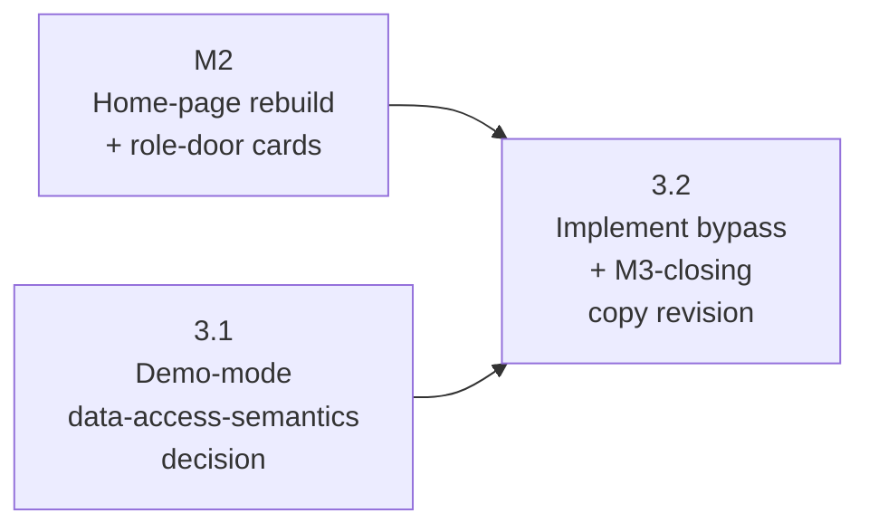

# M3 — Demo-Mode Auth Bypass For Test-Event Slugs

## Status

Proposed.

This milestone doc is the durable coordination artifact for M3:
restated goal, phase sequencing rationale, cross-phase invariants
worth surfacing at milestone level, the cross-phase decisions that
lock contracts between phases (with the rest deferred to the
phase-planning sessions that own them), milestone-level risks, and
the doc-currency map M3 must collectively land. Per AGENTS.md
"Milestone Planning Sessions," it does **not** scope any phase —
phase scoping and plan-drafting belong to per-phase planning
sessions run just-in-time before each phase's implementation,
against actually-merged earlier phases. Per-phase implementation
contracts live in the phase plan(s) drafted by those sessions.

## Goal

Make the three currently-auth-gated apps/web event-route surfaces
reachable on the two test-event slugs without sign-in, scoped
strictly to `harvest-block-party` and `riverside-jam`. After M3:

- `/event/harvest-block-party/admin`,
  `/event/harvest-block-party/game/redeem`,
  `/event/harvest-block-party/game/redemptions`, and the same three
  paths under `/event/riverside-jam/...`, mount for an
  unauthenticated visitor — no `SignInForm` interception, no
  role-gate banner. `Verified by:`
  [apps/web/src/App.tsx:21-70](/apps/web/src/App.tsx) for today's
  dispatcher; the three pages each gate inline today via
  `useAuthSession()` + a per-event role hook
  ([useOrganizerForEvent.ts:113-177](/shared/auth/useOrganizerForEvent.ts),
  [authorizeRedeem.ts:83-103](/apps/web/src/redeem/authorizeRedeem.ts),
  [authorizeRedemptions.ts:83-103](/apps/web/src/redemptions/authorizeRedemptions.ts)).
  Mounting the page is necessary but not sufficient for primary
  UI to populate — the data each surface fetches (admin's
  `loadDraftEvent` against `game_event_drafts`, redemptions'
  list query against `game_entitlements`) is RLS-gated and
  currently denies anonymous reads, so the read-mediation
  strategy phase 3.1 settles is part of what M3 ships
- `/event/:slug/game` is unchanged — the gameplay route is already
  public and was not auth-gated to begin with (`Verified by:`
  [apps/web/src/App.tsx:35-42](/apps/web/src/App.tsx))
- the test-event allowlist (`harvest-block-party`,
  `riverside-jam`) is declared **once** in code and consumed at
  every guard site that asks "is this slug bypass-eligible." Today
  the two slugs are scattered across at least
  [shared/styles/themes/index.ts:20-21](/shared/styles/themes/index.ts),
  [apps/site/lib/eventContent.ts:73-74](/apps/site/lib/eventContent.ts),
  and the per-event content modules under
  [apps/site/events/](/apps/site/events/); no centralized
  allowlist exists yet
- non-test-event slugs (any current or future real event) continue
  to render through the existing auth + role gates with no behavior
  change. The bypass branch is allowlist-membership-gated only —
  no environment flag, no URL parameter, no header asserted by the
  client substitutes for slug membership
- the M3 implementation phase(s) ship the demo-mode data-access
  semantics that **phase 3.1 settles**. The decision covers both
  the read side (how RLS-gated data reaches the unauthenticated
  visitor — anon-RLS broadening scoped by allowlist, an Edge
  Function read shim, pre-published public views, or another
  mediation 3.1 picks) and the write side (whether bypassed
  surfaces accept writes at all, and how those writes are
  mediated, persisted, or isolated). The milestone goal locks
  the reachability commitment and the data-access-semantics
  decision ownership but not the contract content
- M2's role-door copy on Organizer + Volunteer cards (shipped by
  M2 phase 2.3 with "Sign in or wait for demo mode" framing per
  the M2 cross-phase invariant) is **revised in the M3-closing
  PR** to reflect the now-landed bypass. Attendee role-door copy
  is unchanged because its target (`/event/:slug/game`) was never
  auth-gated and the M2 plan declared no auth-state caveat in its
  copy contract for that card
- the test-event noindex + disclaimer banner from event-platform
  -epic M3 phase 3.1 remains in place on apps/site `/event/<slug>`
  and is **extended to** the apps/web event-route shells when
  bypass renders them to unauthenticated visitors. The exact
  noindex-emit shape on apps/web routes is phase-time per
  decision below; the invariant is that bypass-rendered surfaces
  carry the same internal-partner honesty signal as their apps/
  site counterpart

M3 does not seed redemption codes, does not pre-populate the
organizer monitoring view with realistic prior redemptions, does
not ship a reset-cron or operator script for keeping demo state
runnable across visitors, and does not generalize bypass beyond
the two test-event slugs — those are the M4 deliverables that
the epic explicitly defers. M3 also does not register a new test
event, does not change the apps/site home-page surface (M2's
domain), does not change the gameplay route's public-access
posture, and does not modify the trust boundary for non-test
events.

## Phase Status

Pre-implementation estimate per AGENTS.md "Plan content is a mix
of rules and estimates." The 3.1 row is settled at milestone-
planning time (the epic locks 3.1 as a doc-only decision phase);
the 3.2 row is a single-row placeholder that may split into 3.2.x
sub-phases or grow to 3.3, 3.4 once 3.1 settles data-access
semantics and the implementation surface is grounded against that
decision. Phase numbering reflects the recommended ship order;
rows fill in as each phase's plan drafts and as its PR merges.

| Phase | Title (estimate) | Plan | Status | PR |
| --- | --- | --- | --- | --- |
| 3.1 | Demo-mode data-access-semantics decision (doc-only) | _pending phase planning_ | Proposed | _pending_ |
| 3.2 | Implement chosen demo-mode bypass + M3 closure | _pending 3.1_ | Proposed | _pending_ |

The 3.2-as-single-row estimate is the milestone session's working
guess; phase 3.1's planning + plan-drafting is responsible for
re-deriving the row count against the actual implementation
surface that the chosen data-access semantics imply. Plausible
alternative shapes 3.1 should consider when re-deriving:

- **1-implementation-phase shape (3.2 alone).** Likely if 3.1
  chooses **read-only browse**: the bypass surfaces add an
  `isTestEventSlug(slug)` short-circuit in the three apps/web
  page components' auth state machines, ship the read-side
  mediation 3.1 settles (the data each surface fetches is
  RLS-gated today and needs *some* mediation regardless of the
  chosen semantics — anon-RLS broadening scoped by allowlist,
  an Edge Function read shim, pre-published public views, or
  another approach 3.1 picks), and the Edge Function write side
  rejects demo-event mutations with a 403 "demo mode is
  read-only" branch. No seeded write-state, no reset story, no
  parallel-write tables are needed. Cohesive single PR because
  the read-mediation pattern threads all three surfaces
  uniformly and writes are uniformly rejected.
- **2-implementation-phase shape (3.2 + 3.3).** Likely if 3.1
  chooses **functional-with-persistence-and-reset**: 3.2 ships
  the route-level bypass + allowlist constant; 3.3 ships
  read-side AND write-side mediation (RLS broadening scoped by
  allowlist, or service-role Edge Function shims for both reads
  and writes), seeded write-state migrations, the reset story
  documentation, and the M3-closing copy revisions. Split
  because mediation surface (RLS / SECURITY DEFINER changes) is
  a distinct review surface from route-level guard wiring and
  warrants focused review attention. Per AGENTS.md "Cross-phase
  coordination is thin," cross-phase assumptions get written
  down at 3.2's plan-drafting time and verified at 3.3's
  plan-drafting time rather than batch-coordinated up front.
- **3-implementation-phase shape (3.2 + 3.3 + 3.4).** Likely if
  3.1 chooses **sandbox-ephemeral**: 3.2 wires the route-level
  bypass + allowlist; 3.3 introduces the parallel-state schema
  (likely `demo_*` mirror tables or session-scoped storage)
  plus the Edge Function fork that routes demo reads and demo
  writes through that schema; 3.4 ships the M3 closure (copy
  revisions + doc currency). Split because new-table
  introduction is a distinct migration review surface, and
  forking Edge Function read/write paths is a distinct
  trust-boundary review surface from the route-level bypass.

The phase planning session for 3.1 should run AGENTS.md "PR-count
predictions need a branch test" once 3.1's plan drafts; the
milestone doc's row-count estimate does not bind it. The
M3-closing responsibility (milestone-doc Phase Status flips,
milestone-doc top-level Status flip, epic Milestone Status table
flip, doc currency across README + architecture + product +
operations + open-questions, copy revision on M2's role-doors)
travels with whichever phase ships last.

## Sequencing

Phase dependencies (`A --> B` means A blocks B / B depends on A):

**Hard dependency on 3.1.** 3.2 (and any 3.3/3.4 that 3.1 elects
to spawn) depends on 3.1 because 3.1 settles the data-access-
semantics contract — covering both the read-side mediation
strategy (which is in scope under all three options because
mounting the bypassed pages alone is not sufficient when the
data fetches downstream are RLS-gated) and the write-side
contract — that 3.2's implementation translates into route
guards, RLS / Edge-Function mediation, seeded data, and reset
story (or explicitly the absence of each, where the chosen
semantics permits). 3.2's contracts cannot be plan-drafted
before 3.1's decision lands; plan-drafting against an unsettled
data-access-semantics decision would produce a contract that
reshapes mid-flight when 3.1's outcome arrives, which is the
exact churn AGENTS.md "Defer rather than over-resolve" exists to
prevent.

**Upstream-milestone dependency on M2 is closer-scoped.** M2
(home-page rebuild) is **not** a strict ship-blocker for the
bypass mechanism — the three apps/web event-route surfaces are
reachable by URL today and will be after M3 lands regardless of
the home-page's state — but M2 **is** a strict ship-blocker for
the M3-closing copy revision on M2's Organizer + Volunteer
role-door cards, which is one of M3's closing-phase
deliverables. The graph above shows `M2 --> P32` to make that
narrower-than-the-whole-phase prerequisite explicit per
AGENTS.md "Phase dependency graph" ("the upstream milestone
appears as a dependency-only node so prerequisites are
explicit"). The arrow's interpretation is "M2 blocks 3.2's
closer-PR copy-revision deliverable," not "M2 blocks 3.2's
bypass-mechanism work." If 3.1's outcome splits implementation
into 3.2 + 3.3 (or 3.2 + 3.3 + 3.4), the M3-closing
responsibility — and the M2 ship-order arrow with it —
transfers to whichever phase ships last per the Phase Status
section above; readers re-deriving the graph at that point
should redraw the arrow's terminus accordingly. (M2 landed
ahead of M3 milestone planning, so the constraint is satisfied
in practice for the expected ship order; the arrow records the
structural relationship the doc would still assert if scheduling
ever inverted, exactly as the M2 milestone doc documents for
its own 2.2/2.3 ship-order constraint.)

**Plan-drafting cadence.** Phase 3.1's scoping doc and plan doc
draft just-in-time at M3-start, **not in parallel with M2's
remaining work**. Per AGENTS.md "Phase Planning Sessions"
plan-drafting runs against actually-merged earlier phases; for
3.1 the only "earlier" surface is M2 (because M1 already landed
and is incorporated into the apps/web routing dispatcher 3.2
will edit, and event-platform-epic M3 already supplied the test
events themselves). 3.1 is doc-only and does not technically
require M2 to be merged, but its scoping reality-check inputs
include M2's role-door copy contract (the [m2-phase-2-3-plan.md](/docs/plans/epics/demo-expansion/m2-phase-2-3-plan.md)
contract that this milestone doc binds M3 to revise on close);
plan-drafting against an unmerged M2 phase 2.3 introduces the
same churn risk as plan-drafting 3.2 against unsettled 3.1.
Recommended cadence: M2 lands → 3.1 scoping + plan drafts → 3.1
PR merges → 3.2+ scoping + plan drafts in turn.

**Cross-phase coordination is thin.** 3.1 produces a written
data-access-semantics decision with rationale and rejected
alternatives. 3.2's plan-drafting reads that decision, runs its
own reality-check pass against the apps/web routing dispatcher
and the affected Edge Functions, and produces the per-phase
contracts. Cross-phase invariants below name what every phase's
self-review walks against; cross-phase decisions below name what
this milestone session locks (vs. defers to the phase that owns
each decision).

## Cross-Phase Invariants

These rules thread through multiple phase diffs and break
silently when one phase drifts. Self-review walks each one
against every phase's actual changes. **2–4 invariants** per
AGENTS.md guidance.

- **Test-event allowlist has a single source of truth, exposed
  to every guard site by an enforced path.** The two slugs
  (`harvest-block-party`, `riverside-jam`) live in a single
  shared TypeScript constant introduced by M3 (the file path
  and symbol shape are deferred to phase planning per the
  decision below). Every TypeScript guard site — the three
  apps/web page components' auth-bypass branches, any Edge
  Function that mediates test-event reads or writes — imports
  directly from that constant. SQL guard sites (any helper
  function that evaluates test-event-slug membership for RLS
  purposes) cannot import TypeScript at runtime and consume
  the allowlist via a derived SQL representation by **one of
  two enforced paths**: either build-time codegen of the SQL
  representation from the TypeScript source, or a hand-
  mirrored SQL constant whose value-by-value agreement with
  the TypeScript source is asserted by an exact-match test
  that fails CI on drift. Either path satisfies the invariant;
  what fails it is a per-site slug literal duplication — a
  hard-coded `"harvest-block-party"` string at any new
  TypeScript guard site, or a SQL constant whose values are
  not pinned to the TypeScript source by an enforced check.
  The risk this invariant protects against is named in the
  epic Risk Register: a code path that resolves "is this a
  test event" inconsistently between guard sites silently
  extends bypass to real events. Phase 3.2+ picks the SQL
  ingest path and ships the enforcement check; this invariant
  binds the property that *one* of the two paths is taken,
  not which.
- **Real events never receive bypass under any code path.**
  Every guard site's bypass branch is gated on slug membership
  in the shared allowlist and **only** on slug membership. No
  environment flag (`DEMO_MODE=1`), URL parameter (`?demo=1`),
  request header asserted by the client, or session-scoped flag
  is permitted to substitute for or AND-with allowlist
  membership. The trust boundary for real events stays exactly
  where it is today (`useAuthSession()` + per-event role hooks
  on apps/web pages, `authenticateEventOrganizerOrAdmin` /
  `authenticateRedemptionOperator` / `readVerifiedSession` on
  Edge Functions per the
  [docs/architecture.md trust-boundary section](/docs/architecture.md));
  M3's job is to add an allowlist-gated bypass branch beside
  those existing checks, not to relax them.
- **Cross-app demo signaling stays honest at every render.**
  Surfaces rendered for an unauthenticated visitor on a test-
  event slug are signposted as demo mode in their UI (the
  exact pattern — banner, ribbon, page-title prefix, in-page
  copy — is phase-time per the decision below). The
  invariant is that no bypass-rendered surface presents itself
  as if the visitor signed in normally; the epic-level
  "Internal-partner audience" invariant ("surfaces exposed by
  this epic are honest about their demo status") binds. Drift
  here would mislead a partner into thinking they had reached
  the production-equivalent admin / volunteer / organizer
  experience when they had reached the test-event bypass
  branch.
- **Cross-milestone copy contract revision lands with bypass.**
  M3's closing PR revises M2's Organizer + Volunteer role-door
  card copy from "Sign in or wait for demo mode" framing to
  current state. Attendee role-door copy is unchanged
  ([m2-phase-2-3-plan.md](/docs/plans/epics/demo-expansion/m2-phase-2-3-plan.md)
  declared "Play the demo" with no auth caveat, and the
  Attendee target was never auth-gated). Drift here — landing
  bypass without revising copy — leaves a partner reading
  "wait for demo mode" on a card whose target now works
  unsigned, which is the inverse of the M2 cross-phase risk
  this invariant inherits. The M2 milestone doc named this
  forward-pointing risk explicitly, this M3 milestone doc
  receives the inheritance hook, and M3's closing phase plan
  walks the role-door copy as a cross-milestone deliverable.

The epic-level invariant "Test-event slug allowlist for demo-
mode" is restated as the first invariant above because M3 is
the milestone that introduces the allowlist into code; the
epic-level invariant "Internal-partner audience" is restated as
the third invariant because M3 is the milestone that adds new
demo-mode surfaces that must satisfy it.

**Inherited from upstream invariants.** M3 also inherits the URL
contract, theme route scoping, theme token discipline, in-place
auth, auth integration, and trust-boundary invariants from
[`event-platform-epic.md`](/docs/plans/event-platform-epic.md);
the test-event noindex + disclaimer banner invariant from
[`m3-site-rendering.md`](/docs/plans/m3-site-rendering.md); the
apps/web ThemeScope wiring infrastructure delivered by
[m1-themescope-wiring.md](/docs/plans/epics/demo-expansion/m1-themescope-wiring.md)
(ThemeScope wraps in
[apps/web/src/App.tsx](/apps/web/src/App.tsx) stay in place and
M3's bypass branches render under the same theme wraps); and
the cross-app demo / role-door framing context from
[`m2-home-page-rebuild.md`](/docs/plans/epics/demo-expansion/m2-home-page-rebuild.md).
Self-review walks each against every M3 phase's diff even when
the diffs are not expected to touch them.

## Cross-Phase Decisions

### Settled by default

These decisions had a clear default that no scoping pressure
disputed. Recorded for completeness so each phase planning
session does not re-derive them.

- **Three surfaces in scope for the bypass; gameplay route is
  not.** The auth-gated apps/web event-route surfaces are
  exactly `/event/:slug/admin`, `/event/:slug/game/redeem`, and
  `/event/:slug/game/redemptions`, each gated inline by the
  page component's auth state machine
  (`Verified by:` [apps/web/src/App.tsx:21-70](/apps/web/src/App.tsx)
  for the dispatcher;
  [useOrganizerForEvent.ts:113-177](/shared/auth/useOrganizerForEvent.ts),
  [authorizeRedeem.ts:83-103](/apps/web/src/redeem/authorizeRedeem.ts),
  [authorizeRedemptions.ts:83-103](/apps/web/src/redemptions/authorizeRedemptions.ts)
  for the per-event role hooks the pages consume). The
  gameplay route at `/event/:slug/game` is already public
  (`Verified by:` [apps/web/src/App.tsx:35-42](/apps/web/src/App.tsx))
  and is out of M3's scope.
- **Allowlist is two slugs and stays two through this epic.**
  No new test events, no slug additions in M3. The epic-level
  "Out Of Scope" list binds; M3 does not surface a "slug
  registration" pattern intended to extend.
- **Auth gates stay; bypass adds a parallel branch.** The
  current `useAuthSession()` + role-hook composition
  (`Verified by:` [useAuthSession.ts:19-76](/shared/auth/useAuthSession.ts))
  remains the trust boundary for non-test events. M3 does
  **not** delete or relax those gates; it adds an allowlist-
  gated short-circuit beside them. Same on the Edge Function
  side: existing `authenticateEventOrganizerOrAdmin` /
  `authenticateRedemptionOperator` / `readVerifiedSession`
  paths stay; any test-event bypass is a separate code branch.
- **Allowlist constant lives in code, not in env config.** A
  shared TypeScript constant (or equivalent shared module)
  imported by every guard site, not an environment variable
  resolved at boot. Reasoning: the slugs are content
  identifiers tied to per-event modules (`Verified by:`
  [shared/styles/themes/index.ts:20-21](/shared/styles/themes/index.ts),
  [apps/site/lib/eventContent.ts:73-74](/apps/site/lib/eventContent.ts)),
  not environment-dependent toggles, and an env-resolved
  allowlist would diverge between local / preview / prod
  silently. Phase planning owns the exact file path, symbol
  name, and consumption pattern (the *location* is deferred
  below); the *medium* is settled.
- **No demo-mode framework generalization.** The bypass branch
  is hard-coded against the allowlist constant — no plugin
  hook, no per-tenant config table, no "register an event as
  demo-mode" admin surface. The epic Out-Of-Scope list says
  "demo-mode bypass is strictly scoped to `harvest-block-party`
  and `riverside-jam` by slug allowlist" and adds
  "generalization beyond the test-event allowlist" to the
  Backlog Impact's post-epic items.
- **noindex extends to apps/web bypass-rendered surfaces.**
  The epic-level "Internal-partner audience" invariant and the
  test-event noindex inheritance from
  [`m3-site-rendering.md`](/docs/plans/m3-site-rendering.md)
  bind: bypass-rendered surfaces on apps/web are noindex.
  Implementation pattern (per-route metadata, dispatcher-level
  meta tag, server-rendered head injection) is phase-time; the
  *outcome* is settled.

### Deferred to phase-time

These decisions defer to the relevant phase planning session
per AGENTS.md "Defer rather than over-resolve." They are listed
here so phase planning has a complete picture of what is open
at milestone-start; the phase that owns each decision is
named.

- **Demo-mode data-access semantics — read-only /
  functional-with-reset / sandbox-ephemeral.** The headline open
  question of M3, opened by the epic (the epic-level wording
  "write semantics" framed the decision narrower than the
  actual decision space — see
  [Open Questions Newly Opened](/docs/plans/epics/demo-expansion/epic.md#open-questions-newly-opened)
  for the broadened framing) and named for resolution here. The
  decision covers reads as well as writes because removing the
  page-level `SignInForm` interception is necessary but not
  sufficient for the bypassed surfaces to render — the data
  each surface fetches (admin's `loadDraftEvent` against
  `game_event_drafts`, redemptions' list query against
  `game_entitlements`) is RLS-gated and currently denies
  anonymous reads. **Owned by phase 3.1** (doc-only).
  Reality-check inputs: today's read paths on the three
  bypass-target pages and today's mutation surfaces
  (`save-draft`, `publish-draft`, `unpublish-event` for admin;
  `redeem-entitlement` for redeem; `reverse-entitlement-
  redemption` for redemptions, per the Edge Function inventory
  surfaced during milestone planning); the RLS posture on
  `game_event_drafts` and `game_entitlements` (no anon-role
  policies today on either reads or writes; writes flow through
  SECURITY DEFINER RPCs); the absence of any existing precedent
  for unauthenticated Edge Function mediation in
  `supabase/functions/`. Phase 3.1 reality-checks each option's
  read-side **and** write-side implications against the RLS +
  Edge Function shape and records the chosen semantics,
  rationale, and rejected alternatives.
- **3.2+ phase split.** Whether the bypass implementation
  ships as a single PR (3.2 alone), a 2-PR split (3.2 routing
  guards + 3.3 RLS / mediation / seed / closer), or a 3-PR
  split (3.2 routing guards + 3.3 parallel-state introduction
  + 3.4 closer). **Owned by phase 3.1** because the answer
  cascades from 3.1's chosen data-access semantics. The Phase
  Status alternatives above are the working option set; 3.1's
  plan-drafting re-derives against the actual implementation
  surface.
- **Allowlist constant location, TypeScript consumption
  pattern, and SQL ingest path.** Where the shared TypeScript
  module lives (`shared/config/`, `shared/events/`,
  co-located with the theme registry under
  `shared/styles/themes/`, or another location consistent
  with the existing shared-module conventions), what symbol
  it exports (a `readonly` array literal, a `Set`, a typed
  predicate function), how TypeScript guard sites consume it
  (direct import, indirection through a helper), AND the SQL
  ingest path (build-time codegen of a SQL function or array
  from the TypeScript source, or a hand-mirrored SQL constant
  whose agreement with the TypeScript source is asserted by an
  exact-match CI test). The SQL-ingest sub-decision is only
  in scope if 3.1's chosen mediation pattern introduces SQL
  helper functions evaluating test-event-slug membership; if
  3.1 picks an Edge-Function-mediated approach that keeps RLS
  unchanged, no SQL ingest is needed and the sub-decision
  collapses. **Owned by phase 3.2+** (the first implementation
  phase that introduces the constant; SQL ingest path owned by
  whichever phase introduces the SQL helper, if any).
  Reality-check inputs: existing shared-module shape under
  `shared/`; existing conventions for cross-app shared
  constants used by both apps/web and Edge Functions; any
  existing SQL-helper-derived-from-TS pattern in
  `supabase/migrations/` (and the absence of such a pattern if
  none exists, in which case this is a novel mechanism per
  AGENTS.md "Spike before plan for novel mechanisms").
- **Demo-mode signaling pattern in UI.** The exact shape of
  the "you are in demo mode" signpost on bypass-rendered
  surfaces — a top-of-page banner, a ribbon adjacent to the
  page title, a prefix in the page title, an in-section
  callout, or some combination. **Owned by phase 3.2+.**
  Reality-check inputs: the existing TestEventDisclaimer
  component the epic-level "Internal-partner audience"
  invariant flagged (`Verified by:` apps/site reference per
  [docs/architecture.md](/docs/architecture.md) trust-boundary
  / disclaimer section); the apps/web style surface introduced
  by M1's ThemeScope wiring (M3 styling additions live under
  the existing apps/web SCSS conventions).
- **noindex emit shape on apps/web bypass-rendered routes.**
  apps/web is a Vite + React SPA per [`docs/architecture.md`](/docs/architecture.md);
  its head-tag emit pattern differs from apps/site's Next.js
  metadata API. Whether bypass routes inject `<meta
  name="robots" content="noindex,nofollow">` via a per-page
  effect, a dispatcher-level head-manager, or another shape is
  phase-time. **Owned by phase 3.2+.** Reality-check inputs:
  current apps/web head-tag handling (search for existing
  `document.title` mutations, react-helmet usage, or any meta-
  tag injection pattern); the apps/site noindex-emit shape
  for cross-app consistency reference.
- **Test-event-allowlist enforcement assertion (pgTAP or
  equivalent).** The epic Risk Register names "pgTAP or
  equivalent assertions that allowlist membership is honored
  uniformly" as the mitigation for the demo-mode-security-
  boundary risk. Whether the assertion lives in pgTAP (against
  a SQL helper function if 3.1's chosen semantics introduce
  one), in TypeScript test against the shared constant, in
  e2e against a non-test slug confirming the bypass branch
  doesn't fire, or some combination is phase-time. **Owned by
  phase 3.2+** (whichever implementation phase introduces the
  enforcement surface). Reality-check inputs: existing pgTAP
  coverage in `supabase/tests/`; existing e2e fixtures in
  `apps/web/tests/` (or wherever Playwright fixtures live);
  the canonical test-running wrapper scripts in
  `package.json` and `scripts/testing/` per AGENTS.md "Prefer
  existing wrapper scripts."

## Cross-Phase Risks

Risks that span the milestone or surface only at the milestone
level. Phase-level risks live in each phase plan's Risk
Register.

- **Allowlist drift between guard sites.** The first
  cross-phase invariant exists to protect against this risk;
  the risk worth surfacing at milestone-level is its specific
  failure mode. A new guard site added in 3.2+ that hard-codes
  `"harvest-block-party"` instead of importing the shared
  allowlist will pass review (the literal looks correct in
  isolation) and silently extend the surface where the
  invariant must hold. If a future event is added with a slug
  that happens to share a prefix or naming pattern with the
  test events, a string-comparison-based guard could match
  unexpectedly. Mitigation: phase 3.2's plan binds the
  consumption pattern as "import the shared constant; no
  string literals at guard sites"; 3.2's self-review walks
  the diff against this rule; phase 3.2+ ships an enforcement
  assertion (deferred decision above) that fails CI if a non-
  test slug ever resolves through the bypass branch.
- **3.1's chosen semantics shifts during 3.2 implementation.**
  3.1 is doc-only by design — it lets the decision marinate
  before any code commits — but a written decision can still
  prove wrong when 3.2 starts implementing against it. If 3.2
  encounters a dealbreaker (the chosen semantics is feasible
  in principle but the actual Edge Function / RLS surface
  makes it disproportionately costly), the recovery path is
  to revise 3.1 in 3.2's PR (per AGENTS.md "Plan-to-PR
  Completion Gate" — a wrong rule gets corrected in the same
  PR that surfaces the gap, not deferred). Mitigation: 3.1's
  plan-drafting includes an AGENTS.md "Spike before plan for
  novel mechanisms" step against the chosen semantics — a
  30-minute throwaway that exercises the mechanism against
  one of the three surfaces end-to-end — so dealbreakers
  surface during 3.1, not during 3.2 implementation.
- **RLS broadening accidentally extends to non-test events.**
  Applies to any option whose chosen mediation pattern
  introduces RLS changes — which the milestone-session
  research surfaced as likely for at least the read side under
  all three options (read-only browse, functional-with-reset,
  and sandbox-ephemeral all need *some* read mediation, and
  RLS broadening is one of the candidate patterns), unless
  3.1 picks an Edge-Function-mediated-reads or
  pre-published-public-views approach that keeps RLS
  unchanged. A `USING` predicate that intends to scope a new
  policy to test events but evaluates incorrectly against the
  row's `event_id → slug` resolution silently grants the
  permission to all events. Mitigation: if 3.1 chooses an
  option with RLS changes, phase 3.2+ introduces a SQL helper
  function (likely `is_test_event_slug(event_id)` or
  equivalent) that takes a row's `event_id`, resolves it to
  the canonical slug, and returns true only on allowlist
  membership; pgTAP coverage (deferred decision above) walks
  the predicate against a non-test event row and asserts
  false. The helper function consumes the shared allowlist via
  one of the two SQL ingest paths the first cross-phase
  invariant frames (build-time codegen from the TypeScript
  source, or a hand-mirrored SQL constant pinned to the
  TypeScript source by an exact-match CI test); phase 3.2+
  picks which path.
- **Copy contract revision missed at M3 closure.** The fourth
  cross-phase invariant binds the role-door copy revision as
  part of M3's closing PR. The risk is that the closer phase
  plan focuses on the bypass mechanism + doc currency and
  forgets the M2 copy revision because it lives in
  `apps/site/components/home/` (different app, different
  module family) than the apps/web bypass changes. Mitigation:
  the milestone doc names the copy revision as a closing-
  phase deliverable in the Goal section above; the closer
  phase plan's "Files to touch" estimate explicitly lists the
  M2 role-door card files; closer self-review walks the
  fourth invariant against the diff.
- **M4 pulls forward into M3 unintentionally.** M4 is
  deferred at epic drafting time and owns the partner-runnable
  experience: seeded redemption codes for the volunteer
  booth, pre-populated organizer monitoring view, reset story
  for keeping the booth runnable across visitors. If 3.1
  chooses functional-with-reset, the seam between "M3 ships
  the bypass mechanism" and "M4 ships the partner-runnable
  experience" can blur — a phase 3.2+ planner reaching for
  "and we should also seed three demo redemption codes so the
  booth is testable" pulls M4 work into M3. Mitigation: the
  Goal section above explicitly names the M4 deliverables M3
  does **not** ship; phase 3.2+ self-review walks the diff
  against the M3 / M4 boundary; if a 3.2+ planner concludes
  M3 cannot meaningfully validate without some seed data,
  that conclusion is recorded in the phase plan as a scoped
  exception (not absorbed silently), and the exception is
  reviewed against the epic's deferral rationale.

## Documentation Currency

Doc updates the M3 set must collectively make. Each owning
phase is named; M3 is not complete until every entry is landed
in some M3 phase's PR.

- [`README.md`](/README.md) — capability set after M3
  ("test-event admin, redeem, and redemptions surfaces are
  reachable without sign-in on the two test-event slugs;
  real events continue to require auth"); the
  internal-partner-honest framing introduced by M2 extends to
  describe the now-reachable demo surfaces. **Owned by the
  M3-closing phase.**
- [`docs/architecture.md`](/docs/architecture.md) — apps/web
  demo-mode bypass surface added to the trust-boundary
  description; the test-event allowlist constant introduced
  by M3 named as the load-bearing security mechanism for the
  bypass; if 3.1 chooses an option with RLS changes, the new
  helper function and policy-shape changes documented in the
  trust-boundary section. **Owned by the M3-closing phase.**
- [`docs/operations.md`](/docs/operations.md) — only updated
  if 3.1 chooses functional-with-reset (and that option's
  reset story is implemented within M3 rather than M4) or
  sandbox-ephemeral with operator-visible state management.
  The read-only and most functional-with-reset variants leave
  operations unchanged. **Owned by the M3-closing phase**;
  phase 3.1's chosen semantics determines whether this entry
  is in scope.
- [`docs/product.md`](/docs/product.md) — current capability
  description updated for the post-M3 demo experience: which
  of the three role surfaces are partner-reachable on test
  slugs, what state they show, what is real vs. stubbed at
  this iteration boundary. Phase planning re-derives the
  exact paragraphs by greping the doc. **Owned by the
  M3-closing phase.**
- [`docs/open-questions.md`](/docs/open-questions.md) —
  closes the "Demo-mode data-access semantics for test-event
  slugs" entry under the "Demo Expansion Epic — M3 Demo-Mode
  Data Access" section. The entry was added in the same PR as
  this milestone doc per the repo convention "When the repo
  leaves a decision unresolved, capture that uncertainty in
  `docs/open-questions.md`," mirroring the precedent set by
  the "Event Platform Epic — Phase 0.3 Verification" section.
  **Owned by phase 3.1** (the doc-only decision phase that
  resolves it; closure removes the entry from
  `open-questions.md` and is a deliverable of 3.1's PR, not
  the M3-closing PR, because 3.1 is when the decision lands
  and 3.1 is the natural artifact-currency owner for that
  resolution).
- [`docs/styling.md`](/docs/styling.md) — only updated if
  M3's UI signaling for demo mode (banner / ribbon / etc. per
  the deferred decision above) introduces a new themable or
  structural token classification, or revises an existing
  classification. The expectation is no update needed because
  the signaling pattern composes existing tokens; phase
  planning re-derives. **Owned by the M3-closing phase if any
  classification surface changes.**
- [`docs/backlog.md`](/docs/backlog.md) — closes incidentally-
  resolved entries (none knowingly; phase planning may
  surface specific items); adds post-epic items the epic
  Backlog Impact already named (demo-mode generalization
  beyond test-event allowlist; production-friendly demo-mode
  for partner-onboarding scenarios) **only if** they are not
  already there. **Owned by the M3-closing phase.**
- [`docs/plans/epics/demo-expansion/epic.md`](/docs/plans/epics/demo-expansion/epic.md) —
  Milestone Status table M3 row flips `Proposed` → `Landed`
  in the M3-closing PR. The epic's first-iteration completion
  (M1–M3 all `Landed`) is observed by a reader of the table
  but does not flip the epic's top-level Status from
  `Proposed` to `Landed` per the epic's note ("first-iteration
  close alone does not flip top-level Status"). **Owned by
  the M3-closing phase.**
- This milestone doc — Status flips from `Proposed` to
  `Landed` in the M3-closing PR; the Phase Status table
  updates as each phase's plan drafts and as its PR merges.
  **Owned by phase 3.1 (3.1 row update + Phase Status
  re-derivation if 3.1 elects to grow rows beyond 3.2),
  3.2+ (row updates as they ship), M3-closing phase (Status
  flip).**
- [`docs/plans/epics/demo-expansion/m2-phase-2-3-plan.md`](/docs/plans/epics/demo-expansion/m2-phase-2-3-plan.md)
  role-door copy contract — not a doc-currency update so
  much as a contract-fulfillment marker, but worth listing
  here so the closing phase walks the M2 plan's contract
  language and confirms the revised copy in apps/site
  satisfies what the M2 plan declared M3 would inherit.
  **Owned by the M3-closing phase.**

[`docs/dev.md`](/docs/dev.md) is **not** expected to need
updates — M3 introduces no new local-dev workflow (the bypass
is automatic on test slugs in any environment; no setup step
is added). [`docs/self-review-catalog.md`](/docs/self-review-catalog.md)
may grow new audit names if phase 3.2+ introduces a novel
review surface (an RLS policy class or an Edge Function
authorization shape not covered by existing audits); phase
planning re-derives. Phase planning may surface backlog
follow-ups (richer demo data shape for M4, e2e coverage for the
bypass branch beyond pgTAP, partner-feedback capture from
demo sessions) that get added to the backlog at phase-time
per AGENTS.md "Feature-Time Cleanup And Refactor Debt
Capture."

## Backlog Impact

- **Closed by M3.** None at the milestone level. The epic-
  level capability "demo-mode access to admin / redeem /
  redemptions surfaces for test-event slugs without sign-in"
  closes when M3 ships, but the entry is part of the
  demo-expansion epic's scope, not a separate backlog item.
  Phase planning may surface specific bypass-shaped backlog
  entries that close incidentally and records them in the
  relevant phase plan's Backlog Impact.
- **Unblocked by M3.** M4 (role-door surfaces and redemption
  seeding, deferred at epic drafting time) becomes
  implementable on top of M3's bypass + allowlist
  infrastructure. M4's seam — seeded codes, pre-populated
  monitoring, reset story — depends on M3 having settled the
  data-access-semantics contract that M4 builds against. The
  "second-iteration scoping pass against what M1–M3 actually
  delivered" flagged in the epic Risk Register reopens M4
  with the implementation grounded against M3's settled
  contract.
- **Opened by M3.** Per the epic Backlog Impact's post-epic
  items, "demo-mode generalization beyond the test-event
  allowlist" is added as a post-epic item if not already
  present, and "production-friendly demo-mode for
  partner-onboarding scenarios" likewise. Phase planning may
  surface additional follow-ups (test-event-allowlist
  enforcement extended to integration tests, partner-feedback
  capture mechanism, monitoring for demo-mode usage rate)
  that get added at phase-time.

## Related Docs

- [`docs/plans/epics/demo-expansion/epic.md`](/docs/plans/epics/demo-expansion/epic.md) —
  parent epic; M3 paragraph at the "M3 — Demo-Mode Auth
  Bypass For Test-Event Slugs" section. The epic's "Open
  Questions Newly Opened" → "Demo-mode data-access semantics
  for test-event slugs" entry is the open question phase 3.1
  resolves; the epic's Risk Register entry "Demo-mode
  data-access semantics blast radius" frames the trade-space
  3.1 walks.
- [`docs/plans/epics/demo-expansion/m1-themescope-wiring.md`](/docs/plans/epics/demo-expansion/m1-themescope-wiring.md) —
  predecessor milestone; supplied the apps/web ThemeScope
  wiring infrastructure M3's bypass-rendered surfaces
  inherit. The four event-route shells M1 wrapped are exactly
  the surface set M3 operates on (M3 modifies three of the
  four; the gameplay shell stays public).
- [`docs/plans/epics/demo-expansion/m2-home-page-rebuild.md`](/docs/plans/epics/demo-expansion/m2-home-page-rebuild.md) —
  sibling milestone (about to land at M3-planning time); its
  "Cross-Phase Risks" section names the role-door copy
  drift between M2 and M3 as a forward-pointing risk that
  this M3 milestone doc inherits via the fourth Cross-Phase
  Invariant.
- [`docs/plans/epics/demo-expansion/m2-phase-2-3-plan.md`](/docs/plans/epics/demo-expansion/m2-phase-2-3-plan.md) —
  the M2 phase plan that ships the role-door cards whose
  copy M3-closing phase revises. The plan's role-door copy
  contract is the artifact M3 walks against at closing time.
- [`docs/plans/event-platform-epic.md`](/docs/plans/event-platform-epic.md) —
  predecessor epic; supplies the URL contract, theme route
  scoping, in-place auth, and trust-boundary invariants M3
  inherits. Event-platform-epic M2 phase 2.2 shipped the
  per-event admin route shell M3 bypasses; event-platform-
  epic M3 shipped the test events themselves.
- [`docs/plans/m3-site-rendering.md`](/docs/plans/m3-site-rendering.md) —
  predecessor epic milestone doc; supplies the test-event
  noindex + disclaimer banner invariant M3 extends to
  apps/web bypass-rendered surfaces.
- [`apps/web/src/App.tsx`](/apps/web/src/App.tsx) — the
  apps/web routing dispatcher M3 modifies (or whose
  downstream page components M3 modifies — phase planning
  decides where the bypass-branch logic lives).
- [`shared/auth/useAuthSession.ts`](/shared/auth/useAuthSession.ts) —
  the role-neutral auth-session hook; M3's bypass branch
  composes alongside this hook's signed-out branch in each
  affected page component.
- [`shared/auth/useOrganizerForEvent.ts`](/shared/auth/useOrganizerForEvent.ts),
  [`apps/web/src/redeem/authorizeRedeem.ts`](/apps/web/src/redeem/authorizeRedeem.ts),
  [`apps/web/src/redemptions/authorizeRedemptions.ts`](/apps/web/src/redemptions/authorizeRedemptions.ts) —
  the per-event role hooks the three bypass-target pages
  consume today; M3's bypass branch sits beside these
  authorization checks in each page's auth state machine.
- [`shared/styles/themes/index.ts`](/shared/styles/themes/index.ts),
  [`apps/site/lib/eventContent.ts`](/apps/site/lib/eventContent.ts),
  [`apps/site/events/`](/apps/site/events/) — the existing
  scattered locations of the test-event slug literals; M3's
  shared allowlist constant is the consolidation point.
- [`docs/architecture.md`](/docs/architecture.md) — the
  trust-boundary description M3 updates; the existing
  `authenticateEventOrganizerOrAdmin` /
  `authenticateRedemptionOperator` / `readVerifiedSession`
  Edge Function-side auth helpers are named there and stay
  in place after M3.
- [`docs/styling.md`](/docs/styling.md) — themable vs.
  structural token classification reference; only relevant
  if M3's UI demo-mode signaling introduces token-level
  decisions.
- [`docs/open-questions.md`](/docs/open-questions.md) —
  carries the "Demo-mode data-access semantics" question
  phase 3.1 closes, under the "Demo Expansion Epic — M3
  Demo-Mode Data Access" section added by this milestone-doc
  PR.
- [`docs/backlog.md`](/docs/backlog.md) — priority-ordered
  follow-up; receives the post-epic items the epic Backlog
  Impact named.
- [`AGENTS.md`](/AGENTS.md) — Milestone Planning Sessions,
  Phase Planning Sessions, "PR-count predictions are not
  contracts," "Plan content is a mix of rules and estimates,"
  Plan-to-PR Completion Gate, Doc Currency PR Gate.
