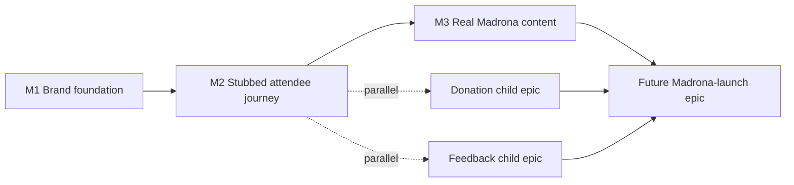

# Madrona Demo Build Epic

## Status

Proposed. Supersedes the prior `madrona-launch/` stub deferred
from [`event-platform-epic.md`](/docs/plans/event-platform-epic.md);
the launch-readiness scope from that stub's inherited M4
paragraphs (volunteer training, QR posters, production smoke run,
real attendee operations) is reassigned to a future Madrona-launch
sibling epic. The directory rename and the doc updates surfaced by
this epic's Documentation Currency PR Gate land with this
promotion PR.

## Purpose

This epic builds a fully content-authored Madrona Music in the
Playfield demo on the platform — a real-feeling, end-to-end
experience the neighborhood association, bands, and potential
sponsors can review on their own phones at the demo URL.

The epic does not include the live Madrona event launch
(volunteer training, QR poster production, sponsor logo
verification, unfurl preview verification, production smoke run,
real attendee operations). That work belongs to a future
Madrona-launch epic, sequenced after this epic and after the
donation and feedback child epics named below.

This epic supersedes `epics/madrona-launch/` (renamed to this
location). The launch-readiness scope from the predecessor stub's
inherited M4 paragraphs is removed from this epic and reassigned
to the future Madrona-launch sibling.

## Why This Epic

Demoing Madrona before launching it creates a feedback loop the
inherited M4 paragraphs did not plan for:

- Real-feeling content surfaces sponsor and band asks before
  field choices are cemented in production. The shape extensions
  this epic ships against `EventContent` are educated speculation
  pending real conversations; the demo is the artifact those
  conversations happen against.
- The neighborhood association gets a concrete artifact to point
  at when courting bands and sponsors. A finished demo URL is a
  stronger ask than a pitch deck.
- The "warm-cream → Madrona" brand transition and the full
  attendee journey (landing → game → completion → redeem booth)
  get exercised end-to-end against a real (non-test) event slug
  before live attendees and real money are involved.
- The donation and feedback child epics (named below) sequence
  off a settled content shape rather than a moving target. Their
  shape additions land against an `EventContent` whose bands and
  sponsors are already fleshed out, not against placeholder
  scaffolding.

## Goal

Madrona Music in the Playfield has a real-feeling, end-to-end
demo at `/event/madrona` and `/event/madrona/game` such that:

- the Madrona Theme is registered in
  [`shared/styles/themes/`](/shared/styles/themes/) and
  `/event/madrona*` routes render in Madrona's palette, replacing
  the warm-cream `getThemeForSlug` fallback;
- `EventContent`'s band and sponsor shapes carry the depth fields
  agreed in this scoping session (band image, link list, longer
  bio, featured quote; sponsor short description, social links);
- `apps/site/events/madrona.ts` is authored with real Madrona
  content — three concert dates, three real bands with real
  bios/photos/links/quotes, real sponsors with real
  descriptions/links;
- `/event/madrona/game` runs a real (not placeholder) Madrona
  game end-to-end: gameplay → completion → redeem booth handoff
  works against `slug=madrona`;
- the demo URL is shareable with stakeholders directly;
- cross-app theme continuity is verified for `slug=madrona` by
  UI-review pair (apps/site landing and apps/web game render the
  same Theme).

The demo URL is not promoted, not posted on QR posters, not run
against live attendees. Those are launch-epic work.

## Out Of Scope

- **Live Madrona launch.** Volunteer training, QR poster
  production, sponsor logo URL verification at print time,
  unfurl preview verification on every social client, production
  smoke run with assertions on the live Madrona path, and real
  attendee operations are deferred to a future Madrona-launch
  epic.
- **Integrated donation flow.** Deferred to a Madrona donation
  child epic, sequenced parallel with this epic's M3. The
  donation child epic owns the reversal of the
  [`docs/product.md`](/docs/product.md) Non-Goals (MVP) entry
  "Payments or billing infrastructure"; this epic does not
  reverse it.
- **Attendee feedback collection.** Deferred to a Madrona
  feedback child epic, sequenced parallel with this epic's M3.
- **Native series support.** No `EventSeries` shape, no
  `/series/...` route, no series→event inheritance/cascade rules.
  Deferred to a future Madrona '27 native-series-support epic, contingent on triggers
  surfaced during Madrona '26 (see Open Questions). Madrona '26
  is modeled as one event with three days using the existing
  `EventContent.schedule.days[]` shape.
- **Real money flow of any kind.** The demo runs against a
  placeholder reward; the redeem booth flow is exercised
  end-to-end but no real reward is redeemed by a real attendee
  during the demo phase.
- **Sponsor and band sales conversations.** The organizer
  follows up off-platform; the platform's role is the demo URL.

## Inherited Context

The following inheritance carries forward from the predecessor
`madrona-launch/` stub and remains relevant to this epic:

- **Apps/web ThemeScope wiring already shipped (demo-expansion
  epic M1 phase 1.1, 2026-05-01).** The `<ThemeScope>` wraps
  exist on `GameRoutePage`, `EventRedeemPage`,
  `EventRedemptionsPage`, and `EventAdminPage` in the central
  [`App.tsx`](/apps/web/src/App.tsx) routing dispatcher. Once
  Madrona's registry entry lands, the existing wraps
  automatically pick up Madrona's `Theme` for `slug=madrona`. No
  per-route engineering surface here.
- **Cross-app theme-continuity already verified for the two test
  events (demo-expansion epic M1 phase 1.1).** This epic extends
  the verification to `slug=madrona`.
- **Madrona's `Theme` deferred from event-platform-epic M1 phase
  1.5.2.** No `madrona.ts` file exists in
  [`shared/styles/themes/`](/shared/styles/themes/) today; the
  registry comment at index lines 5–17 names this epic as the
  registration site.
- **Apps/web `:root` warm-cream defaults remain in place for
  `slug=madrona` until M1 lands the Theme.** Until Madrona's
  `Theme` registers, `getThemeForSlug` returns the platform Sage
  Civic Theme.

The launch-readiness paragraphs from the predecessor stub
(volunteer training, QR posters, smoke run) carry forward as
inherited context for the future Madrona-launch epic, not for
this epic.

## Cross-Cutting Invariants

These invariants thread through multiple files and break
silently when one site drifts. Each milestone's plan walks them
against its diff surface.

1. **Madrona '26 implementation must not foreclose '27 native
   series support.** Bands and sponsors stay on `EventContent`,
   not as Madrona-specific globals. Entitlements stay
   event-session pairs. Redemption agents stay event-scoped.
   Admin authorization stays event-scoped. The `/series/*` URL
   namespace stays unclaimed. Madrona's Theme registers
   slug-keyed in
   [`shared/styles/themes/index.ts`](/shared/styles/themes/index.ts)
   with no cascade rules introduced.
2. **`EventContent` shape extensions must not foreclose the
   donation and feedback child epics.** Field naming and types
   stay neutral with respect to whether donation and feedback
   content lives on `EventContent` or alongside it. New band and
   sponsor fields do not occupy field names the child epics may
   want.
3. **Madrona is not a test event.** No `testEvent: true`, no
   inclusion in
   [`shared/events/testEventAllowlist.ts`](/shared/events/testEventAllowlist.ts)
   `TEST_EVENT_SLUGS`, no test-event disclaimer banner. The
   demo-mode bypass (read-only auth bypass on test-event slugs)
   does not apply to `slug=madrona`. Search-indexing posture is
   resolved separately (Open Questions).
4. **Every `EventContent` consumer renders gracefully when
   new band and sponsor fields are absent.** New fields land as
   `?: T` optional; absence yields the current render output.
   The invariant binds every consumer of
   `EventContent.lineup[]` and `EventContent.sponsors[]` —
   `apps/site/components/event/EventLineup.tsx`,
   `apps/site/components/event/EventSponsors.tsx`, the
   apps/site home-page demo showcase if it reads either array,
   any apps/web surface that reads either array, and every test
   fixture or seed module that constructs `EventContent`
   literals. Existing test events (`harvest-block-party`,
   `riverside-jam`) rendering unchanged is the load-bearing
   check that the invariant holds across all sites
   simultaneously.

## Milestone Structure

Per AGENTS.md "Epic Drafting," this section captures
milestone-level capability targets and sequencing rationale.
Per-milestone phase counts, per-phase content, validation gate
specifics, documentation lists, and self-review audit sets are
re-derived against actually-merged code at each milestone's
planning session.

**M1 — Madrona brand foundation.** Capability target: a
Madrona-branded landing page renders at `/event/madrona`
against placeholder content, with the deeper-content shape
fields rendering when present. The warm-cream → Madrona visual
transition is captured in UI review during this milestone. No
game wired; M2 owns that. Sequencing rationale: brand and
shape-extension foundation must land before content authoring
can be exercised against real fields, and before M2's full
attendee journey wiring has stable shape to lean on.

**M2 — Stubbed full attendee journey.** Capability target: the
full path from landing through gameplay through redeem booth
runs end-to-end against `slug=madrona` with placeholder game
content. End state: a shareable URL pointing at
`/event/madrona/game` runs gameplay → completion → redeem booth
handoff against placeholder content; the demo is shippable for
stakeholder review without real content yet. Sequencing
rationale: proving the end-to-end Madrona path works against a
real (non-test) slug before real content investment is the
"first iteration" target — surfaces wiring problems against
placeholder content where reauthoring is cheap.

**M3 — Real Madrona content authoring.** Capability target: the
demo URL is real-feeling enough to share with the neighborhood
association, bands, and potential sponsors. End state:
placeholder bands, sponsors, and game questions are replaced
with real Madrona content. Largely authoring + UI review;
modest engineering. **Parallelism:** if the donation and
feedback child epics have been scoped and are in flight by M3
start, M3 sequences in parallel with them; the Cross-Cutting
Invariants above commit M1's shape extensions to not foreclose
either child epic's shape needs, so concurrent authoring is
safe. If neither child epic has settled by M3 start, M3 ships
standalone and the child epics inherit the resulting
`EventContent` shape when they later scope. Either path
satisfies the epic's terminal goal.

The epic terminates at M3. Launch-readiness work
(volunteer training, QR posters, production smoke run, sponsor
logo URL verification at print time, unfurl preview verification
on every social client) is the future Madrona-launch epic's
scope.

## Backlog Impact

**Closes:** nothing in [`docs/backlog.md`](/docs/backlog.md). The
backlog items that referenced "Madrona launch" reference the
launch-readiness scope that this epic does not own; they belong
to the future Madrona-launch sibling.

**Enables (named here so parallelism is on the record):**

- **Madrona donation child epic.** Integrated donation flow on
  Madrona event surfaces. Sequences in parallel with this
  epic's M3. Reverses the
  [`docs/product.md`](/docs/product.md) Non-Goals (MVP) entry
  "Payments or billing infrastructure"; that reversal is the
  donation epic's responsibility, not this one's. Scoping
  pending; this epic's Cross-Cutting Invariant 2 keeps the
  shape door open.
- **Madrona feedback child epic.** Attendee feedback collection
  (form route, Supabase table, organizer-readable surface).
  Sequences in parallel with this epic's M3. Scoped at
  [`epics/madrona-feedback/epic.md`](/docs/plans/epics/madrona-feedback/epic.md);
  invariant 2 keeps the shape door open.

**Sequences toward:**

- **Future Madrona-launch epic.** Volunteer training, QR poster
  production, sponsor logo URL verification, unfurl preview
  verification, production smoke run with Madrona-specific
  assertion set. Adopts the predecessor stub's launch-readiness
  inherited paragraphs. Begins after this epic's M3 and after
  the donation and feedback child epics have settled enough to
  ship under the Madrona name.
- **Future Madrona '27 native-series-support epic.** Contingent
  on triggers surfaced during Madrona '26 (see Open Questions).

## Documentation Currency PR Gate

The first PR in this epic that lands the directory rename must
update every doc that references the predecessor
`madrona-launch/` location, surfaced by
`grep -r "madrona-launch" docs/` (excluding test slugs named
`madrona-launch-day`, which are unrelated test fixtures). At
authoring time of this epic the surfaced docs are:

- `docs/plans/epics/madrona-launch/` directory removal and
  `docs/plans/epics/madrona-demo-build/` directory creation —
  this epic's own location.
- [`docs/architecture.md`](/docs/architecture.md) — Theme
  registry paragraph that names the Madrona-launch epic as the
  Theme registration site.
- [`docs/styling.md`](/docs/styling.md) — per-event Theme
  procedure that names the Madrona-launch epic as the Theme
  registration site.
- [`docs/plans/release-readiness.md`](/docs/plans/release-readiness.md) —
  "current real-event launch epic" reference; reframe to point
  at the demo-build epic as the active real-event work, with
  launch noted as a deferred far-future sibling.
- [`docs/plans/event-platform-epic.md`](/docs/plans/event-platform-epic.md) —
  multiple inline references (M4 row in milestone table, "moved
  to" notes, deferred-phase references); replace
  `epics/madrona-launch/` with the demo-build path; note that
  launch-readiness scope split off to a far-future sibling.
- [`docs/plans/epics/demo-expansion/epic.md`](/docs/plans/epics/demo-expansion/epic.md) —
  Related Docs and inline references; same treatment.
- [`docs/plans/epics/demo-expansion/m2-home-page-rebuild.md`](/docs/plans/epics/demo-expansion/m2-home-page-rebuild.md) —
  inline reference to the Madrona-launch epic as Theme owner.
- [`docs/product.md`](/docs/product.md) — verify the "Initial
  deployment: Madrona Music in the Playfield" framing is honest
  about the demo-build phase preceding launch; update phrasing
  if needed so the doc does not imply launch work is in motion
  when only demo-build work is.

The grep is the authoritative discovery mechanism; if new
references land between authoring of this epic and the rename
PR, the PR includes them.

Subsequent milestones each handle their own doc-currency gates
in their milestone planning sessions; this section gates the
epic-creation PR specifically.

## Sizing Summary

3 milestones. Estimate, not binding; per-milestone PR counts are
re-derived at each milestone's planning session.

- **M1:** 2–3 PRs estimated; **2 PRs actual** —
  [#182](https://github.com/kcrobinson-1/neighborly-events/pull/182)
  (Theme registration + minimal Madrona content module) and
  [#185](https://github.com/kcrobinson-1/neighborly-events/pull/185)
  (`EventContent` shape extensions + section component renderer
  updates + Madrona placeholder depth-field population, with
  phase 1.3 collapsed into 1.2 per the milestone-doc-authorized
  deviation). Within the estimate range; the collapse rationale
  is recorded in PR #185's `## Estimate Deviations`.
- **M2:** 1–2 PRs estimated; **5 PRs actual** — substrate
  ([m2-phase-2-1-plan.md](/docs/plans/epics/madrona-demo-build/m2-phase-2-1-plan.md)),
  apps/web noindex fix-up surfaced during deployment review,
  agent-guidance updates spun off from substrate review,
  content iteration after the placeholder copy proved
  unsuitable for the public-facing beta, and the close-out
  PR landing 2026-05-06 with the six attendee-journey
  captures and the milestone-doc Status flips. The deviation
  was driven by three forces the milestone estimate did not
  anticipate: (1) production deployment review surfaced a
  noindex gap that warranted its own focused fix, (2) review
  feedback during substrate landing produced agent-guidance
  changes worth their own PR, and (3) the placeholder
  content was not suitable for the public-facing event the
  demo became, requiring a content-iteration PR before
  close-out captures could match deployed reality. Each
  deviation is justified at its own PR's `## Estimate
  Deviations`; collectively they argue the M2 milestone
  estimate underweighted "review-driven follow-ups" as a
  PR-count contributor distinct from the implementation
  work itself.
- **M3:** 1–2 PRs. Real content authoring; UI review of the
  finished demo URL.

Total: 4–7 PRs across the epic.

## Risk Register

- **Sponsor and band asks not yet known.** Field choices for
  deeper band and sponsor content (image, link list, featured
  quote, longer bio; sponsor description, social links) are
  educated speculation pending real conversations. As
  conversations happen between now and M3, field choices may
  shift. Mitigation: M1 ships shape extensions as additive
  optional fields so M3 can extend them without breaking. M3
  planning logs estimate-deviation rationale per AGENTS.md
  "Estimate Deviations" if field shape shifts.
- **Cross-cutting invariant drift.** Invariants 1 and 2 ("don't
  foreclose '27 series" and "don't foreclose donation/feedback
  child epics") break silently if a milestone's implementer
  introduces a Madrona-specific module that bypasses the
  registry, or hardcodes a sponsor/band relationship outside
  `EventContent`. Mitigation: invariants named explicitly here;
  each milestone plan walks all four invariants against its
  diff surface as a dedicated self-review pass.
- **Madrona Theme palette discussion blocks M1 engineering.**
  Theme palette choice (~10 colors, typography, accent
  treatment) is a design discussion, not pure engineering.
  Holding the discussion mid-implementation churns M1's
  UI-review captures. Mitigation: the Theme palette is treated
  as an M1 design-decision input that must settle before M1
  implementation begins. M1's milestone planning session owns
  where in M1's structure that resolution lives.
- **Demo URL surfaces to public audience prematurely.** A
  stakeholder shares the demo URL with someone outside the
  intended review group; that person treats it as live event
  info or surfaces it on social media. Mitigation: default
  during demo iteration is `<meta name="robots" content="noindex">`
  on `/event/madrona*`, enforced in code, until the future
  Madrona-launch epic flips it. The Open Questions section
  records the unresolved choice between `noindex` and
  password-gating as the next-tier mitigation if `noindex`
  alone is insufficient.
- **Manual SQL agent assignment introduces operational
  friction.** Madrona's redemption agent assignment requires
  manual root-admin SQL today (per
  [`docs/backlog.md`](/docs/backlog.md) Tier 4 "Organizer-managed
  agent assignment"). Mitigation: accept manual SQL for the
  demo phase; the launch epic decides whether organizer-managed
  agent assignment must land before live ops.

## Open Questions

- **Demo indexing posture: `noindex` during demo phase, or
  indexed?** Default during demo iteration is
  `<meta name="robots" content="noindex">` so the demo URL stays
  out of public search until the future Madrona-launch epic
  resolves the posture. Open during demo iteration; resolved by
  the launch epic. Not blocking M1.
- **Madrona '26 → '27 series-promotion triggers.** Four
  candidate triggers surfaced in this epic's scoping session:
  per-night branding pressure (sponsors or bands push to lead
  with their specific night); per-night sponsor inventory drift
  (different sponsors sign up for different nights); cross-night
  attendee identity (attendees attend multiple nights and want
  series-wide leaderboard or punch-card); year-over-year
  authoring drift (Madrona '27 wants to reuse '26 chrome with
  new bands and dates). Which (if any) actually fire is
  observation work during the demo phase and after the eventual
  launch. Resolved by the Madrona '27 native-series-support epic.
- **Demo-sharing model: shareable URL, password-gated, or
  both?** The demo URL needs to reach stakeholders without
  leaking publicly. Default during demo iteration: share URL
  directly, trust recipients, `noindex`. Worth revisiting if a
  stakeholder accidentally surfaces the URL or if the
  production-friendly demo-mode backlog item (Tier 4) gets
  scoped before this epic's M3.
- **Donation processor and 501(c)(3) backing.** Deferred to the
  donation child epic's own scoping; named here so that epic's
  scoping does not surprise this one. Field shape on
  `EventContent` is the donation epic's call, not this epic's;
  invariant 2 keeps the shape door open.

## Related Docs

- [`event-platform-epic.md`](/docs/plans/event-platform-epic.md) —
  predecessor epic; brand-launch context inherited from its M4
  paragraphs informs this epic's M1 visual transition framing.
- [`epics/demo-expansion/epic.md`](/docs/plans/epics/demo-expansion/epic.md) —
  sibling epic that shipped the apps/web ThemeScope wiring this
  epic inherits.
- [`docs/product.md`](/docs/product.md) — product overview;
  Madrona is named as initial deployment.
- [`docs/experience.md`](/docs/experience.md) — UX philosophy
  and attendee experience principles this epic's content
  authoring honors.
- [`docs/styling.md`](/docs/styling.md) — themable vs.
  structural token discipline; Madrona Theme registration
  follows the per-event Theme procedure documented there.
- [`AGENTS.md`](/AGENTS.md) — agent behavior, planning depth,
  doc currency PR gate, epic drafting rules, In draft →
  Proposed promotion gate.
- (Future, not yet authored) `docs/plans/epics/madrona-donation/epic.md` —
  child epic, parallel with this epic's M3.
- [`epics/madrona-feedback/epic.md`](/docs/plans/epics/madrona-feedback/epic.md) —
  child epic, parallel with this epic's M3.
- (Future, not yet authored) `docs/plans/epics/madrona-launch/epic.md` —
  far-future sibling; demo-build is its sequential predecessor.
  Inherits the launch-readiness paragraphs from the predecessor
  stub this epic supersedes.
