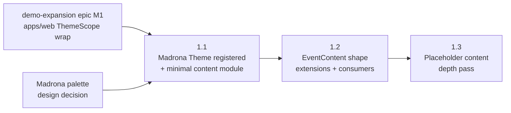

# M1 — Madrona Brand Foundation

## Status

Proposed.

This milestone doc is the durable coordination artifact for M1
of the Madrona demo-build epic: restated milestone goal, phase
sequencing, cross-phase invariants, cross-phase decisions
(settled-by-default and deferred-to-phase-time), milestone-level
risks, and the doc-currency map M1 must collectively land.
Per-phase implementation contracts live in the phase plan(s)
drafted by the phase planning session(s) that follow this
milestone session.

Per AGENTS.md "Anti-goal: do not scope any phase in this
session," nothing below resolves a per-phase contract,
file inventory, validation procedure, or self-review audit
set; those re-derive at phase planning time against the
actually-merged code at phase-start.

## Goal

Build the Madrona brand foundation on the platform such that a
Madrona-branded landing page renders at `/event/madrona` against
placeholder content, and the deeper `EventContent` shape fields
agreed in the epic's scoping session are available for content
authoring by M3.

After M1:

- a `madrona.ts` Theme is registered in
  [`shared/styles/themes/`](/shared/styles/themes/) and exported
  from
  [`shared/styles/themes/index.ts`](/shared/styles/themes/index.ts)
  under the slug `madrona`, replacing the warm-cream
  `getThemeForSlug` fallback for `slug=madrona`
  (`Verified by:`
  [shared/styles/themes/index.ts:21-24](/shared/styles/themes/index.ts)
  for the registry shape;
  [shared/styles/getThemeForSlug.ts:18-20](/shared/styles/getThemeForSlug.ts)
  for the resolver and its fallback)
- the `EventContent` type in
  [`apps/site/lib/eventContent.ts`](/apps/site/lib/eventContent.ts)
  carries the depth fields agreed in the epic's scoping session —
  band image, link list, longer bio, featured quote; sponsor
  short description and social links — as additive optional
  fields per cross-cutting invariant 4
  (`Verified by:`
  [apps/site/lib/eventContent.ts:55-71](/apps/site/lib/eventContent.ts)
  for the current shape that gets extended;
  [docs/plans/epics/madrona-demo-build/epic.md:143-185](/docs/plans/epics/madrona-demo-build/epic.md)
  for the four cross-cutting invariants this milestone binds)
- every existing `EventContent` consumer renders gracefully when
  the new fields are absent (the existing test events
  `harvest-block-party` and `riverside-jam` continue to render
  unchanged — the load-bearing check that invariant 4 holds)
- `apps/site/events/madrona.ts` is registered in
  [`apps/site/lib/eventContent.ts`](/apps/site/lib/eventContent.ts)
  with placeholder Madrona content (placeholder bands, sponsors,
  schedule, FAQ) sufficient to render every section component
  including the new depth fields; M2's gameplay wiring and M3's
  real content authoring extend this module without re-shaping it
- `slug=madrona` is **not** a test event: `madrona.ts` does not
  set `testEvent: true`, the slug is not added to
  [`shared/events/testEventAllowlist.ts`](/shared/events/testEventAllowlist.ts)
  `TEST_EVENT_SLUGS`, no test-event disclaimer banner renders,
  and the M3 demo-mode auth bypass from the demo-expansion epic
  does not apply
  (`Verified by:`
  [docs/plans/epics/madrona-demo-build/epic.md:165-170](/docs/plans/epics/madrona-demo-build/epic.md)
  for invariant 3 binding this rule;
  [shared/events/testEventAllowlist.ts](/shared/events/testEventAllowlist.ts)
  for the allowlist that must not gain `madrona`)
- cross-app theme-continuity is verified for `slug=madrona`:
  apps/site `/event/madrona` and apps/web `/event/madrona/game`
  render the same Madrona Theme. M2 owns the gameplay wiring;
  M1's contribution is verifying the Theme applies on apps/web
  shells via the existing centralized `<ThemeScope>` wrap that
  demo-expansion epic M1 phase 1.1 already shipped
  (`Verified by:`
  [apps/web/src/App.tsx:61-67](/apps/web/src/App.tsx)
  for the existing per-event admin ThemeScope wrap, with the
  game / redeem / redemptions wraps following the same shape at
  [App.tsx:75-77](/apps/web/src/App.tsx),
  [App.tsx:85-109](/apps/web/src/App.tsx), and
  [App.tsx:117-141](/apps/web/src/App.tsx) — Madrona inherits
  all four the moment its Theme registers;
  [docs/plans/epics/madrona-demo-build/epic.md:117-126](/docs/plans/epics/madrona-demo-build/epic.md)
  for the Inherited Context paragraph naming demo-expansion epic
  M1 phase 1.1 as the wrap-already-shipped site)
- `<meta name="robots" content="noindex">` enforces during the
  demo phase on `/event/madrona*`, per the epic's Risk Register
  mitigation for premature public surfacing; the future
  Madrona-launch epic flips this when ready
  (`Verified by:`
  [docs/plans/epics/madrona-demo-build/epic.md:378-387](/docs/plans/epics/madrona-demo-build/epic.md))

M1 does not wire gameplay (M2's scope), does not author real
Madrona content (M3's scope), and does not ship the live launch
(future Madrona-launch epic's scope).

## Phase Status

This table is the milestone-session estimate of phase shape per
AGENTS.md "Plan content is a mix of rules and estimates" and
"PR-count predictions are not contracts." The phase planning
session for each phase re-derives the actual shape against
merged code at phase-start.

| Phase | Title | Plan | Status | PR |
| --- | --- | --- | --- | --- |
| 1.1 | Madrona Theme registration + minimal Madrona content module | [m1-phase-1-1-plan.md](/docs/plans/epics/madrona-demo-build/m1-phase-1-1-plan.md) | Landed | [#182](https://github.com/kcrobinson-1/neighborly-events/pull/182) |
| 1.2 | `EventContent` shape extensions + section component renderer updates | [m1-phase-1-2-plan.md](/docs/plans/epics/madrona-demo-build/m1-phase-1-2-plan.md) | Landed | `<TBD>` |
| 1.3 | Placeholder Madrona content depth pass exercising the extended shape | — | Collapsed into 1.2 | `<TBD>` |

The 3-row estimate matches the epic's Sizing Summary (M1: 2–3
PRs) at the upper bound. Phase 1.3 may collapse into 1.2 at
phase-planning time if the placeholder-content depth pass is
small enough that splitting it from the shape extensions
produces review churn rather than review coherence; the
collapse is authorized in advance and recorded in the
collapsing phase's plan as an Estimate Deviation. A 1.1 / 1.2
split into sub-phases is similarly authorized if a phase-time
branch test surfaces blast radius beyond the AGENTS.md
"PR-count predictions need a branch test" thresholds.

## Sequencing

Phase dependencies (`A --> B` means A blocks B / B depends on
A):

**Why 1.1 before 1.2.** Registering the Madrona Theme and
landing a minimal `apps/site/events/madrona.ts` produces a
real `/event/madrona` route that subsequent phases exercise
shape extensions against. Reversing the order — extending the
shape against test events and only later registering Madrona —
defers the cross-app theme-continuity check to a later phase
and produces a "is the Theme even applying" ambiguity inside
the shape-extension review. Landing the Theme first keeps the
extension review focused on shape changes only.

**Why 1.2 before 1.3.** The shape extensions in 1.2 must land
before placeholder content can be authored against the
extended shape. Reversing produces dead placeholder content
that gets rewritten when the type changes.

**Why 1.3 may collapse into 1.2.** If the depth pass is
narrow enough that the same PR can extend the type and seed
sufficient placeholder content to exercise the new fields end-
to-end without bloating the diff, splitting is review churn.
Phase planning owns the call.

**Madrona palette is a phase 1.1 input, not a phase.** Per the
epic's Risk Register, "Madrona Theme palette discussion blocks
M1 engineering" — the ~10-color palette + typography + accent
treatment is a design decision that must settle before phase
1.1 implementation begins. The decision artifact lives in
phase 1.1's scoping doc as a settled-by-scoping decision with a
`Verified by:` reference to wherever the palette gets recorded
(a design file, a captured palette swatch image attached to the
scoping doc, a settled section in the scoping doc itself); the
phase 1.1 plan does not start drafting against an unsettled
palette. The milestone doc does not pre-decide where the
palette gets recorded — that is a phase 1.1 scoping-session
choice — but the milestone doc records that the palette IS the
phase 1.1 plan's first reality-check input.

**Independence from sibling milestones.** M2 (full attendee
journey wiring) depends on M1 — Madrona's Theme must be
registered and `apps/site/events/madrona.ts` must exist before
gameplay wiring can target `slug=madrona`. M3 (real content
authoring) depends on M1's shape extensions because it authors
against the extended type.

**Independence from the donation and feedback child epics.**
Per epic Cross-Cutting Invariant 2, M1's shape extensions must
not foreclose the donation or feedback child epics' shape
needs. The phase planning session for 1.2 owns the
verification — the donation epic's open question on
`EventContent` field shape is named in the epic's Open
Questions and is the load-bearing check that the M1 shape
extensions stay neutral with respect to where donation /
feedback content eventually lives.

## Cross-Phase Invariants

M1 binds the four cross-cutting invariants from the parent
epic verbatim by reference; self-review at every phase walks
each against that phase's diff:

1. **No foreclosure of '27 native series support.** Bands and
   sponsors stay on `EventContent`; entitlements stay
   event-session pairs; the `/series/*` URL namespace stays
   unclaimed; Madrona's Theme registers slug-keyed with no
   cascade rules.
2. **No foreclosure of the donation and feedback child epics.**
   New band and sponsor field names and types stay neutral with
   respect to whether donation / feedback content lives on
   `EventContent` or alongside it.
3. **Madrona is not a test event.** No `testEvent: true`, no
   inclusion in `TEST_EVENT_SLUGS`, no test-event disclaimer
   banner, no demo-mode auth bypass on `slug=madrona`.
4. **Every `EventContent` consumer renders gracefully when new
   band and sponsor fields are absent.** Additive `?: T`
   optional fields; absence yields current render output. Binds
   `EventLineup.tsx`, `EventSponsors.tsx`, the apps/site
   home-page demo showcase if it reads either array, any
   apps/web surface that reads either array, and every test
   fixture or seed module that constructs `EventContent`
   literals.

(`Verified by:`
[docs/plans/epics/madrona-demo-build/epic.md:143-185](/docs/plans/epics/madrona-demo-build/epic.md))

M1 also adds the following milestone-level invariants — rules
that thread through more than one M1 phase or that surface only
when multiple phases interact:

- **Cross-app theme-continuity for `slug=madrona`.** After M1,
  apps/site `/event/madrona` and apps/web `/event/madrona/game`
  render the same Madrona Theme. The continuity check is the
  load-bearing UI-review gate; phase 1.1's plan owns the
  validation procedure (capture-pair shape inherited from
  demo-expansion epic M1 phase 1.1 is the working precedent —
  see
  [m1-phase-1-1-plan.md §Validation Gate](/docs/plans/epics/demo-expansion/m1-phase-1-1-plan.md)).
  Phase 1.2 and 1.3 do not regress the continuity; their
  validation gates re-confirm it for any new component surface
  they touch.
- **`noindex` on `/event/madrona*` enforced from phase 1.1
  onward.** The robots-noindex meta is in place from the moment
  `slug=madrona` resolves to a registered Theme; no phase ships
  a publicly-indexable Madrona surface. Phase 1.1's plan owns
  the enforcement mechanism (Next.js per-page `metadata.robots`,
  middleware, or `robots.txt` carve-out — phase-time choice
  against current
  [`apps/site/app/event/[slug]/page.tsx`](/apps/site/app/event/[slug]/page.tsx)).
- **Token-classification bucket integrity for the new Theme.**
  The Madrona Theme overrides themable tokens only, per
  [`docs/styling.md`](/docs/styling.md). If self-review during
  phase 1.1 surfaces a component on the `/event/madrona*`
  surface that visually breaks under Madrona because of a
  hard-coded color or wrong-bucket token, the fix is a
  one-line `_tokens.scss` / component edit per
  demo-expansion epic M1 phase 1.1 precedent (scoping decision
  3 there). Rule-shape ripples defer to a focused follow-up
  rather than blocking M1.
- **Section component renderer updates are render-when-present,
  not require-when-absent.** When phase 1.2 extends
  `EventLineup.tsx` and `EventSponsors.tsx` to render new band
  and sponsor depth fields, the rendered output for an event
  that omits the new fields must equal the pre-1.2 output byte-
  for-byte. The load-bearing check is `harvest-block-party` and
  `riverside-jam` rendering unchanged.

**Inherited from upstream invariants.** M1 also inherits the
URL contract, theme route scoping, and theme token discipline
invariants from the predecessor epic
([event-platform-epic.md](/docs/plans/event-platform-epic.md))
and the apps/web ThemeScope-wrap centralization invariant from
the sibling demo-expansion epic
([m1-themescope-wiring.md §Cross-Phase Invariants](/docs/plans/epics/demo-expansion/m1-themescope-wiring.md));
self-review walks each against M1's diff even though the diff
is not expected to touch them.

## Cross-Phase Decisions

### Settled by default

Decisions with a clear default that no scoping pressure
disputes. Recorded so phase planning sessions do not re-derive.

- **Theme registry location.** Madrona's Theme registers
  slug-keyed in
  [`shared/styles/themes/index.ts`](/shared/styles/themes/index.ts)
  alongside `harvest-block-party` and `riverside-jam`. No
  cascade rules, no Madrona-specific globals
  (`Verified by:`
  [shared/styles/themes/index.ts:21-24](/shared/styles/themes/index.ts)
  for the registry's flat slug-keyed shape; epic invariant 1).
- **Resolver function.** `getThemeForSlug` from
  [`shared/styles/getThemeForSlug.ts`](/shared/styles/getThemeForSlug.ts).
  Single existing resolver; no parallel resolver introduced.
- **Apps/web ThemeScope wrap.** Inherited from demo-expansion
  epic M1 phase 1.1; the four centralized wraps at
  [apps/web/src/App.tsx:61-67 / 75-77 / 85-109 / 117-141](/apps/web/src/App.tsx)
  cover all four event-route shells (admin, game, redeem,
  redemptions) and pick up Madrona's Theme automatically once
  the registry maps `madrona` → `madronaTheme`. M1 of this epic
  ships no apps/web wrapping change.
- **Madrona is not a test event.** No `testEvent: true`, no
  `TEST_EVENT_SLUGS` entry, no test-event disclaimer banner.
  Epic invariant 3.
- **Shape extension policy.** New band and sponsor depth fields
  land as `?: T` optional. Epic invariant 4.
- **Static event registration.** `apps/site/events/madrona.ts`
  imports into
  [`apps/site/lib/eventContent.ts`](/apps/site/lib/eventContent.ts)
  alongside the existing test events; static imports preserve
  Next.js bundle analysis
  (`Verified by:`
  [apps/site/lib/eventContent.ts:73-85](/apps/site/lib/eventContent.ts)
  for the existing static-import pattern this extends).

### Deferred to phase-time

Decisions deferrable to phase planning per AGENTS.md "Defer
rather than over-resolve." Each is named here so phase planning
finds them, with the constraints that bound the resolution
space:

- **Madrona Theme palette concrete values.** Phase 1.1 input.
  ~10 colors + typography + accent treatment. Constraint:
  cross-app theme-continuity must read as a Madrona-distinct
  palette in cross-app capture pairs (the warm-cream → Madrona
  visual transition the epic Goal names). Settles in phase 1.1
  scoping with a `Verified by:` reference to wherever the
  palette is recorded.
- **Phase 1.3 collapse vs. independent ship.** Phase planning
  for 1.2 / 1.3 owns the call against actual placeholder-content
  size at phase-start. The Phase Status table above already
  authorizes the collapse; the rationale gets recorded in the
  phase plan that absorbs the work.
- **Exact field names for band and sponsor depth extensions.**
  Phase 1.2 owns naming. Constraint: invariant 2 (do not
  foreclose donation / feedback child epics) — phase 1.2's
  reality-check inputs include the donation and feedback
  child-epic scoping notes (if any exist by phase-start) so the
  naming check is not shape-blind. If neither child epic has
  scoped by phase 1.2 start, the naming choice records the
  invariant-2 audit explicitly.
- **Cross-app theme-continuity validation procedure for
  `slug=madrona`.** Capture-pair shape from demo-expansion epic
  M1 phase 1.1 is the working precedent
  ([m1-phase-1-1-plan.md §Validation Gate](/docs/plans/epics/demo-expansion/m1-phase-1-1-plan.md)
  for the eight-capture pattern: 6 in-app + 2 cross-app). Phase
  1.1's plan adopts, refines, or replaces; the milestone doc
  does not pre-decide.
- **`noindex` enforcement mechanism on `/event/madrona*`.**
  Phase 1.1 owns the choice between Next.js per-page
  `metadata.robots`, middleware, or a `robots.txt` carve-out.
  Constraint: the mechanism does not interfere with the future
  Madrona-launch epic's flip from `noindex` to indexable.
- **Section component renderer surface for new fields.** Phase
  1.2 owns whether new band depth fields render inline in
  `EventLineup.tsx`'s existing card layout or in an expanded
  surface, and whether sponsor depth fields render inline in
  `EventSponsors.tsx` or behind a "more" affordance. Constraint:
  invariant 4 — render-when-present, not require-when-absent;
  test events render unchanged.
- **Apps/site home-page demo showcase impact.** Phase 1.2's
  reality-check inputs include grepping for the home-page
  showcase's `EventContent.lineup` / `EventContent.sponsors`
  reads. If the showcase reads either array, phase 1.2's plan
  walks the showcase against invariant 4 explicitly. The
  milestone doc does not pre-resolve because the surface depends
  on apps/site state at phase-start.
- **Per-PR commit shape.** Phase plans own commit boundaries
  per AGENTS.md "Plan content is a mix of rules and estimates."
  The milestone doc only commits to phase boundaries.

## Cross-Phase Risks

Risks that span the milestone or surface only at the milestone
level. Phase-level risks live in each phase plan's Risk
Register.

- **Madrona Theme palette discussion blocks phase 1.1
  engineering.** Restated from the epic's Risk Register because
  mitigation lives in M1 structure: the palette is a phase 1.1
  scoping input, not a mid-implementation question. Phase 1.1's
  scoping doc carries the palette as a settled-by-scoping
  decision with a `Verified by:` reference; phase 1.1's plan
  does not promote past `In draft` until the reference resolves.
- **Shape extensions foreclose donation or feedback child
  epics.** Epic invariant 2 break. Mitigation: phase 1.2's
  reality-check inputs include the donation and feedback child-
  epic scoping notes (if any by phase-start), and the phase
  plan's self-review walks invariant 2 against every new field
  name and type. Recurring trap: a band-depth field that names
  itself ambiguously (e.g., a generic `link[]` that the
  donation epic might want for donation-CTA links, or a generic
  `description` field where both child epics may want their own
  description) — the field name's specificity is the lever.
- **Token-classification gaps surface for `slug=madrona` only.**
  Components on the `/event/madrona*` surface may consume hard-
  coded colors or wrong-bucket tokens that warm-cream defaults
  hid because no per-event Theme was layered. Mitigation: same
  shape as demo-expansion epic M1 phase 1.1 — one-line
  `_tokens.scss` / component edits ship in the phase 1.1 PR;
  rule-shape ripples surface as backlog with rationale recorded
  in the phase plan's Out Of Scope.
- **Madrona accidentally treated as a test event.** Epic
  invariant 3 break. The recurring trap is a contributor (or
  agent) noticing that `madrona` is a "demo" and adding it to
  `TEST_EVENT_SLUGS`, or copying the test-event disclaimer
  framing into `madrona.ts`. Mitigation: phase 1.1 self-review
  asserts `TEST_EVENT_SLUGS` is unchanged in the diff, and that
  `madrona.ts` does not set `testEvent: true`. The phase 1.1
  plan names this as an explicit Out Of Scope entry so the audit
  trail is durable.
- **Field-naming churn when M3 authors real content.** Phase
  1.2 names the fields against the epic's scoping speculation;
  M3 may surface that real conversations require different field
  shapes. Mitigation: the epic's Risk Register already covers
  this — additive optional fields make M3 extension non-
  breaking; M3 logs estimate-deviation rationale per AGENTS.md
  "Estimate Deviations" if shape shifts.
- **Cross-app theme-continuity false positive from caching or
  CDN propagation.** Same shape as demo-expansion epic M1 phase
  1.1's risk; mitigation inherits from there
  ([m1-themescope-wiring.md §Cross-Phase Risks](/docs/plans/epics/demo-expansion/m1-themescope-wiring.md)).
  Phase 1.1's validation gate names the freshness check
  (build-id assertion or capture timestamps within N minutes of
  the latest deploys).
- **Placeholder content reads as a launch announcement.**
  External viewers of the demo URL during M1 may misread
  placeholder-band names or placeholder-sponsor logos as a real
  Madrona lineup. Mitigation: `noindex` keeps the URL out of
  search; the epic's demo-sharing model (share URL directly,
  trust recipients) holds during M1. Phase 1.1's plan owns
  whether the placeholder content explicitly flags itself as
  placeholder in copy (e.g., "Lineup TBD — demo content shown
  for preview" in a hero subline) or whether the `noindex`
  posture alone is sufficient.

## Documentation Currency

The doc updates the M1 set must collectively make. Each is
owned by the phase named below; any phase that lands a partial
update records the remainder under its plan's Documentation
Currency PR Gate. M1 is not complete until all are landed across
the M1 PR set.

- [`shared/styles/getThemeForSlug.ts`](/shared/styles/getThemeForSlug.ts)
  — header comment currently reads "Madrona in M4 phase 4.1"
  (`Verified by:`
  [shared/styles/getThemeForSlug.ts:5-16](/shared/styles/getThemeForSlug.ts));
  rewrite to point at this epic's M1 (phase 1.1 specifically when
  the slug-to-Theme mapping lands). **Owned by 1.1.**
- [`shared/styles/themes/index.ts`](/shared/styles/themes/index.ts)
  — registry comment block already references this epic
  (`Verified by:`
  [shared/styles/themes/index.ts:5-20](/shared/styles/themes/index.ts));
  add `"madrona": madronaTheme` to the registry literal and an
  `import` line; comment may need a small phrasing update if it
  still implies registration is pending. **Owned by 1.1.**
- [`apps/site/lib/eventContent.ts`](/apps/site/lib/eventContent.ts)
  — header comment currently names "M4 phase 4.2 (Madrona)" as
  the third event; rewrite to point at this epic. The same file
  also gains the `madronaContent` import and registry entry,
  and (in 1.2) the type-shape extensions for band and sponsor
  depth fields with comment updates that name the additive-
  optional discipline. **Owned by 1.1 (registry/comment) and 1.2
  (shape extension).**
- [`apps/site/events/harvest-block-party.ts`](/apps/site/events/harvest-block-party.ts)
  — header comment says "Madrona in M4 omits the field"
  (`Verified by:`
  [apps/site/events/harvest-block-party.ts:1-12](/apps/site/events/harvest-block-party.ts));
  rewrite the M4 reference to point at this epic. The
  `riverside-jam.ts` file likely carries an analogous reference;
  the phase-1.1 plan re-verifies by grep at phase-start.
  **Owned by 1.1.**
- [`docs/styling.md`](/docs/styling.md) — "Procedure For Adding
  A New Theme" reference and any per-event Theme paragraph that
  names the Madrona-launch epic as the registration site.
  Phase-1.1 plan-drafting re-verifies by grep at phase-start
  against the post-doc-currency-PR-gate state of the file.
  **Owned by 1.1.**
- [`docs/architecture.md`](/docs/architecture.md) — Theme
  registry paragraph and any "Madrona" reference left over from
  the predecessor epic's docs-currency pass; phase-1.1
  re-verifies by grep. **Owned by 1.1.**
- [`docs/product.md`](/docs/product.md) — "Initial deployment:
  Madrona Music in the Playfield" framing was already audited
  for honesty during the epic-creation PR; M1's contribution is
  re-confirming the framing matches what M1 actually ships
  (a demo URL, not a live launch). **Owned by 1.1; verification
  may produce no edit.**
- [`docs/backlog.md`](/docs/backlog.md) — phases that surface
  follow-up work (token-classification rule-shape ripples,
  noindex flip mechanism for the future Madrona-launch epic,
  field-shape items the donation / feedback child epics may
  want to inherit) add backlog entries with rationale. **Owned
  by whichever phase surfaces the follow-up.**
- [`docs/plans/epics/madrona-demo-build/epic.md`](/docs/plans/epics/madrona-demo-build/epic.md)
  — the M1 paragraph in Milestone Structure stays prose-form;
  no Milestone Status table exists on this epic to flip
  (`Verified by:`
  [docs/plans/epics/madrona-demo-build/epic.md:213-249](/docs/plans/epics/madrona-demo-build/epic.md)).
  The terminal M1 PR (whichever ships last) reconciles the
  epic's Sizing Summary M1 line with the actual PR count per
  AGENTS.md "Estimate Deviations" if the count differs. **Owned
  by the terminal M1 PR.**
- This milestone doc — Status flips `In draft` → `Proposed`
  before phase 1.1 plan-drafting begins (per AGENTS.md
  promotion gate); Status flips `Proposed` → `Landed` in the
  terminal M1 PR; Phase Status rows update as each phase plan
  drafts and as each phase PR merges. **Owned by 1.1 for the
  promotion flip; owned by the terminal M1 PR for the Landed
  flip.**

[`docs/dev.md`](/docs/dev.md), [`docs/operations.md`](/docs/operations.md),
[`docs/experience.md`](/docs/experience.md), and
[`README.md`](/README.md) are not knowingly touched by M1;
phase 1.1 plan-drafting re-verifies by grep against the
post-epic-creation-PR state. M1 introduces no new local-dev
workflow, no operational concern, and no product-capability
change beyond what M2 (gameplay wiring) and M3 (real content)
will describe.

[`docs/open-questions.md`](/docs/open-questions.md) — the
epic's Open Questions section names the unresolved demo-
indexing posture, '26 → '27 series-promotion triggers, demo-
sharing model, and donation processor / 501(c)(3) backing
question; M1 does not resolve any of these. Phase plans log
new open questions surfaced during planning into
`docs/open-questions.md` per AGENTS.md doc currency rules.

## Backlog Impact

- **Closed by M1.** Nothing in
  [`docs/backlog.md`](/docs/backlog.md). Per the epic's
  "Backlog Impact," items that referenced "Madrona launch"
  reference launch-readiness scope this epic does not own.
- **Unblocked by M1.** M2 (full attendee journey wiring against
  `slug=madrona`) and M3 (real content authoring against the
  extended shape). The donation and feedback child epics — once
  scoped — also inherit the M1 shape extensions per epic
  invariant 2.
- **Opened by M1.** Phase plans surface follow-ups via
  `docs/backlog.md` entries with rationale. Anticipated
  candidates: a token-classification rule-shape follow-up if
  phase 1.1 surfaces structural mis-classification beyond
  one-line correction (analogous to demo-expansion epic M1
  phase 1.1's
  [themescope-derived-shade-cascade.md](/docs/plans/themescope-derived-shade-cascade.md)
  spinout); a noindex-flip-mechanism follow-up the future
  Madrona-launch epic inherits.

## Related Docs

- [`docs/plans/epics/madrona-demo-build/epic.md`](/docs/plans/epics/madrona-demo-build/epic.md)
  — parent epic. M1 paragraph in Milestone Structure (lines
  213-221), Sizing Summary M1 line, Cross-Cutting Invariants
  this milestone binds.
- [`docs/plans/event-platform-epic.md`](/docs/plans/event-platform-epic.md)
  — predecessor epic. Inherited URL contract, theme route
  scoping, and theme token discipline invariants.
- [`docs/plans/epics/demo-expansion/m1-themescope-wiring.md`](/docs/plans/epics/demo-expansion/m1-themescope-wiring.md)
  — sibling epic's M1 milestone doc; the apps/web wrap
  inheritance and the cross-app capture-pair validation
  precedent both come from here.
- [`docs/plans/epics/demo-expansion/m1-phase-1-1-plan.md`](/docs/plans/epics/demo-expansion/m1-phase-1-1-plan.md)
  — sibling phase plan; canonical reference for the eight-
  capture cross-app theme-continuity validation procedure phase
  1.1 inherits or refines.
- [`shared/styles/themes/index.ts`](/shared/styles/themes/index.ts)
  — Theme registry; M1 phase 1.1 adds Madrona.
- [`shared/styles/getThemeForSlug.ts`](/shared/styles/getThemeForSlug.ts)
  — resolver; behavior unchanged in M1 (Madrona registration
  changes which Theme the resolver returns for `slug=madrona`,
  not the resolver's contract).
- [`apps/site/lib/eventContent.ts`](/apps/site/lib/eventContent.ts)
  — `EventContent` type and content registry; M1 phase 1.1
  registers Madrona, M1 phase 1.2 extends the type.
- [`apps/site/components/event/EventLineup.tsx`](/apps/site/components/event/EventLineup.tsx)
  and
  [`apps/site/components/event/EventSponsors.tsx`](/apps/site/components/event/EventSponsors.tsx)
  — section components that render lineup and sponsors; M1
  phase 1.2 extends them to render new depth fields when
  present.
- [`shared/events/testEventAllowlist.ts`](/shared/events/testEventAllowlist.ts)
  — test-event allowlist; epic invariant 3 forbids adding
  `madrona` here.
- [`docs/styling.md`](/docs/styling.md) — token-classification
  authority for any corrections that surface during M1
  self-review; "Procedure For Adding A New Theme" reference.
- [`docs/self-review-catalog.md`](/docs/self-review-catalog.md)
  — audit-name source for each phase plan's Self-Review Audits
  section.
- [`AGENTS.md`](/AGENTS.md) — milestone planning rules,
  Plan-to-PR Completion Gate, Doc Currency PR Gate, "PR-count
  predictions need a branch test," "Plan content is a mix of
  rules and estimates."
