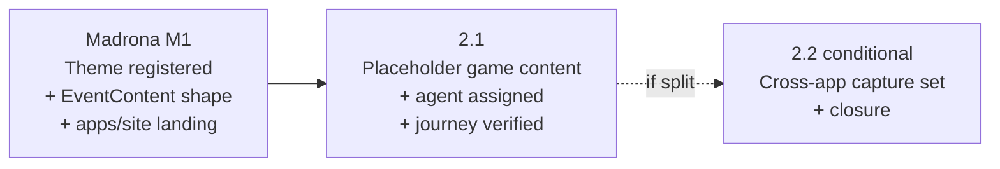

# M2 — Stubbed Full Attendee Journey

## Status

Proposed.

This milestone doc is the durable coordination artifact for M2 of
the Madrona demo-build epic: restated milestone goal, phase
sequencing, cross-phase invariants, cross-phase decisions
(settled-by-default and deferred-to-phase-time), milestone-level
risks, and the doc-currency map M2 must collectively land.
Per-phase implementation contracts live in the phase plan(s)
drafted by the phase planning session(s) that follow this
milestone session.

Per AGENTS.md "Anti-goal: do not scope any phase in this
session," nothing below resolves a per-phase contract, file
inventory, validation procedure, or self-review audit set; those
re-derive at phase planning time against the actually-merged code
at phase-start.

## Goal

Wire the full attendee journey end-to-end against `slug=madrona`
with placeholder game content, such that a stakeholder visiting
`/event/madrona` follows landing → gameplay → completion → redeem
booth handoff to a working set of surfaces.

After M2:

- a published `game_events` row exists for `slug=madrona` with
  placeholder questions and options sufficient to play the game
  end-to-end, such that
  [`shared/events/published.ts:103-171`](/shared/events/published.ts)
  `loadPublishedGameBySlug("madrona")` returns a non-null
  `GameConfig`
  (`Verified by:`
  [shared/events/published.ts:103-171](/shared/events/published.ts)
  for the resolver contract that must succeed;
  [supabase/migrations/20260406130000_add_published_quiz_content.sql](/supabase/migrations/20260406130000_add_published_quiz_content.sql)
  for the `game_events` / `game_questions` / `game_question_options`
  schema the placeholder content lands against;
  [supabase/migrations/20260423010000_rename_live_version_number_to_last_published_version_number.sql:31](/supabase/migrations/20260423010000_rename_live_version_number_to_last_published_version_number.sql)
  for `publish_game_event_draft` — the canonical authoring path
  this content rides, regardless of which surface invokes it)
- at least one identity has `event_role_assignments.role = 'agent'`
  for Madrona, such that the redeem booth surface authorizes the
  agent without falling through to the test-event demo-mode bypass
  (which by epic invariant 3 must not apply to `slug=madrona`)
  (`Verified by:`
  [supabase/migrations/20260421000100_add_event_role_assignments.sql](/supabase/migrations/20260421000100_add_event_role_assignments.sql)
  for the event-role table the assignment lands in;
  [apps/web/src/pages/EventRedeemPage.tsx:435-446](/apps/web/src/pages/EventRedeemPage.tsx)
  for the test-event-only demo-mode-bypass branch that must **not**
  fire for Madrona — non-test slugs flow through the normal
  sign-in path, which is the contract M2's agent assignment
  satisfies)
- the four `/event/madrona*` apps/web surfaces (game, admin,
  redeem, redemptions) render under the registered Madrona
  Theme — apps/web's centralized `<ThemeScope>` wraps inherited
  from demo-expansion epic M1 phase 1.1 already pick up
  `madronaTheme` automatically via the M1-landed registry entry,
  so M2 ships **no** apps/web wrapping change; M2's contribution is
  exercising the wrap end-to-end on a real (non-test) slug
  (`Verified by:`
  [apps/web/src/App.tsx:61-67](/apps/web/src/App.tsx)
  for the admin `<ThemeScope>` wrap pattern; the game, redeem, and
  redemptions wraps follow the same shape at
  [App.tsx:75-77](/apps/web/src/App.tsx),
  [App.tsx:85-109](/apps/web/src/App.tsx),
  [App.tsx:117-141](/apps/web/src/App.tsx))
- cross-app theme-continuity captures cover the apps/web surfaces
  M1 did not touch — M1's continuity gate covered the apps/site
  `/event/madrona` landing only because gameplay was not yet
  wired; M2 extends the capture set to cover gameplay /
  completion / redeem / redemptions under the Madrona Theme on a
  real attendee + agent + organizer journey
  (`Verified by:`
  [docs/plans/epics/madrona-demo-build/m1-brand-foundation.md:243-253](/docs/plans/epics/madrona-demo-build/m1-brand-foundation.md)
  for the M1 cross-app theme-continuity invariant M2 inherits and
  extends)
- `<meta name="robots" content="noindex">` posture (apps/site) and
  the apps/web `X-Robots-Tag: noindex` header continue to apply
  across every Madrona surface; M2 ships no flip and no carve-out
  (`Verified by:`
  [apps/site/events/madrona.ts:41](/apps/site/events/madrona.ts)
  for the apps/site meta;
  [docs/plans/epics/madrona-demo-build/epic.md:384-393](/docs/plans/epics/madrona-demo-build/epic.md)
  for the Risk Register mitigation enforced from M1 onward)
- the demo URL is shareable end-to-end for stakeholder review
  without real Madrona content yet — the gameplay is real
  gameplay, the redeem is real redeem, but the questions, options,
  and reward stay placeholder; M3 owns swapping in real content

M2 does **not** author real Madrona content (M3's scope), does
not register a Theme (M1 already did), does not extend
`EventContent` shape (M1 phase 1.2 already did), does not stand
up a real reward or real money flow (epic Out Of Scope), does
not adopt demo-mode auth bypass for `slug=madrona` (epic
invariant 3 forbids it), and does not ship live-launch
operations (future Madrona-launch sibling epic).

## Phase Status

This table is the milestone-session estimate of phase shape per
AGENTS.md "Plan content is a mix of rules and estimates" and
"PR-count predictions are not contracts." The phase planning
session for each phase re-derives the actual shape against
merged code at phase-start.

| Phase | Title (estimate) | Plan | Status | PR |
| --- | --- | --- | --- | --- |
| 2.1 | Placeholder Madrona game content authored + published; agent assigned; full attendee journey verified end-to-end | [m2-phase-2-1-plan.md](/docs/plans/epics/madrona-demo-build/m2-phase-2-1-plan.md) | In flight | [#188](https://github.com/kcrobinson-1/neighborly-events/pull/188) |
| 2.2 | (Conditional) Cross-app theme-continuity capture set + closure | — | Collapsed into 2.1 | [#188](https://github.com/kcrobinson-1/neighborly-events/pull/188) |

The 1–2 phase estimate matches the epic's Sizing Summary
(M2: 1–2 PRs). The default shape is **single phase**: the work
of authoring placeholder content + assigning an agent + walking
the journey is tightly coupled — splitting it across PRs makes
each half hard to review in isolation (a content-only PR cannot
demonstrate the journey works; a journey-verification PR with
no content has nothing to verify). The phase 2.1 planning
session decides whether the journey-verification capture set is
substantial enough to warrant its own focused PR (the **2-phase
shape** the table above leaves room for). Both shapes satisfy
the milestone goal; the call is review-coherence, not technical
dependency.

A 2.1 split into sub-phases (2.1.1 / 2.1.2) is also authorized
in advance if a phase-time branch test surfaces blast radius
beyond the AGENTS.md "PR-count predictions need a branch test"
thresholds — for example, if placeholder game-content authoring
surfaces a non-test-event-only assumption deeper in the
gameplay or redemption stack that the milestone session did not
anticipate (the trap the cross-phase invariants below name
explicitly).

## Sequencing

Phase dependencies (`A --> B` means A blocks B / B depends on
A):

**Why M1 blocks 2.1.** M2 wires gameplay / redeem against
`slug=madrona`; the slug must already resolve to a registered
Theme and a registered apps/site `EventContent` for the journey
to render coherently. M1's two PRs ([#182](https://github.com/kcrobinson-1/neighborly-events/pull/182),
[#185](https://github.com/kcrobinson-1/neighborly-events/pull/185))
landed both prerequisites and the M1 milestone is `Landed`.
Reversing the order (extending placeholder game content against
an unregistered slug) silently falls back to the warm-cream
platform Theme and produces capture pairs that don't actually
demonstrate Madrona's brand, defeating the milestone's
load-bearing visual check.

**Why 2.2 is conditional.** If 2.1's PR carries the journey-
verification capture set inline alongside the content authoring
and agent-assignment work without exceeding review-coherence
budget, 2.2 collapses into 2.1 and the Phase Status row marks
itself absorbed. If 2.1's diff is already large enough that
adding the capture set would bury the operational details, 2.1
ships content + agent + smoke validation, and 2.2 ships the
formal cross-app continuity capture pairs and the milestone
closure burden (Phase Status flips, milestone-doc Status flip,
epic Sizing Summary reconciliation, doc currency across
README + architecture + product). The collapsing call is owned
by 2.1's planning session, not pre-decided here.

**Independence from sibling milestones.** M3 (real content
authoring) depends on M2's gameplay being wired — M3 swaps in
real bands, real sponsors, real questions, but does not
re-derive the gameplay-publication / agent-assignment / redeem
journey wiring. The donation and feedback child epics, when
they scope, sequence in parallel with M3 per the epic's
Milestone Structure; M2's placeholder content does not
foreclose either child epic's shape needs (epic invariant 2,
restated below).

**Plan-drafting cadence.** Per AGENTS.md "Phase Planning
Sessions" parallel-drafting allowance, 2.1's plan may begin
drafting against M1's already-merged state at any point; 2.2's
plan (if split) drafts in parallel with 2.1's implementation
under the named-input-citation rule. M2's milestone session
records no pending input from outside the epic — every
prerequisite (Theme registry, content shape, apps/site landing,
apps/web ThemeScope wraps, redemption stack including the
test-event-only demo-mode-bypass branch named below) is already
merged and grep-verifiable at phase-start.

## Cross-Phase Invariants

M2 binds the four cross-cutting invariants from the parent
epic verbatim by reference; self-review at every phase walks
each against that phase's diff:

1. **No foreclosure of '27 native series support.** Bands and
   sponsors stay on `EventContent`; entitlements stay
   event-session pairs; redemption agents stay event-scoped via
   `event_role_assignments`; admin authorization stays
   event-scoped; the `/series/*` URL namespace stays unclaimed.
   M2's placeholder game content lands as a single-event row
   (`game_events.slug = 'madrona'`), not as a series-keyed or
   multi-night-keyed row.
2. **No foreclosure of the donation and feedback child epics.**
   Placeholder game content does not introduce questions,
   prompts, or sponsor-fact strings whose phrasing would
   constrain the donation / feedback child epics' content
   surfaces (e.g., a placeholder question whose `sponsor_fact`
   references a donation flow that doesn't exist yet, or whose
   completion copy implies a feedback survey will follow).
3. **Madrona is not a test event.** No `testEvent: true`
   addition to `apps/site/events/madrona.ts`, no inclusion in
   [`shared/events/testEventAllowlist.ts`](/shared/events/testEventAllowlist.ts)
   `TEST_EVENT_SLUGS`, no test-event disclaimer banner, **and
   no demo-mode auth bypass on `slug=madrona`**. The third clause
   is M2's load-bearing check: the redeem / redemptions / admin
   pages each carry a `isTestEventSlug(slug)` branch that opens
   a demo-mode-bypass UI for test events; for Madrona those
   branches must **not** fire, and the journey must instead
   route operators through real authentication.
4. **Every `EventContent` consumer renders gracefully when new
   band and sponsor fields are absent.** M1 phase 1.2 satisfied
   this for the apps/site landing surfaces; M2 reaffirms by
   not regressing — the placeholder game content M2 lands
   does not change `EventContent`, so the test events
   (`harvest-block-party`, `riverside-jam`) continue to render
   byte-for-byte unchanged on apps/site.

(`Verified by:`
[docs/plans/epics/madrona-demo-build/epic.md:143-185](/docs/plans/epics/madrona-demo-build/epic.md))

M2 also adds the following milestone-level invariants — rules
that thread through more than one M2 phase (or the single phase
plus its closure) and surface only when multiple phases interact
or when the gameplay / redemption stack interacts with Madrona
specifically:

- **End-to-end journey is the load-bearing falsifier.**
  After M2, the journey landing → gameplay → completion →
  attendee status polling → agent redeem → organizer monitor
  visibility runs end-to-end against `slug=madrona` on the
  deployed demo URL. A green build, a passing test suite, and
  even a successful capture-pair set do not satisfy this
  invariant — the falsifier is a recorded walkthrough on the
  deployed demo. The phase plan's validation gate names how the
  walkthrough is recorded (capture sequence, log of each step,
  paired against expected state changes).
- **Every test-event-only branch is asserted unfired for
  `slug=madrona`.** The three known sites — `EventAdminPage`,
  `EventRedeemPage`, `EventRedemptionsPage` — each call
  `isTestEventSlug(slug)` to gate a demo-mode-bypass UI. M2's
  self-review asserts each branch is unfired during the Madrona
  walkthrough (operator sign-in flow runs instead). Any **new**
  test-event-only branch introduced between M2 milestone-session
  and M2 implementation surfaces during phase-time grep of
  `isTestEventSlug` and gets its own assertion line. The
  `Verified by:` for this invariant at milestone-session time:
  [apps/web/src/pages/EventRedeemPage.tsx:435-446](/apps/web/src/pages/EventRedeemPage.tsx),
  [apps/web/src/pages/EventAdminPage.tsx:393-396](/apps/web/src/pages/EventAdminPage.tsx),
  [apps/web/src/pages/EventRedemptionsPage.tsx:696-699](/apps/web/src/pages/EventRedemptionsPage.tsx)
  — phase-time grep re-confirms.
- **Cross-app theme-continuity capture covers all four
  Madrona-themed surfaces.** M1's continuity capture pair was
  apps/site `/event/madrona` landing only (because gameplay was
  not yet wired). M2 captures `/event/madrona/game` and at least
  one of `/event/madrona/game/redeem` or
  `/event/madrona/game/redemptions` under operator sign-in,
  paired against the apps/site landing. The continuity check
  inspects tokens that re-evaluate (`--primary`, `--accent`,
  `--secondary`, `--bg`), not derived shades — the same
  finding from demo-expansion epic M1 phase 1.1's
  derived-shade-cascade work
  ([docs/plans/themescope-derived-shade-cascade.md](/docs/plans/themescope-derived-shade-cascade.md)).
  Phase 2.1's plan owns the exact capture set and the freshness
  check (build-id assertion or capture timestamps within N
  minutes of the latest deploy) per demo-expansion epic M1
  phase 1.1's precedent.
- **`noindex` posture preserved across every M2 surface.**
  Apps/site `/event/madrona` carries `meta.robots: "noindex"`
  ([apps/site/events/madrona.ts:41](/apps/site/events/madrona.ts));
  apps/web routes carry `X-Robots-Tag: noindex` via the Vercel
  headers config (existing). M2 ships no flip and no carve-out;
  the milestone-doc rule binds every phase's diff to leave both
  posture mechanisms intact. Phase 2.1's plan walks an `Out Of
  Scope` line confirming `meta.robots` is unchanged on
  `apps/site/events/madrona.ts` and the Vercel headers config
  is unchanged.
- **Placeholder content is content-neutral with respect to
  M3.** Placeholder questions / options / sponsor-fact strings
  M2 authors are deliberately non-canonical: real Madrona
  content is M3's scope. The milestone-level rule is that M2's
  placeholder choices do not constrain M3's authoring (e.g., a
  schema choice that makes M3's real content awkward to land,
  or a placeholder question count that locks M3 into the same
  count). Phase 2.1's plan walks the constraint check explicitly.

**Inherited from upstream invariants.** M2 also inherits the
URL contract, theme route scoping, and theme token discipline
invariants from the predecessor epic
([event-platform-epic.md](/docs/plans/event-platform-epic.md)),
the apps/web ThemeScope-wrap centralization invariant from the
sibling demo-expansion epic
([m1-themescope-wiring.md §Cross-Phase Invariants](/docs/plans/epics/demo-expansion/m1-themescope-wiring.md)),
the in-place auth and trust-boundary invariants from
event-platform-epic, and the published-content schema +
publish-flow invariants from
[`docs/plans/archive/database-backed-quiz-content.md`](/docs/plans/archive/database-backed-quiz-content.md)
and the reward-redemption phase plans
([phase-a-1](/docs/plans/archive/reward-redemption-phase-a-1-plan.md),
[phase-b-1](/docs/plans/archive/reward-redemption-phase-b-1-plan.md),
[phase-c-1](/docs/plans/archive/reward-redemption-phase-c-1-plan.md)).
Self-review walks each against M2's diff even though the diffs
are not expected to touch them.

## Cross-Phase Decisions

### Settled by default

Decisions with a clear default that no scoping pressure
disputes. Recorded so phase planning sessions do not re-derive.

- **Game content authoring schema.** Placeholder game content
  lands in the existing
  `game_events` / `game_questions` / `game_question_options`
  tables via the canonical
  `publish_game_event_draft(text, uuid)` RPC. No new tables,
  no new columns, no parallel publish path
  (`Verified by:`
  [supabase/migrations/20260406130000_add_published_quiz_content.sql](/supabase/migrations/20260406130000_add_published_quiz_content.sql)
  for schema;
  [supabase/migrations/20260423010000_rename_live_version_number_to_last_published_version_number.sql:31](/supabase/migrations/20260423010000_rename_live_version_number_to_last_published_version_number.sql)
  for the publish RPC).
- **Redemption agent assignment.** Manual root-admin SQL
  `INSERT` into `event_role_assignments` per the epic's Risk
  Register mitigation
  ([epic.md:394-400](/docs/plans/epics/madrona-demo-build/epic.md)).
  M2 does not introduce organizer-managed agent assignment;
  that is launch-epic territory if it lands at all.
- **Apps/web ThemeScope wraps.** Inherited from M1 (which
  inherits from demo-expansion epic M1 phase 1.1). The four
  centralized wraps at
  [apps/web/src/App.tsx:61-67 / 75-77 / 85-109 / 117-141](/apps/web/src/App.tsx)
  cover all four event-route shells and pick up Madrona's
  Theme automatically. M2 ships no apps/web wrapping change.
- **Madrona is not a test event.** Reaffirmed from the epic
  (invariant 3) and from M1 (which already settled this for the
  apps/site landing). No `testEvent: true`, no
  `TEST_EVENT_SLUGS` entry, no demo-mode bypass.
- **Existing reward-redemption stack handles non-test slugs.**
  The redemption RPCs (`redeem_entitlement_by_code`,
  `reverse_redemption`), the agent / organizer authorization
  helpers (`is_agent_for_event`, `is_organizer_for_event`,
  `is_root_admin`), and the attendee status-polling hook
  (`useAttendeeRedemptionStatus`) are all event-scoped, not
  test-event-scoped. M2's load-bearing check is that this
  unguarded path holds when exercised against `slug=madrona`;
  the milestone-session hypothesis is that no engineering
  change is needed (the test-event-only branches are limited to
  the three demo-mode-bypass UI gates named in the M2
  invariant). Phase 2.1's reality-check inputs include a
  phase-time grep of `isTestEventSlug` and `testEvent` against
  apps/web/src to falsify the hypothesis before authoring.
- **`noindex` posture mechanism.** Apps/site uses
  `meta.robots: "noindex"` rendered by `generateMetadata`;
  apps/web uses Vercel `X-Robots-Tag: noindex` headers. Both
  are already in place from M1 / prior work; M2 ships no
  change.
- **No new app routes.** M2 does not introduce a new apps/site
  or apps/web route. The four event-route shells
  (`/event/:slug`, `/event/:slug/game`, `/event/:slug/admin`,
  `/event/:slug/game/redeem`, `/event/:slug/game/redemptions`)
  cover the journey.

### Deferred to phase-time

Decisions deferrable to phase planning per AGENTS.md "Defer
rather than over-resolve." Each is named here so phase planning
finds them, with the constraints that bound the resolution
space:

- **Game content authoring surface.** Whether placeholder game
  content lands via (a) the admin-UI flow signed in as a root
  admin or organizer for Madrona, (b) a service-role script that
  invokes `publish_game_event_draft` directly, or (c) a one-off
  seed migration. Constraint: the published row must come from
  the canonical publish path (settled-by-default above), so
  option (c) — a seed migration that bypasses
  `publish_game_event_draft` — is **out of bounds**. The choice
  between (a) and (b) is review-coherence and replayability —
  phase 2.1's planning session owns the call with a reality
  check on the deployed environment shape. **Owned by 2.1.**
- **Placeholder question / option content.** Number of
  questions, type of placeholder content (music-themed
  trivia, generic neighborhood trivia, deliberately-banal
  filler), and sponsor-fact strings. Constraint: M2 invariant
  "placeholder content is content-neutral with respect to M3"
  binds — content does not constrain M3's real authoring. The
  epic's M3 risk register entry on field-shape churn applies.
  **Owned by 2.1.**
- **Phase 2.2 collapse vs. independent ship.** Phase planning
  for 2.1 owns whether the cross-app continuity capture set
  fits inside 2.1's PR or warrants a focused 2.2. The Phase
  Status table above already authorizes the collapse; the
  rationale gets recorded in the phase plan that absorbs the
  closure work.
- **Cross-app theme-continuity capture procedure for the
  apps/web Madrona surfaces.** Capture-pair shape from
  demo-expansion epic M1 phase 1.1 is the working precedent
  ([m1-phase-1-1-plan.md §Validation Gate](/docs/plans/epics/demo-expansion/m1-phase-1-1-plan.md)
  for the eight-capture pattern). M1 of this epic adopted that
  shape for the apps/site landing only; M2's phase plan adopts
  / refines / replaces for the apps/web surfaces. Token-
  inspection target (which token's value is eyeballed) inherits
  the `--primary` / `--accent` / `--secondary` / `--bg`
  guidance from the derived-shade-cascade finding.
- **End-to-end journey walkthrough recording.** How the
  attendee → agent → organizer journey gets recorded for
  posterity and review (linear video, capture sequence,
  state-transition log, paired against expected entitlement
  state changes in the database). Constraint: the M2 invariant
  "end-to-end journey is the load-bearing falsifier" binds —
  whatever shape the recording takes must demonstrate the
  journey ran on the deployed demo, not just locally.
  **Owned by 2.1 (or 2.2 if split).**
- **Agent identity choice.** Which user account gets the
  `event_role_assignments` row for Madrona — a personal
  developer account, a shared demo agent account, a
  service-style account. Constraint: the account must be able
  to sign in via the existing apps/web magic-link flow, which
  rules out service accounts that bypass auth. **Owned by
  2.1.**
- **Whether to also assign an organizer for Madrona during
  M2.** The redemptions monitoring page
  (`/event/madrona/game/redemptions`) requires
  `is_organizer_for_event` or `is_root_admin`. The M2 journey
  exercises the redemptions surface as part of the end-to-end
  walkthrough, so an organizer assignment (or root-admin
  bypass) is needed. The choice between "assign an organizer
  identity" and "use root-admin bypass for the demo phase" is
  phase-time. **Owned by 2.1.**
- **Whether the M2 PR(s) depend on a deployed Madrona event in
  staging vs. production.** The journey verification can run
  against staging (lower stakes, no real-money risk) or
  production (matches the demo URL stakeholders will visit).
  Constraint: the demo URL the epic Goal names is the
  production URL. Phase planning owns the call between
  "validate on staging, replay-equivalent commands on
  production for the demo" and "validate directly on
  production." **Owned by 2.1.**
- **Per-PR commit shape.** Phase plans own commit boundaries
  per AGENTS.md "Plan content is a mix of rules and estimates."
  The milestone doc only commits to phase boundaries.

## Cross-Phase Risks

Risks that span the milestone or surface only at the milestone
level. Phase-level risks live in each phase plan's Risk
Register.

- **Test-event-only branch gates Madrona somewhere unmapped.**
  The milestone-session hypothesis is that the three demo-mode-
  bypass UI gates on the admin / redeem / redemptions pages are
  the only test-event-only sites. If a phase-time grep of
  `isTestEventSlug` / `testEvent` surfaces a fourth site (an
  RPC, a header, a copy branch, a hidden assertion), M2's
  invariant 3 binds it: assert unfired for `slug=madrona` and
  add an explicit assertion line in the phase plan. The
  recurring trap shape: an author seeing a code branch that
  says "show this if test event" and assuming the inverse
  branch handles non-test correctly without verifying the
  inverse renders coherently for a non-test slug. Mitigation:
  the journey walkthrough exercises every surface end-to-end,
  which falsifies any silent-bail branch. Phase 2.1's plan
  binds the grep + walkthrough + invariant 3 audit as a single
  self-review pass.
- **Manual SQL agent assignment forgotten before the demo URL
  is shared.** The agent-assignment step is operational, not
  code; it lives in the phase plan's runbook, not in a CI gate.
  Stakeholders visiting the demo URL would reach the redeem
  surface and hit a sign-in wall the journey is supposed to
  pass; the journey breaks silently for the agent role.
  Mitigation: the phase plan's validation gate names the
  agent-assignment row as a precondition checked **before** the
  recorded walkthrough begins; the plan's Documentation
  Currency entry records the SQL command the runbook executes,
  so it's recoverable if the agent assignment is dropped from
  a future environment refresh.
- **Cross-app theme-continuity false positive from caching or
  CDN propagation.** Same shape as demo-expansion epic M1 phase
  1.1's risk and Madrona M1 phase 1.1's risk; mitigation
  inherits — phase 2.1's validation gate names the freshness
  check (build-id assertion or capture timestamps within N
  minutes of the latest deploys for both apps).
- **Placeholder game content reads as a launch announcement to
  external viewers.** External viewers of the demo URL during
  M2 may misread placeholder questions or sponsor-fact strings
  as a real Madrona quiz. Mitigation: `noindex` keeps the URL
  out of search; the epic's demo-sharing model (share URL
  directly, trust recipients) holds during M2; the apps/site
  landing's first FAQ entry already surfaces the demo posture
  in page-visible copy
  ([apps/site/events/madrona.ts:23-25](/apps/site/events/madrona.ts)
  for the M1 hook). Phase 2.1's plan owns whether placeholder
  game content needs an analogous hook — a question, a
  completion-screen subline, or a redeem-screen subline that
  flags itself as placeholder, or whether the existing
  apps/site disclaimer is sufficient.
- **Re-authoring churn when M3 lands real content.** M2's
  placeholder game content gets fully replaced by M3. If M2's
  placeholder shape (number of questions, sponsor-fact pattern,
  question pacing) is not content-neutral with respect to M3,
  the M3 PR carries unnecessary structural rework on top of
  content swaps. Mitigation: M2 invariant 5 binds; phase 2.1's
  plan walks the constraint check explicitly (e.g., does M2
  pick a question count that locks M3's authoring? does M2
  reference the placeholder bands in a way that requires
  cross-file rewrites when M3 swaps in real bands?).
- **Production publish slips into a non-publish-RPC path.**
  The settled-by-default decision binds publish to
  `publish_game_event_draft`. The trap is a phase-time author
  taking a shortcut — direct INSERT, manual SQL via Supabase
  Studio, edge-function bypass — to skip the draft-validation
  flow. Mitigation: phase 2.1's plan's Documentation Currency
  records the publish path and the validation gate confirms
  via `select` query that the published row carries the
  `published_at`, `event_code`, and version fields the RPC
  populates, not a hand-written subset.
- **Organizer-monitor surface depends on organizer or
  root-admin assignment.** The end-to-end journey's last leg
  is the organizer viewing redemptions on
  `/event/madrona/game/redemptions`. If M2 lands without an
  organizer (or root-admin) identity that can monitor Madrona,
  the journey breaks at the last leg. The deferred-to-phase
  decision above flags this; the risk is the decision being
  forgotten or under-resolved at phase-time. Mitigation: phase
  2.1's plan's validation gate names the organizer-or-root-
  admin precondition explicitly, paired with the agent
  assignment.

## Documentation Currency

The doc updates the M2 set must collectively make. Each is
owned by the phase named below; any phase that lands a partial
update records the remainder under its plan's Documentation
Currency PR Gate. M2 is not complete until all are landed
across the M2 PR set.

- [`docs/plans/epics/madrona-demo-build/epic.md`](/docs/plans/epics/madrona-demo-build/epic.md)
  — the M2 paragraph in Milestone Structure stays prose-form;
  no Milestone Status table exists on this epic to flip
  (`Verified by:`
  [docs/plans/epics/madrona-demo-build/epic.md:213-249](/docs/plans/epics/madrona-demo-build/epic.md)).
  The terminal M2 PR (whichever ships last) reconciles the
  epic's Sizing Summary M2 line with the actual PR count per
  AGENTS.md "Estimate Deviations" if the count differs.
  **Owned by the terminal M2 PR.**
- This milestone doc — Status flips `In draft` → `Proposed`
  before phase 2.1 plan-drafting begins (per AGENTS.md
  promotion gate; this milestone session ends with `Proposed`
  unless phase 2.1's planning session surfaces a pending input
  that demotes it back to `In draft`); Status flips `Proposed`
  → `Landed` in the terminal M2 PR; Phase Status rows update
  as each phase plan drafts and as each phase PR merges.
  **Owned by 2.1 for Phase Status seeding; owned by the
  terminal M2 PR for the Landed flip.**
- [`README.md`](/README.md) — M2 introduces no new attendee-
  visible capability beyond "the Madrona demo URL plays
  through to the redeem booth," which is already implicit in
  the platform's published capability set. Phase 2.1
  re-derives by grep at phase-start; the expectation is no
  edit. **Owned by 2.1; verification may produce no edit.**
- [`docs/architecture.md`](/docs/architecture.md) — M2
  introduces no new architectural surface (no new table, no
  new RPC, no new route, no new wrap, no new shape). Phase 2.1
  re-derives by grep; the expectation is no edit. **Owned by
  2.1; verification may produce no edit.**
- [`docs/product.md`](/docs/product.md) — M2's contribution to
  product framing is "the Madrona demo URL is shareable end-
  to-end" — not yet the real-feeling demo M3 lands. Phase 2.1
  re-confirms the doc's "Initial deployment: Madrona Music in
  the Playfield" framing matches what M2 actually ships (a
  playable but placeholder-content demo, not a launched
  event). **Owned by 2.1; verification may produce no edit.**
- [`docs/operations.md`](/docs/operations.md) — the manual
  agent-assignment SQL runbook entry is M2's first
  operational artifact for Madrona. Phase 2.1's plan owns
  whether the runbook entry lives in `docs/operations.md`,
  inline in the phase plan (transient), or in a focused
  follow-up doc; the constraint is replayability when the
  agent assignment needs to be re-applied (environment
  refresh, agent identity change). **Owned by 2.1.**
- [`docs/backlog.md`](/docs/backlog.md) — phases that surface
  follow-up work (organizer-managed agent-assignment UI
  promotion, additional non-test-event-only branch sites
  surfaced by phase-time grep, M3-anticipated content-shape
  refinements) add backlog entries with rationale. The
  organizer-managed agent assignment item is already in the
  backlog at Tier 4; M2 does not promote it but may add cross-
  references if the manual SQL shape proves friction-heavy
  during the journey walkthrough. **Owned by whichever phase
  surfaces the follow-up.**
- [`docs/open-questions.md`](/docs/open-questions.md) — the
  epic's Open Questions section names the demo-indexing
  posture, '26 → '27 series-promotion triggers, demo-sharing
  model, and donation-processor / 501(c)(3) backing question;
  M2 does not resolve any of these. Phase plans log new open
  questions surfaced during planning into
  `docs/open-questions.md` per AGENTS.md doc currency rules.
  **Owned by whichever phase surfaces a new open question.**

[`docs/dev.md`](/docs/dev.md), [`docs/styling.md`](/docs/styling.md),
[`docs/experience.md`](/docs/experience.md), and the
self-review-catalog ([`docs/self-review-catalog.md`](/docs/self-review-catalog.md))
are not knowingly touched by M2; phase 2.1 plan-drafting
re-verifies by grep against the post-M1 state. M2 introduces
no new local-dev workflow, no token-classification change, no
new attendee-experience principle, and no new self-review
audit shape.

## Backlog Impact

- **Closed by M2.** Nothing in
  [`docs/backlog.md`](/docs/backlog.md). The end-to-end
  Madrona journey is the epic's M2 capability target, not a
  separate backlog item; closure happens at the epic level
  when M3 lands real content and the demo URL is in the state
  the epic Goal describes.
- **Unblocked by M2.** M3 (real Madrona content authoring)
  becomes shippable once M2's gameplay is wired. M3 swaps in
  real bands / sponsors / questions but does not re-derive the
  publish flow / agent assignment / journey wiring M2 lands.
  The donation and feedback child epics — when they scope —
  also benefit from a wired demo URL where their child-epic
  shape additions can be exercised against an end-to-end
  journey.
- **Opened by M2.** Phase plans surface follow-ups via
  `docs/backlog.md` entries with rationale. Anticipated
  candidates: an organizer-managed agent-assignment UI cross-
  reference if the manual SQL shape proves friction-heavy
  during the journey walkthrough; a journey-walkthrough-as-
  smoke-test follow-up if phase-time discovery suggests the
  recorded walkthrough should run as a CI gate (likely
  defers to launch-epic territory, but recording the option
  is honest).

## Related Docs

- [`docs/plans/epics/madrona-demo-build/epic.md`](/docs/plans/epics/madrona-demo-build/epic.md)
  — parent epic. M2 paragraph in Milestone Structure (lines
  223-233), Sizing Summary M2 line, Cross-Cutting Invariants
  this milestone binds, Risk Register entries on manual SQL
  agent assignment and demo-URL premature surfacing.
- [`docs/plans/epics/madrona-demo-build/m1-brand-foundation.md`](/docs/plans/epics/madrona-demo-build/m1-brand-foundation.md)
  — predecessor milestone doc. M2's apps/site landing
  prerequisites (Theme registration, content registration,
  shape extensions, `meta.robots: "noindex"` posture) all
  landed in M1 phases 1.1 / 1.2. M2's cross-app theme-
  continuity capture extends M1's apps/site-only capture set.
- [`docs/plans/event-platform-epic.md`](/docs/plans/event-platform-epic.md)
  — predecessor epic. URL contract, theme route scoping, theme
  token discipline, in-place auth, and trust-boundary
  invariants inherited.
- [`docs/plans/epics/demo-expansion/m1-themescope-wiring.md`](/docs/plans/epics/demo-expansion/m1-themescope-wiring.md)
  — sibling epic's M1 milestone doc; the apps/web ThemeScope
  wrap inheritance and the cross-app capture-pair validation
  precedent both come from here.
- [`docs/plans/epics/demo-expansion/m1-phase-1-1-plan.md`](/docs/plans/epics/demo-expansion/m1-phase-1-1-plan.md)
  — sibling phase plan; canonical reference for the cross-app
  theme-continuity validation procedure phase 2.1 inherits or
  refines.
- [`docs/plans/epics/demo-expansion/m3-demo-mode-auth-bypass.md`](/docs/plans/epics/demo-expansion/m3-demo-mode-auth-bypass.md)
  — sibling milestone doc that landed the test-event-only
  demo-mode-bypass UI gates M2 invariant 3 binds away from
  Madrona; the three call sites
  ([EventAdminPage.tsx:393-396](/apps/web/src/pages/EventAdminPage.tsx),
  [EventRedeemPage.tsx:435-446](/apps/web/src/pages/EventRedeemPage.tsx),
  [EventRedemptionsPage.tsx:696-699](/apps/web/src/pages/EventRedemptionsPage.tsx))
  are the load-bearing assertion sites for M2's invariant.
- [`docs/plans/archive/database-backed-quiz-content.md`](/docs/plans/archive/database-backed-quiz-content.md)
  — published-content schema and PostgREST read path. M2's
  placeholder game content lands against this schema via the
  canonical publish RPC.
- [`docs/plans/archive/quiz-authoring-plan.md`](/docs/plans/archive/quiz-authoring-plan.md)
  — quiz authoring flow; the admin-UI authoring surface phase
  2.1 may invoke as one option for placeholder content
  authoring.
- [`docs/plans/archive/reward-redemption-phase-a-1-plan.md`](/docs/plans/archive/reward-redemption-phase-a-1-plan.md),
  [`docs/plans/archive/reward-redemption-phase-b-1-plan.md`](/docs/plans/archive/reward-redemption-phase-b-1-plan.md),
  [`docs/plans/archive/reward-redemption-phase-c-1-plan.md`](/docs/plans/archive/reward-redemption-phase-c-1-plan.md)
  — redemption stack landings: `event_role_assignments`,
  `redeem_entitlement_by_code`, `useAttendeeRedemptionStatus`.
  M2 inherits all three end-to-end.
- [`apps/site/events/madrona.ts`](/apps/site/events/madrona.ts)
  — Madrona content module landed in M1 phase 1.1; M2 ships
  no edits to this file (the goal section's "Out Of Scope"
  for `meta.robots` and `testEvent` binds the no-edit
  expectation).
- [`apps/site/lib/eventContent.ts`](/apps/site/lib/eventContent.ts)
  — `EventContent` type (M1 phase 1.2 extended); M2 ships no
  edits.
- [`shared/styles/themes/index.ts`](/shared/styles/themes/index.ts),
  [`shared/styles/getThemeForSlug.ts`](/shared/styles/getThemeForSlug.ts)
  — Theme registry and resolver; behavior unchanged in M2.
- [`shared/events/published.ts`](/shared/events/published.ts)
  — `loadPublishedGameBySlug`; the resolver M2's placeholder
  publish satisfies.
- [`shared/events/testEventAllowlist.ts`](/shared/events/testEventAllowlist.ts)
  — test-event allowlist; epic invariant 3 forbids adding
  `madrona` here, M2 reaffirms.
- [`apps/web/src/pages/EventAdminPage.tsx`](/apps/web/src/pages/EventAdminPage.tsx),
  [`apps/web/src/pages/EventRedeemPage.tsx`](/apps/web/src/pages/EventRedeemPage.tsx),
  [`apps/web/src/pages/EventRedemptionsPage.tsx`](/apps/web/src/pages/EventRedemptionsPage.tsx)
  — the three demo-mode-bypass call sites M2 invariant
  "every test-event-only branch is asserted unfired" binds.
- [`apps/web/src/App.tsx`](/apps/web/src/App.tsx) — apps/web
  routing dispatcher; the four `<ThemeScope>` wraps M2
  inherits.
- [`docs/styling.md`](/docs/styling.md) — token-classification
  authority; if M2 surfaces a Madrona-only token-classification
  gap on apps/web surfaces (analogous to demo-expansion epic
  M1 phase 1.1's surfacing on apps/web), one-line corrections
  ship in the phase 2.1 PR; rule-shape ripples surface as
  backlog with rationale.
- [`docs/self-review-catalog.md`](/docs/self-review-catalog.md)
  — audit-name source for each phase plan's Self-Review Audits
  section.
- [`AGENTS.md`](/AGENTS.md) — milestone planning rules,
  Plan-to-PR Completion Gate, Doc Currency PR Gate, "PR-count
  predictions need a branch test," "Plan content is a mix of
  rules and estimates," "Estimate Deviations," promotion gate.
