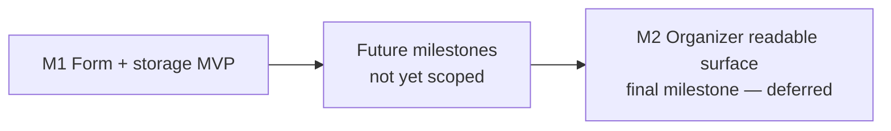

# Madrona Feedback Child Epic

## Status

Proposed. Child of
[`epics/madrona-demo-build/epic.md`](/docs/plans/epics/madrona-demo-build/epic.md);
sequences in parallel with that epic's M3 per its Backlog Impact /
Enables list. This document captures the high-level product
design; milestone and phase shape are deferred to milestone
planning sessions per
[`docs/agents/planning/epic.md`](/docs/agents/planning/epic.md).

## Purpose

Give attendees a low-friction surface to tell the organizer how
the show went, and give the organizer a structured corpus of
ratings + free text they can read after the event to inform the
next show and the next year.

The MVP target is the Madrona '26 demo; the surface is built
generically against `EventContent` so any event slug can opt in.
Generic-by-default is a deliberate hedge against the parent
epic's Cross-Cutting Invariant 2 (don't foreclose the feedback
child epic's shape) — building this Madrona-only would re-impose
the foreclosure.

## Why This Epic

- Madrona '26 is the first real show on the platform. Without a
  feedback surface the organizer learns from hallway conversation
  and memory; with one, '27 planning starts from a corpus of
  attendee voices.
- Ratings + free text together is the load-bearing combination:
  the ratings make trends visible at a glance ("sound quality
  was rough night 2"), the free text explains them ("the wind
  picked up after 8pm").
- Low-friction submission matters more than survey rigor.
  Attendees are on phones, possibly walking back to their car,
  possibly half-paying-attention. A taps-only ratings flow with
  one optional text box clears the bar; a multi-page survey
  does not.

## Goal

Madrona '26 attendees can reach a feedback form from the event
landing page, submit ratings + optional free text + an optional
email in under a minute on a phone, and see a thank-you
confirmation. The organizer can later read ratings and
individual free-text responses through an event-scoped admin
route, including the email + newsletter-opt-in columns needed
for manual newsletter export.

End state for the MVP:

- `/event/<slug>/feedback` route renders a feedback form for any
  event whose `EventContent` opts feedback in, and a friendly
  "feedback isn't being collected for this event" state for
  events that have not opted in.
- The event landing page (`/event/<slug>`) renders an
  `EventFeedbackCTA` section between the existing gameplay
  `EventCTA` and `EventFooter`, linking to the feedback route.
- Form contents: a small set of 1–5 star rating questions
  (each with an N/A option), an optional free-text prompt, an
  email field with a decline checkbox, and a newsletter
  opt-in checkbox. Submission replaces the form in-place with
  a thank-you message.
- Submissions persist to a Supabase table keyed by event slug
  with timestamp, ratings, free text, email + decline flag,
  and newsletter opt-in flag. The schema supports later
  analysis (aggregation per question, free-text read-through,
  manual newsletter export).
- Submissions are durable across the demo phase and the launch
  phase; nothing about the storage shape assumes Madrona-only.

End state out of scope for the MVP (see Out Of Scope below).

## Out Of Scope

- **Per-night ratings on a multi-day event.** Madrona '26 is
  modeled as one event with three days. The MVP collects one
  feedback submission per attendee against the event as a whole;
  per-night ratings (e.g., rate Friday's sound separately from
  Saturday's) is a candidate Madrona '27 trigger
  (parent epic Open Questions §"Madrona '26 → '27 series-promotion
  triggers"), not MVP scope.
- **Identity / login required to submit.** The MVP is
  submission-without-auth. The email field is the only
  identifier path and is itself optional via the decline
  checkbox; no name field, no login gate.
- **Real-time organizer dashboard.** Organizer reads through a
  static admin surface or direct table query; live aggregation
  UI is out of scope.
- **Feedback moderation surface.** The MVP assumes the audience
  is small and friendly enough that an organizer-eyes-only
  read-through is sufficient. Public display of feedback,
  abuse-flagging UI, and edit/delete tooling are out of scope.
- **Cross-event aggregation.** The organizer reads feedback per
  event slug; cross-event trend views are out of scope.
- **Sentiment analysis or LLM summarization of free text.** The
  organizer reads the responses themselves; automated summary is
  not MVP.
- **Email or push followups.** The MVP does not solicit feedback
  via email or push, does not confirm via email, and does not
  follow up on submissions.

## Cross-Cutting Invariants

1. **Generic by event slug, not Madrona-specific.** The route,
   table, components, and `EventContent` shape additions key off
   `slug` and behave for any event whose content opts feedback
   in. A Madrona-only feedback page would re-foreclose the
   parent epic's Invariant 2 in the opposite direction.
2. **Optional opt-in on `EventContent`.** Events that have not
   opted feedback in render no landing-page CTA. The route
   `/event/<slug>/feedback` itself renders a friendly
   "feedback isn't being collected for this event" state
   rather than 404ing, so a stale or guessed link lands
   somewhere humane. The route is owned by apps/site via
   the catch-all `/event/:slug/:path*` rewrite to the
   neighborly-events-site origin (Verified by:
   [`apps/web/vercel.json:23-26`](/apps/web/vercel.json)),
   making the friendly state a Next.js page render in
   apps/site rather than an apps/web SPA route. Existing test
   events (`harvest-block-party`, `riverside-jam`) render
   unchanged (Verified by:
   [`apps/site/events/harvest-block-party.ts`](/apps/site/events/harvest-block-party.ts),
   [`apps/site/events/riverside-jam.ts`](/apps/site/events/riverside-jam.ts);
   neither sets a `feedback` field on `EventContent`, so the
   default-omitted CTA section honors the invariant by
   construction).
3. **Ratings questions are content, not code.** The set of
   rating dimensions (music, sound, park, website, ...) is
   authored on `EventContent`, not hardcoded in the form
   component. Per-event dimension keys are content-authored
   (any string the event author writes), explicitly *not* a
   stable platform-wide enum. Madrona '26 picking
   `music_choice` does not reserve that key, prescribe its
   shape, or constrain other events' choices — a future event
   is free to author entirely different dimensions, the same
   labels under different keys, or the same keys with
   different meanings. Cross-event aggregation is therefore
   manual / human-read, not automatic, and that is the
   deliberate trade.
4. **Submissions are durable and analyzable.** Ratings are
   stored as integers 1–5 with a sentinel for N/A under the
   content-authored dimension keys (Invariant 3); free text
   is stored as-is. The schema survives the per-event
   dimension set evolving across years because keys are
   per-event and aggregation is per-event.
5. **Anti-abuse posture is named, not skipped.** The MVP's
   submission shape (anonymous, no captcha, single Supabase
   insert) is a deliberate trade-off for friction, not an
   oversight; the Risk Register names what we accept and what
   the launch epic may need to revisit.
6. **Submissions accepted only for known feedback-enabled
   events, enforced at the database.** The submission write
   is reachable from an unauthenticated origin-gated endpoint
   (the Next.js feedback page), so per
   [`AGENTS.md:125-130`](/AGENTS.md) the epic must answer
   what prevents arbitrary or nonexistent data before
   implementation. Answer: the `feedback_submissions` table's
   `event_slug` column carries DB-level referential integrity
   to a server-side registry of feedback-enabled event slugs
   (foreign key to a `feedback_enabled_events` table, or
   equivalent — exact SQL mechanic deferred to milestone
   planning, but the invariant binds). An insert against a
   slug not in the registry MUST fail at the database, not
   only at the application layer. Concretely this means: the
   M1 migration introduces both the submissions table and the
   feedback-enabled-events registry in the same change;
   opting an event in is a registry insert; the disabled-event
   promise is enforced by FK, not by client-side route
   gating; and an attacker who hits the Supabase REST endpoint
   directly with arbitrary slugs gets database errors, not
   stored rows. Application-layer client validation is fine
   as a UX layer on top, but it is not the load-bearing
   enforcement.

## Product Surface

### Attendee path

1. Attendee finishes the show (or the redeem booth flow, or
   reads the landing page later that night).
2. On `/event/<slug>` they see a small `EventFeedbackCTA`
   section rendered between the existing `EventCTA` (gameplay)
   and `EventFooter`, with copy like "How was the show? Tell
   us what you liked or didn't" and a link to
   `/event/<slug>/feedback`. The current section render order
   on the landing page is Header → Schedule → Lineup →
   Sponsors → FAQ → CTA → Footer (Verified by:
   [`apps/site/components/event/EventLandingPage.tsx:27-42`](/apps/site/components/event/EventLandingPage.tsx));
   the feedback CTA slots in between the existing CTA and
   Footer. Visual weight is intentionally below the gameplay
   CTA so feedback doesn't steal attention from the headline
   action pre- and during-event; the placement keeps it
   findable for post-event scrollers, who are the primary
   audience anyway. Section omission rule matches the other
   section components — the renderer omits the section when
   the `EventContent` field is empty / absent (Verified by:
   the `length > 0` guards on `schedule.days`, `lineup`,
   `sponsors`, and `faq` at
   [`apps/site/components/event/EventLandingPage.tsx:30-39`](/apps/site/components/event/EventLandingPage.tsx))
   — so events that don't opt feedback in render unchanged.
3. The feedback page presents the rating questions as labeled
   1–5 star rows, each with an N/A option. Tapping a star sets
   the rating; tapping N/A clears stars and marks the row N/A.
4. Below the ratings, an optional free-text box: "Anything
   specific you'd like the organizer to hear?" (exact copy is
   a milestone-planning call).
5. **Email ask.** A prominent email field with copy that pushes
   for it ("Email — so we can follow up if you want"), plus
   two checkboxes:
   - "I'd rather not share my email" — when checked, hides /
     disables the email field and lets submission proceed
     without one. Default unchecked; the design pushes for the
     email rather than treating opt-out as the path of least
     resistance.
   - "Add me to the Madrona Neighborhood Association
     newsletter." Default unchecked (opt-in, not opt-out — see
     Risk Register on consent posture). Disabled / hidden when
     the decline-email checkbox is checked, since there's no
     address to add.
6. Submit button. After submission, the form is replaced
   in-place with a short thank-you message ("Thanks — we read
   every response"). No redirect, no further nudges.

### Organizer path

The organizer reads submissions after the event through an
event-scoped admin route under `/event/<slug>/admin/feedback`,
shipped in M2. `/event/:slug/admin/:path*` is owned by apps/web
via the rewrite to the SPA's `/index.html` (Verified by:
[`apps/web/vercel.json:11-18`](/apps/web/vercel.json)), so the
feedback admin lives in apps/web alongside the existing
event-scoped `EventAdminPage` (Verified by:
[`apps/web/src/pages/EventAdminPage.tsx:288`](/apps/web/src/pages/EventAdminPage.tsx)
and the route dispatch in
[`apps/web/src/App.tsx:57-68`](/apps/web/src/App.tsx)). The
route renders per-dimension rating distributions, a list of
free-text responses in submission order, and a filter /
export view of newsletter opt-in rows (email + submitted_at)
for the manual newsletter export. Gated on sign-in plus the
organizer-or-admin role, reusing `EventAdminPage`'s
session-state + event-scope auth pattern (Verified by:
`EventAdminPage.tsx:287` doc comment naming the gate as
"sign-in plus organizer-or-admin role," and the
`useEventAdminWorkspace` wiring at line 205).

During the M1 demo phase before M2 ships, the organizer reads
via Supabase Studio. Studio access is the unblock path, not
the long-term surface.

### Rating dimensions (initial, authored per event)

Madrona '26 starting set, subject to revision in milestone
planning:

- **Music choice** — how the band lineup landed.
- **Sound quality** — mix, volume, intelligibility.
- **Park experience** — atmosphere, layout, comfort, vibes.
- **Website experience** — landing page, game, redeem booth.
- **Overall** — single summary rating.

Plus probably 1–2 more surfaced in milestone planning (food /
vendors? volunteer interactions? the scavenger game
specifically?). The point of authoring on `EventContent` is
that the set can shift without code changes.

## Data Shape (sketch, not contract)

Two tables land together in the M1 migration so the integrity
invariant (Cross-Cutting Invariant 6) holds from the first
write:

`feedback_enabled_events` — server-side registry of which
event slugs accept submissions. Roughly:

- `slug` — text, primary key
- (additional columns deferred to milestone planning, e.g.
  `enabled_at`, opt-in metadata; the load-bearing column is
  `slug`)

`feedback_submissions` — keyed by event slug, roughly:

- `id` — uuid primary key
- `event_slug` — text, foreign key to
  `feedback_enabled_events(slug)`, indexed. The FK is the
  load-bearing enforcement of Invariant 6 — inserts against
  unregistered slugs fail at the database.
- `submitted_at` — timestamptz, default now()
- `ratings` — jsonb keyed by rating-dimension key, values
  `1..5 | "n/a"`
- `free_text` — text, nullable
- `email` — text, nullable (null when attendee declined)
- `email_declined` — boolean, true when the decline checkbox
  was checked (distinguishes "declined to share" from "left
  blank by accident / didn't reach the field")
- `newsletter_opt_in` — boolean, default false. True only when
  the attendee checked the newsletter box AND provided an
  email. Stored on the same row as the feedback so the consent
  context (when, against which event) is preserved alongside
  the address.

RLS posture, set in the M1 migration alongside the tables:
anonymous inserts into `feedback_submissions` are permitted
(the form is unauthenticated by design); reads are gated on
sign-in plus the organizer-or-admin role per the existing
event-scoped admin auth pattern; the `feedback_enabled_events` registry is
read-restricted from anon (anon doesn't need to enumerate it
— the FK does the enforcement on insert) and write-restricted
to service-role / admin paths. Exact policy SQL is a
milestone-planning detail; the shape of the policy is fixed
here.

Final column types are milestone-planning calls. The
rating-dimension key strategy is settled (content-authored
per-event, see Resolved Decisions).

`EventContent` adds an optional `feedback?: { enabled: true;
ratingDimensions: { key: string; label: string }[]; ... }`
shape — exact field names deferred to milestone planning, and
chosen so they don't collide with the donation child epic's
shape (parent Invariant 2 again).

## Milestone Structure (estimate, pending milestone planning)

Per [`docs/agents/planning/epic.md`](/docs/agents/planning/epic.md),
this section is an estimate; phase counts and per-phase
content are re-derived at each milestone planning session.
Where a milestone doc exists, that doc is canonical; the epic
paragraph is historical record.

**M1 is the immediate next milestone. M2 (organizer-readable
surface) is the final milestone of this epic and is explicitly
deferred** — sequenced after every other milestone, including
any additional milestones the epic adds between M1 and M2.
The M2 milestone doc that exists today carries Status
`Deferred` per
[`docs/agents/planning/shared.md`](/docs/agents/planning/shared.md)
"`Deferred` status for paused planning"; the doc is preserved
as **non-prescriptive historical research**, not as a binding
contract. The future planning session that turns M2 into the
next-up milestone flips Status `Deferred` → `In draft` and
re-derives goal / sequencing / decisions / risks against the
actually-merged code at that time, not bound by what's
recorded there (`Verified by:` the `Deferred` Status block at
[`m2-organizer-readable-surface.md`](/docs/plans/epics/madrona-feedback/m2-organizer-readable-surface.md)).

The form-and-storage MVP and the organizer surface do not
collapse into one even if the second is small, since the
demo-phase value of M1 is realized whether or not M2 has
shipped, and forcing them together would couple two
independent UI-review surfaces.

**M1 — Form and storage MVP.** Milestone doc:
[`m1-form-and-storage-mvp.md`](/docs/plans/epics/madrona-feedback/m1-form-and-storage-mvp.md)
(canonical; estimate paragraph below preserved as historical
record). Capability target: a Madrona
attendee can submit feedback at `/event/madrona/feedback` and
the submission lands in Supabase. `EventContent` shape
extension; the new `EventFeedbackCTA` section component +
landing-page wiring; the feedback route + form component
(ratings, free text, email field, decline-email checkbox,
newsletter opt-in checkbox); the friendly disabled-event
state at the route; light client-side email validation;
Supabase migration introducing both `feedback_enabled_events`
(registry, FK target) and `feedback_submissions` (the FK
holder) along with their RLS policies — landing both tables
in the same migration is what makes Invariant 6's DB-level
integrity hold from the first write; `madrona` registered as
a feedback-enabled event in that migration; `madrona.ts`
opts feedback in on the content side with the initial rating
dimension set. No organizer UI yet — the organizer reads via
Studio for the demo phase.

**M2 — Organizer-readable surface (Status `Deferred`; final
milestone).** Capability target: the organizer reads ratings
and free text through a UI rather than Studio, including the
email + newsletter opt-in columns so manual newsletter export
is a copy-paste away. The shape sketched here — admin route
gated on sign-in plus the organizer-or-admin role, per-dimension
rating distributions, free-text list, filterable / exportable
view of newsletter opt-in rows — is the
**non-prescriptive historical sketch**, not a settled
contract. M2's milestone planning session reopens cleanly when
M2 becomes the next-up milestone (Status flips `Deferred` →
`In draft`) and is not bound by the choices preserved in
[`m2-organizer-readable-surface.md`](/docs/plans/epics/madrona-feedback/m2-organizer-readable-surface.md).
Sequenced last because M2 is operational convenience layered
on top of the demo-phase deliverables (M1 plus any intervening
milestones), and the demo-phase value of M1 is realized
whether or not M2 has shipped.

## Backlog Impact

**Closes:** nothing in [`docs/backlog.md`](/docs/backlog.md).
Backlog scan at promotion surfaced no attendee-feedback items
(Verified by: `grep -n -i feedback docs/backlog.md` returned
hits at lines 85, 189, 198 only). Those hits refer to UI
feedback for logging
([`docs/backlog.md:85`](/docs/backlog.md)) and to
organizer/admin shape informed by partner feedback
([`docs/backlog.md:189`](/docs/backlog.md),
[`docs/backlog.md:198`](/docs/backlog.md)) — not attendee
feedback collection.

**Sequences toward:** future Madrona-launch epic, which
inherits the option to revisit the anti-abuse posture against
real-attendee volume.

## Risk Register

- **Spam / abuse on an anonymous, captcha-less form.** The
  feedback page hosts an anonymous Supabase insert; anyone
  with the URL — or with the Supabase REST endpoint and a
  feedback-enabled slug — can submit. Two faces of the risk,
  separately mitigated:
  - **Discovery via search.** The demo phase serves
    `X-Robots-Tag: noindex, nofollow` on `/event/madrona/*`
    (Verified by:
    [`apps/web/vercel.json:59-64`](/apps/web/vercel.json))
    so the URL is not surfaced by search engines.
  - **Direct attack against a known slug.** Once a slug is
    in the feedback-enabled registry, the FK from
    `feedback_submissions.event_slug` (Invariant 6) does
    not slow spam against that slug — it only stops
    fabricated / unregistered slugs. Accepted for MVP: the
    Madrona '26 audience is small and known and the
    organizer can purge garbage rows post-event. The launch
    epic revisits if real volume surfaces real abuse.
- **Rating-dimension drift between Madrona '26 and '27 breaks
  aggregation.** If '27 reuses '26's keys with shifted meaning,
  or picks new ones, automatic year-over-year comparison gets
  ugly. Accepted: per Resolved Decisions the keys are
  content-authored per-event and aggregation is per-event;
  cross-year comparison happens at the human-read level, not
  aggregated. The trade buys other events the freedom to
  author whatever dimensions fit them.
- **Landing-page CTA competes with the gameplay CTA.** The
  landing page already steers attendees toward the game.
  Adding a feedback CTA risks visual clutter or steering
  attention away from gameplay during the live event.
  Mitigation: per Resolved Decisions the `EventFeedbackCTA`
  section sits between `EventCTA` and `EventFooter` with
  visual weight intentionally below the gameplay CTA; M1
  UI-review captures verify the gameplay CTA still leads.
- **Anonymous submission means no per-attendee dedupe.** One
  attendee can submit ten times. Accepted: no dedupe and no
  rate-limiting in this epic. The Madrona '26 audience is
  small enough that the organizer can spot duplicate-looking
  submissions when reading through; introducing per-session
  or per-IP fingerprinting trades privacy for a problem we
  don't have yet.
- **Free text contains PII or names other attendees.** The
  organizer reads it; nobody else does in MVP. Mitigation: the
  organizer-readable surface is auth-gated; any future
  public-facing display of feedback is explicitly out of scope.
- **Newsletter consent is load-bearing legally.** Newsletter
  opt-in is opt-in (default unchecked, explicit affirmative
  action), not opt-out, and it's stored alongside the
  submission so we have a record of when and against which
  event the address was collected. Pre-checking the box would
  make the consent record useless. The organizer's downstream
  newsletter tool must respect unsubscribes; that's out of
  this epic's scope but named so it isn't forgotten.
- **Email field as dark pattern.** Pushing for an email and
  burying the decline checkbox would harm trust. Mitigation:
  the decline checkbox is visible and labeled in plain
  language; submission without an email is a first-class path,
  not a hidden one. The "push" is in copy and visual weight,
  not in friction asymmetry.

## Open Questions

(None at the epic level. Surface anything that comes up in
milestone planning back here if it turns out to be load-bearing
across milestones.)

## Resolved Decisions

Decisions locked at the epic level so milestone planning
inherits them rather than re-litigating:

- **Disabled-event behavior:** friendly "feedback isn't being
  collected for this event" state at `/event/<slug>/feedback`,
  not 404.
- **Rating-dimension key strategy:** content-authored
  per-event keys; no platform-wide enum. Madrona's choices do
  not constrain other events. Cross-event aggregation is
  manual.
- **CTA placement:** new `EventFeedbackCTA` section between
  the existing `EventCTA` (gameplay) and `EventFooter`, with
  visual weight below the gameplay CTA. Section omitted when
  feedback isn't opted in.
- **Submission rate-limiting / per-device dedupe:** none, in
  this epic and in the launch epic absent a concrete abuse
  signal.
- **Newsletter delivery pipeline:** manual export by the
  organizer post-event. No automated sync to a newsletter
  tool from this epic.
- **Email validation:** light client-side check only
  (presence of `@` and a dot, non-empty domain segment); no
  deliverability or DNS check.
- **Milestone count:** at least two. M1 (form + storage) and
  M2 (organizer surface) do not collapse.
- **No name field.** The form collects ratings, free text,
  email, and the two checkboxes — that is the complete field
  set. Email is the only identifier path; a separate name
  field is not added in this epic.
- **Confirmation state:** stay on the feedback route after
  submission and replace the form with a short thank-you
  message. No redirect, no game-pivot, no email confirmation.
  Exact copy is a milestone-planning detail.

## Related Docs

- [`m1-form-and-storage-mvp.md`](/docs/plans/epics/madrona-feedback/m1-form-and-storage-mvp.md) —
  M1 milestone doc; canonical phase shape, cross-phase
  invariants, cross-phase decisions (settled-by-default and
  deferred-to-phase-time), risks, and doc-currency map for
  the form-and-storage MVP milestone.
- [`epics/madrona-demo-build/epic.md`](/docs/plans/epics/madrona-demo-build/epic.md) —
  parent demo-build epic; this epic sequences parallel with its
  M3 and inherits Cross-Cutting Invariant 2 ("don't foreclose
  feedback child epic shape") as a hard constraint on
  `EventContent` field choices.
- [`docs/product.md`](/docs/product.md) — product overview;
  attendee feedback is named as a deferred Madrona deliverable.
- [`docs/experience.md`](/docs/experience.md) — attendee UX
  principles the form's friction posture honors.
- [`AGENTS.md`](/AGENTS.md) — agent behavior, planning depth,
  In draft → Proposed promotion gate.
- (Future, not yet authored) sibling Madrona donation child
  epic — shares the parent's Invariant 2 constraint on
  `EventContent` field naming.
