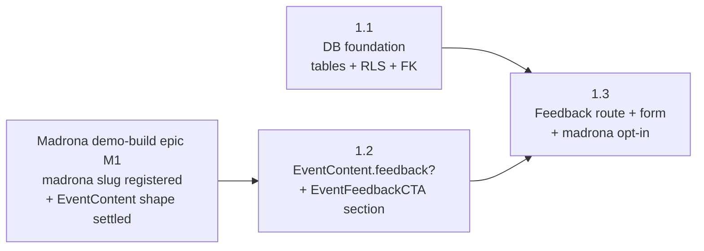

# M1 — Form and Storage MVP

## Status

Landed.

This milestone doc is the durable coordination artifact for M1 of
the [Madrona feedback child epic](/docs/plans/epics/madrona-feedback/epic.md):
restated milestone goal, phase sequencing, cross-phase invariants,
cross-phase decisions (settled-by-default and deferred-to-phase-time),
milestone-level risks, and the doc-currency map M1 must collectively
land. Per-phase implementation contracts live in the phase plan(s)
drafted by the phase planning session(s) that follow this milestone
session.

Per [`docs/agents/planning/milestone.md`](/docs/agents/planning/milestone.md)
"Anti-goal: do not scope any phase in this session," nothing below
resolves a per-phase contract, file inventory, validation procedure,
or self-review audit set; those re-derive at phase planning time
against the actually-merged code at phase-start.

## Goal

Build the form-and-storage MVP such that a Madrona '26 attendee can
reach `/event/madrona/feedback` from the event landing page, submit
ratings + optional free text + optional email + an optional newsletter
opt-in in under a minute on a phone, and see a thank-you state
in-place — and the submission persists to Supabase against a schema
whose integrity is enforced at the database, not in the application
layer.

After M1:

- Two tables exist in Supabase: `feedback_enabled_events` (slug
  registry, FK target) and `feedback_submissions` (the FK holder),
  landed in a single migration so the integrity invariant
  (epic Cross-Cutting Invariant 6) holds from the first write.
  RLS posture lands in the same migration: anonymous insert into
  `feedback_submissions` allowed; reads gated on the existing
  organizer-or-admin predicate shape
  `public.is_organizer_for_event(<event-id>) OR public.is_root_admin()`
  inherited from the M2-phase-2.1 broadened-RLS migration;
  `feedback_enabled_events` is read-restricted from anon and
  write-restricted to service-role / admin paths.
  (`Verified by:` epic Cross-Cutting Invariant 6 at
  [docs/plans/epics/madrona-feedback/epic.md:155-177](/docs/plans/epics/madrona-feedback/epic.md);
  the AGENTS rule the invariant binds at
  [AGENTS.md:125-130](/AGENTS.md);
  the helper definitions at
  [supabase/migrations/20260421000200_add_event_role_helpers.sql:23-47](/supabase/migrations/20260421000200_add_event_role_helpers.sql);
  the canonical broadened-predicate shape at
  [supabase/migrations/20260427010000_broaden_event_scoped_rls.sql:31-32](/supabase/migrations/20260427010000_broaden_event_scoped_rls.sql))
- `EventContent` carries an optional `feedback?` field whose presence
  opts an event in to the feedback surface. Field-name specificity
  preserves epic Invariant 2 (no foreclosure of donation child epic
  shape). Existing test events `harvest-block-party` and
  `riverside-jam` continue to render the same section set
  with no new section sprouting.
  (`Verified by:` the existing additive-optional discipline already
  documented for lineup / sponsor depth fields at
  [apps/site/lib/eventContent.ts:49-71](/apps/site/lib/eventContent.ts);
  the existing render-when-present guards at
  [apps/site/components/event/EventLandingPage.tsx:30-39](/apps/site/components/event/EventLandingPage.tsx))
- A new `EventFeedbackCTA` section component renders between
  `EventCTA` and `EventFooter` on `/event/<slug>` for any event whose
  `EventContent.feedback` is present, omitted otherwise. Section
  omission rule matches the existing renderer pattern.
  (`Verified by:`
  [apps/site/components/event/EventLandingPage.tsx:27-42](/apps/site/components/event/EventLandingPage.tsx)
  for the section-component composition + `length > 0` omission
  pattern this extends)
- A `/event/<slug>/feedback` route renders the feedback form for any
  event opted in, and a friendly "feedback isn't being collected for
  this event" state for any other slug. The route lives in apps/site
  per the `/event/:slug/:path*` rewrite to the neighborly-events-site
  origin. (`Verified by:`
  [apps/web/vercel.json:23-26](/apps/web/vercel.json))
- The form collects: per-dimension 1–5 star ratings (each with N/A),
  one optional free-text prompt, an optional email field, and a
  newsletter opt-in checkbox (visible at all times; disabled while
  the email field is empty). A blank email at submit is the implicit
  decline. Submit replaces the form in-place with a thank-you
  message; no redirect. (Original M1 form shipped a separate "I'd
  rather not share my email" checkbox; the post-landing UX revamp
  swapped to blank-as-implicit-decline — see m1-phase-1-3-plan.md
  Status block.)
- The phase 1.1 migration registers `madrona` in
  `feedback_enabled_events` as part of the schema-creation change,
  per epic Invariant 6's "the M1 migration introduces both the
  submissions table and the feedback-enabled-events registry in the
  same change... `madrona` registered as a feedback-enabled event
  in that migration." (`Verified by:`
  [docs/plans/epics/madrona-feedback/epic.md:155-177](/docs/plans/epics/madrona-feedback/epic.md)
  for Invariant 6;
  [docs/plans/epics/madrona-feedback/epic.md:344-360](/docs/plans/epics/madrona-feedback/epic.md)
  for the M1 sketch's "in that migration" claim)
- `apps/site/events/madrona.ts` opts feedback in (phase 1.3) with
  the initial rating-dimension set (Music choice, Sound quality,
  Park experience, Website experience, Overall, plus any additions
  surfaced in phase planning). The route + form ship in the same
  phase. Until 1.3 lands, the route does not exist; the FK is
  satisfied for `madrona` from the moment 1.1 ships, but no surface
  reaches it from inside the app.
- `X-Robots-Tag: noindex, nofollow` continues to apply to the
  feedback surface — the existing madrona-scoped header already
  covers `/event/madrona/feedback` because it matches
  `/event/madrona/:path*`. (`Verified by:`
  [apps/web/vercel.json:60-64](/apps/web/vercel.json))

M1 does not ship an organizer UI (M2's scope). During M1 the
organizer reads via Supabase Studio. Organizer-readable surface,
per-dimension distributions, free-text list, and newsletter
opt-in export view are explicitly M2.

## Phase Status

This table is the milestone-session estimate of phase shape per
[`docs/agents/planning/shared.md`](/docs/agents/planning/shared.md)
"Plan content is a mix of rules and estimates" and
[`docs/agents/planning/milestone.md`](/docs/agents/planning/milestone.md)
"PR-count predictions are not contracts." The phase planning session
for each phase re-derives the actual shape against merged code at
phase-start.

| Phase | Title | Plan | Status | PR |
| --- | --- | --- | --- | --- |
| 1.1 | DB foundation: `feedback_enabled_events` + `feedback_submissions` migration with RLS, seeding `madrona` into the registry | [m1-phase-1-1-plan.md](/docs/plans/epics/madrona-feedback/m1-phase-1-1-plan.md) | Landed | [#205](https://github.com/kcrobinson-1/neighborly-events/pull/205) |
| 1.2 | `EventContent.feedback?` shape + `EventFeedbackCTA` section component + landing-page wiring | [m1-phase-1-2-plan.md](/docs/plans/epics/madrona-feedback/m1-phase-1-2-plan.md) | Landed | [#213](https://github.com/kcrobinson-1/neighborly-events/pull/213) |
| 1.3 | `/event/<slug>/feedback` route + form component + `madrona.ts` feedback opt-in | [m1-phase-1-3-plan.md](/docs/plans/epics/madrona-feedback/m1-phase-1-3-plan.md) | Landed | [#217](https://github.com/kcrobinson-1/neighborly-events/pull/217) (1.3.1), [#219](https://github.com/kcrobinson-1/neighborly-events/pull/219) (1.3.2) |

The 3-phase split is solid; the milestone doc does not authorize
a collapse. The split is: 1.1 lands the data-layer foundation
(both tables, RLS, FK, and the `madrona` registry seed in one
migration per epic Invariant 6 "the M1 migration introduces both
the submissions table and the feedback-enabled-events registry in
the same change"); 1.2 lands the type-and-section-component
changes against events that haven't opted in (so test events
render unchanged and no CTA appears anywhere yet); 1.3 lands the
route + form and opts madrona in on the content side, which is
the moment the CTA renders on `/event/madrona` and the form
becomes reachable from the landing page. (`Verified by:` epic
Cross-Cutting Invariant 6 at
[docs/plans/epics/madrona-feedback/epic.md:155-177](/docs/plans/epics/madrona-feedback/epic.md);
M1 sketch at
[docs/plans/epics/madrona-feedback/epic.md:344-360](/docs/plans/epics/madrona-feedback/epic.md))

A 1.3 split into sub-phases is authorized if the route + form +
content opt-in chunk exceeds the
[`docs/agents/planning/phase.md`](/docs/agents/planning/phase.md)
"PR-count predictions need a branch test" thresholds — recorded
as an Estimate Deviation in the absorbing phase's plan and PR.
The 1.2 / 1.3 collapse is **not** authorized at the milestone
level: 1.2's purpose (verify the type extension and CTA omission
guard against test events with no event opted in) loses its
falsifier if it lands in the same PR as madrona's content opt-in,
because there's no longer a "no event opts in" intermediate state
to capture.

## Sequencing

Phase dependencies (`A --> B` means A blocks B / B depends on A):

**Why 1.1 and 1.2 are independent.** The DB migration touches
Supabase only; the type-and-section-component changes touch
apps/site only. Neither references the other's artifacts —
the form's submission wiring is the first surface that reads
both, and that wiring lives in 1.3. Drafting 1.1 and 1.2 in
parallel is allowed under
[`docs/agents/planning/phase.md`](/docs/agents/planning/phase.md)
"Next-phase drafting allowed during prior-phase implementation"
because there is no implementation-coupling between them.

**Why 1.3 depends on both.** The form's Supabase insert needs
the tables; the form's CTA entry point needs the section
component and the EventContent field. Reversing — landing the
form before the migration — would either ship a route that
errors on submit, or force application-layer-only enforcement
of Invariant 6 (the rule the invariant explicitly forbids).

**Why no broken intermediate state at any 1.x boundary.** Each
phase ships a coherent state of the world:

- After 1.1: tables exist, RLS allows anonymous insert against
  registered slugs, `madrona` is registered. No write path
  exists in the app — no route, no form, no client code that
  reaches the table. The Supabase REST endpoint accepts a
  well-formed insert against `event_slug = "madrona"` from any
  caller, but discovery of the slug-as-feedback-enabled is
  bounded by the `noindex` posture and the absence of any
  client-side reference to the table; the open-window risk is
  the same shape as the post-1.3 steady-state risk the epic's
  Risk Register already accepts (anonymous, captcha-less form
  on a known slug).
- After 1.2: `EventContent.feedback?` is optional and no event
  opts in. `EventFeedbackCTA` is defined and wired into
  `EventLandingPage` but renders for no event because none have
  set the field. Test events render the same section set with
  no new section sprouting (no `EventFeedbackCTA` heading,
  copy, or markup reachable).
  No `/event/<slug>/feedback` route exists.
- After 1.3: the route lives in apps/site; madrona's content
  module opts feedback in (CTA renders on `/event/madrona`,
  pointing at the route); the form submits against the
  already-registered `madrona` slug; any other slug renders the
  friendly disabled-event state at the route.

**Independence from sibling milestones.** M2 (organizer-readable
surface) depends on M1 because the admin route reads the tables
M1 creates and inherits the auth posture M1 sets in RLS.

**Independence from the parent demo-build epic.** This child
epic's M1 sequences in parallel with the demo-build epic's M3
per the parent epic's Backlog Impact / Enables list. The
demo-build M1 (which already shipped — `madrona` slug
registered, `madronaContent` module exists, page route renders)
is the upstream prerequisite (`Verified by:`
[apps/site/lib/eventContent.ts:127-144](/apps/site/lib/eventContent.ts)
for `madronaContent` registration; the
[Madrona demo-build epic M1 milestone doc](/docs/plans/epics/madrona-demo-build/m1-brand-foundation.md)
for the brand-foundation completion). This M1 layers feedback
onto that foundation without re-touching it.

## Cross-Phase Invariants

M1 binds the six cross-cutting invariants from the
[parent feedback epic](/docs/plans/epics/madrona-feedback/epic.md)
verbatim by reference; self-review at every phase walks each
against that phase's diff.

(`Verified by:`
[docs/plans/epics/madrona-feedback/epic.md:106-177](/docs/plans/epics/madrona-feedback/epic.md))

M1 also binds the following milestone-level invariants — rules
that thread through more than one M1 phase or that surface only
when multiple phases interact:

- **DB-level integrity from the first write.** The FK from
  `feedback_submissions.event_slug` to
  `feedback_enabled_events(slug)` lands in the same migration
  as both tables, in phase 1.1. No phase ships an
  application-layer-only enforcement of "this slug is
  feedback-enabled" with intent to add the FK later. The
  invariant binds the migration's shape (one migration file,
  both tables, FK declared inline) and binds phase 1.3's
  registration approach: opting madrona in is a registry
  insert, not a route-gate.
- **Test events render the same set of sections across the M1
  PR set — no new section sprouts.** Every M1 phase preserves
  the section list `harvest-block-party` and `riverside-jam`
  render today (Header → Schedule → Lineup → Sponsors → FAQ →
  CTA → Footer): no new section heading appears, no existing
  section disappears, and no `EventFeedbackCTA` markup or copy
  is reachable on either event's rendered output. Markup-level
  drift inside an existing section's body is not bound by this
  invariant — that is implementation-PR concern, not
  cross-phase contract. Phase 1.2's shape extension is `?: T`
  optional; phase 1.2's `EventLandingPage` change adds an
  omission-guarded section matching the existing pattern
  (`Verified by:`
  [apps/site/components/event/EventLandingPage.tsx:30-39](/apps/site/components/event/EventLandingPage.tsx));
  phase 1.3 ships no apps/site shape change beyond madrona's
  own opt-in. Phase 1.2's and 1.3's validation gates re-confirm
  the same-section-set invariant.
- **Newsletter opt-in is opt-in, not opt-out, and the consent
  context is stored alongside the submission.** Default
  unchecked checkbox; the column is `false` unless the
  attendee both checked the box and provided an email; the
  row carries `submitted_at` and `event_slug` so the
  consent record is durable. The form (phase 1.3) and the
  schema (phase 1.1) both bind this rule; either alone is
  insufficient — pre-checking the box would invalidate the
  consent record even if the schema is correct, and storing
  the boolean without the timestamp / slug would lose the
  consent context. (`Verified by:` epic Risk Register
  "Newsletter consent is load-bearing legally" at
  [docs/plans/epics/madrona-feedback/epic.md:437-444](/docs/plans/epics/madrona-feedback/epic.md))
- **Submit-without-email is a first-class path, not a hidden
  one.** The email field is explicitly labeled optional; an
  attendee leaves it blank to submit without one, and the form
  accepts that as the implicit decline (no separate checkbox
  to find). The schema accepts `email: null` with
  `email_declined: true`; reads of "decliners" via
  `email_declined = true` continue to resolve correctly. Both
  the form (phase 1.3, post-landing UX revamp) and the schema
  (phase 1.1) bind this rule. (`Verified by:` epic Risk
  Register "Email field as dark pattern" at
  [docs/plans/epics/madrona-feedback/epic.md:445-450](/docs/plans/epics/madrona-feedback/epic.md))
- **Disabled-event behavior is render-friendly, not 404.** The
  `/event/<slug>/feedback` route handles three cases:
  (a) slug resolves to an event with `feedback` opted in →
  render the form; (b) slug resolves to an event without
  `feedback` opted in → render the friendly disabled state;
  (c) slug resolves to no event → render the friendly
  disabled state, not 404. The phase 1.3 plan owns the
  exact branch logic; the milestone doc binds the
  no-404-on-stale-link contract. (`Verified by:` epic
  Resolved Decisions "Disabled-event behavior" at
  [docs/plans/epics/madrona-feedback/epic.md:463-465](/docs/plans/epics/madrona-feedback/epic.md))

**Inherited from upstream invariants.** M1 inherits the apps/web
ThemeScope-wrap centralization invariant from the demo-expansion
epic and the URL contract / theme route scoping invariants from
the predecessor event-platform epic. The feedback route is
served from apps/site and inherits the existing apps/site
rendering shell, including theme application; phase 1.3's
validation gate confirms the route renders inside the existing
shell rather than introducing a parallel one. (`Verified by:`
[apps/web/vercel.json:23-26](/apps/web/vercel.json) for the
apps/site origin ownership of `/event/:slug/:path*`)

## Cross-Phase Decisions

### Settled by default

Decisions with a clear default that no scoping pressure disputes.
Recorded so phase planning sessions do not re-derive.

- **Migration ships both tables together, plus the `madrona`
  registry seed.** Phase 1.1 introduces `feedback_enabled_events`
  and `feedback_submissions` in the same migration file, with the
  FK declared inline AND the `madrona` row inserted into
  `feedback_enabled_events` in the same migration. Splitting
  across two migrations is forbidden because it creates a window
  in which the FK target does not exist; deferring the seed to a
  later phase is forbidden because the epic's Invariant 6 binds
  the seed to the schema-creation migration ("the M1 migration
  introduces both the submissions table and the feedback-enabled-events
  registry in the same change... `madrona` registered as a
  feedback-enabled event in that migration"). (`Verified by:`
  [docs/plans/epics/madrona-feedback/epic.md:155-177](/docs/plans/epics/madrona-feedback/epic.md)
  for Invariant 6;
  [docs/plans/epics/madrona-feedback/epic.md:344-360](/docs/plans/epics/madrona-feedback/epic.md)
  for the M1 sketch's "in that migration" claim)
- **RLS posture lands in the same migration as the tables.** No
  phase ships a table without RLS and follows up with a policy
  migration. The phase 1.1 plan owns the exact policy SQL; the
  posture is fixed (anon insert on submissions, organizer-or-admin
  read using the existing
  `public.is_organizer_for_event(<event-id>) OR public.is_root_admin()`
  predicate shape, anon read-restricted on registry, service-role
  write on registry). The helpers
  `public.is_organizer_for_event(text)` and
  `public.is_root_admin()` already exist and are granted to
  `anon, authenticated, service_role`; phase 1.1 reuses them
  rather than introducing a parallel auth predicate.
  (`Verified by:`
  [supabase/migrations/20260421000200_add_event_role_helpers.sql:23-54](/supabase/migrations/20260421000200_add_event_role_helpers.sql)
  for the helper definitions, signatures, and grants;
  [supabase/migrations/20260427010000_broaden_event_scoped_rls.sql:31-32](/supabase/migrations/20260427010000_broaden_event_scoped_rls.sql)
  for the canonical broadened-predicate shape this M1 inherits;
  [supabase/migrations/20260421000500_add_redemption_rls_policies.sql:22-23](/supabase/migrations/20260421000500_add_redemption_rls_policies.sql)
  for an additional reuse precedent on a different event-scoped
  table)
- **`EventContent.feedback` is optional (`?: T`).** Phase 1.2's
  shape extension uses the same additive-optional discipline as
  the M1 lineup / sponsor depth fields shipped by the demo-build
  epic. (`Verified by:`
  [apps/site/lib/eventContent.ts:49-71](/apps/site/lib/eventContent.ts))
- **CTA placement.** `EventFeedbackCTA` renders between
  `EventCTA` and `EventFooter`. Visual weight intentionally below
  the gameplay CTA. Section omitted when `feedback` is absent,
  matching the existing `length > 0` guards. (`Verified by:`
  [apps/site/components/event/EventLandingPage.tsx:30-42](/apps/site/components/event/EventLandingPage.tsx);
  epic Resolved Decisions at
  [docs/plans/epics/madrona-feedback/epic.md:470-473](/docs/plans/epics/madrona-feedback/epic.md))
- **Feedback route lives in apps/site.** `/event/:slug/:path*`
  rewrites to the neighborly-events-site origin, so the route is
  a Next.js page in apps/site, not an apps/web SPA route.
  (`Verified by:`
  [apps/web/vercel.json:23-26](/apps/web/vercel.json))
- **`X-Robots-Tag` already covers the feedback path.** The
  existing madrona-scoped header on `/event/madrona/:path*`
  applies to `/event/madrona/feedback` without modification. M1
  ships no vercel.json change. (`Verified by:`
  [apps/web/vercel.json:60-64](/apps/web/vercel.json))
- **No name field.** The form collects ratings, free text, an
  optional email, and a newsletter opt-in checkbox — that is
  the complete field set. (`Verified by:` epic Resolved Decisions
  at
  [docs/plans/epics/madrona-feedback/epic.md:485-488](/docs/plans/epics/madrona-feedback/epic.md))
- **Confirmation state.** Stay on the route after submission;
  replace the form with a short thank-you message. No redirect.
  Exact copy is a phase 1.3 detail. (`Verified by:` epic
  Resolved Decisions at
  [docs/plans/epics/madrona-feedback/epic.md:489-492](/docs/plans/epics/madrona-feedback/epic.md))
- **Organizer reads via Studio during M1.** No organizer UI
  ships in M1. Studio access is the unblock path. M2 owns the
  read-through surface. (`Verified by:` epic Organizer Path
  paragraph at
  [docs/plans/epics/madrona-feedback/epic.md:230-252](/docs/plans/epics/madrona-feedback/epic.md))

### Deferred to phase-time

Decisions deferrable to phase planning per
[`docs/agents/planning/milestone.md`](/docs/agents/planning/milestone.md)
"Defer rather than over-resolve." Each is named here so phase
planning finds them, with the constraints that bound resolution.

- **Exact column types and names on `feedback_submissions`.**
  Phase 1.1 owns. Constraints: `event_slug` is the FK column;
  ratings stored under content-authored dimension keys with N/A
  sentinel (epic Invariant 4); `email_declined` and
  `newsletter_opt_in` are separate booleans (the milestone
  invariants above bind their semantics); `submitted_at` carries
  the consent timestamp.
- **Exact RLS policy SQL, including how the read predicate
  resolves slug → event_id.** Phase 1.1 owns. The predicate
  shape is fixed
  (`public.is_organizer_for_event(<event-id>) OR public.is_root_admin()`,
  per the Settled-by-default RLS entry above), but the helper
  takes the event UUID-text PK
  (`Verified by:`
  [supabase/migrations/20260421000200_add_event_role_helpers.sql:23-37](/supabase/migrations/20260421000200_add_event_role_helpers.sql))
  and `feedback_submissions` is keyed by `event_slug` per epic
  Cross-Cutting Invariant 6's wording. Phase 1.1 chooses among:
  (a) add an `event_id` column to `feedback_submissions`
  alongside `event_slug` and key the RLS predicate on the id
  column; (b) join through `game_events` inside the policy to
  resolve slug → id; (c) introduce a slug-keyed helper
  (`is_organizer_for_event_by_slug(text)`) that wraps the
  existing helper. Constraint: whichever shape lands must
  preserve epic Invariant 6's DB-level enforcement and must
  not introduce a parallel auth predicate that drifts from the
  broadened-RLS migration's pattern.
- **`EventContent.feedback` exact field shape.** Phase 1.2 owns.
  Constraint: epic Invariant 2 — field names must not foreclose
  the donation child epic's shape needs. Recurring trap: a
  generic `prompt` or `dimensions` field that the donation
  child epic might also want under a different name. The
  field-name specificity discipline that lineup / sponsor depth
  fields adopted is the working precedent. (`Verified by:`
  [apps/site/lib/eventContent.ts:67-71](/apps/site/lib/eventContent.ts)
  for the field-name-specificity-preserves-Invariant-2 paragraph
  this extends)
- **Initial rating-dimension set.** Phase 1.3 owns the final
  list authored on `madrona.ts`. Constraint: epic
  "Rating dimensions" section names the starting set (Music
  choice, Sound quality, Park experience, Website experience,
  Overall) and flags 1–2 more for phase-planning surfacing.
  (`Verified by:`
  [docs/plans/epics/madrona-feedback/epic.md:255-268](/docs/plans/epics/madrona-feedback/epic.md))
- **Form copy.** Phase 1.3 owns the free-text prompt, the
  email-field copy ("Email — so we can follow up if you'd
  like (optional)" is the current shape after the post-landing
  UX revamp), the optional email placeholder, the newsletter
  opt-in label, the submit button label, and the thank-you
  message. The epic names the posture (push for the email but
  treat blank as implicit decline; opt-in not opt-out on
  newsletter; thank-you replaces form in-place); phase 1.3
  picks the words.
- **Light client-side email validation rule.** Phase 1.3 owns.
  Constraint: presence of `@` and a dot, non-empty domain
  segment; no deliverability or DNS check. (`Verified by:` epic
  Resolved Decisions at
  [docs/plans/epics/madrona-feedback/epic.md:480-482](/docs/plans/epics/madrona-feedback/epic.md))
- **Disabled-event branch logic.** Phase 1.3 owns the exact
  conditional shape the route uses to distinguish the three
  branches (form-rendering, friendly-disabled, no-event). The
  milestone-level invariant fixes the no-404 contract; the
  implementation is phase-time.
- **Phase 1.3 sub-split, if branch test calls for it.** Phase
  planning owns the call against actual scope at phase-start.
  The Phase Status table above authorizes a 1.3 sub-split as
  an Estimate Deviation; the 1.2 / 1.3 collapse is **not**
  authorized at the milestone level (rationale at the
  Phase Status section's collapse-rejection paragraph: 1.2's
  "no event opts in" intermediate state is the falsifier
  collapse would erase).
- **Per-PR commit shape.** Phase plans own commit boundaries
  per
  [`docs/agents/planning/shared.md`](/docs/agents/planning/shared.md)
  "Plan content is a mix of rules and estimates." The
  milestone doc commits only to phase boundaries.

## Cross-Phase Risks

Risks that span the milestone or surface only at the milestone
level. Phase-level risks live in each phase plan's Risk
Register; the parent epic's Risk Register also binds.

- **Migration / form ship-order error opens an integrity gap.**
  If phase 1.3 ships before phase 1.1, the form has nowhere to
  write; if the FK is added later than the tables, there is a
  window in which an unregistered slug can be inserted.
  Mitigation: the milestone-level invariant
  ("DB-level integrity from the first write") binds the FK to
  the table-creation migration, and the sequencing graph
  forbids 1.3 from shipping before 1.1. Phase 1.1's plan owns
  the migration shape verification (one file, both tables, FK
  declared inline).
- **EventContent shape forecloses the donation child epic.**
  Epic Invariant 2 break. Recurring trap: a generic field name
  the donation epic might also want. Mitigation: phase 1.2's
  reality-check inputs include the donation child-epic scoping
  notes (if any exist by phase-start), and the phase plan's
  self-review walks Invariant 2 against every new field name
  and type. Field-name specificity is the lever (the lineup /
  sponsor depth fields are the precedent the demo-build epic
  M1 set).
- **Test events regress when EventLandingPage gains the new
  section.** The omission guard for `EventFeedbackCTA` must
  match the existing pattern; otherwise an empty section
  heading or a stray render artifact breaks the
  same-section-set invariant. Mitigation: phase 1.2's validation gate captures
  the test-event landing pages before and after, and the
  guard shape mirrors the existing
  [`length > 0`](/apps/site/components/event/EventLandingPage.tsx)
  pattern.
- **Phase 1.1 migration omits the `madrona` registry seed.**
  If phase 1.1 ships the schema migration without the seed
  insert for `madrona`, phase 1.3's form renders but every
  submission fails at the FK. The seed is part of the
  schema-creation migration per epic Invariant 6, not a
  separate later migration; phase 1.1's plan binds the seed
  to the same migration file as the table DDL, and phase
  1.3's validation gate exercises a real submission against
  the deployed Supabase instance to catch a missing seed.
- **Open Supabase REST surface for `madrona` between 1.1 and
  1.3 ship.** Once 1.1 ships, anyone who discovers the
  feedback-enabled posture for `madrona` can submit via the
  Supabase REST endpoint before the form route exists.
  Mitigation: accepted — the open-window risk shape is the
  same as the post-1.3 steady-state shape the epic's Risk
  Register already accepts, the demo phase's `noindex`
  posture continues to apply, and discovery requires reading
  client code that reveals the slug as feedback-enabled (no
  such client code exists until 1.3 ships). Phase 1.1's plan
  does not introduce captcha or rate-limit; deferring the
  registry seed to 1.3 (the alternative shape) was rejected
  because the epic's Invariant 6 binds the seed to the
  schema-creation migration.
- **Anonymous submission spam on a known feedback-enabled
  slug.** Once `madrona` is registered, anyone hitting the
  Supabase REST endpoint with `event_slug = "madrona"` can
  insert. The FK doesn't slow this. Mitigation: accepted by
  the epic's Risk Register; the demo phase's `noindex`
  posture and small-known-audience reduce real exposure.
  Phase 1.3's plan does not introduce captcha or rate-limit;
  if the launch epic surfaces real abuse, that's its scope.
  (`Verified by:` epic Risk Register at
  [docs/plans/epics/madrona-feedback/epic.md:392-409](/docs/plans/epics/madrona-feedback/epic.md))
- **Studio-only organizer read during M1 leaks expectations
  into M2.** If the organizer leans on Studio queries that
  M2's UI then must match exactly, M2 risks scope creep.
  Mitigation: this milestone doc names Studio as the M1
  unblock path, not the long-term surface; M2's planning
  re-derives what the UI shows from the epic's organizer-path
  description, not from the Studio queries the organizer
  happens to write between M1 ship and M2 start.
- **Robots header gap on a non-madrona feedback opt-in.** The
  existing `X-Robots-Tag` header is slug-scoped to
  `/event/(harvest-block-party|riverside-jam)/...` and
  `/event/(madrona)/...`. If a future event opts feedback in
  before the launch epic flips the indexable posture, that
  event's feedback route would be indexable while madrona's
  isn't — likely fine for a launched event, but worth a
  conscious choice. Mitigation: out of scope for M1 (madrona
  is the only intended opt-in); recorded here so the launch
  epic and any future-event scoping session knows to
  re-derive the robots posture per event.

## Documentation Currency

The doc updates the M1 set must collectively make. Each is owned
by the phase named below; any phase that lands a partial update
records the remainder under its plan's Documentation Currency PR
Gate. M1 is not complete until all are landed across the M1 PR
set.

- [`apps/site/lib/eventContent.ts`](/apps/site/lib/eventContent.ts)
  — header comment block describing the additive-optional
  discipline (currently names lineup / sponsor depth fields)
  extends to name the `feedback?` field. **Owned by 1.2.**
- [`apps/site/events/madrona.ts`](/apps/site/events/madrona.ts)
  — header comment names what madrona's content module opts
  into; phase 1.3's content opt-in extends the comment to name
  the feedback opt-in and the rating-dimension set. **Owned by
  1.3.**
- [`apps/site/components/event/EventLandingPage.tsx`](/apps/site/components/event/EventLandingPage.tsx)
  — composition comment block describing section omission may
  need a small edit if the new section's omission rule reads
  differently from the existing `length > 0` pattern. Phase
  1.2 plan-drafting re-verifies. **Owned by 1.2; verification
  may produce no edit.**
- [`docs/architecture.md`](/docs/architecture.md) — any data-model
  paragraph that describes the Supabase table set extends to
  name `feedback_enabled_events` and `feedback_submissions`.
  Phase 1.1 plan-drafting re-verifies by grep at phase-start.
  **Owned by 1.1.**
- [`docs/product.md`](/docs/product.md) — any attendee-feedback
  reference that named the surface as deferred extends to
  reflect what M1 ships. Phase 1.3 plan-drafting re-verifies.
  **Owned by 1.3.**
- [`docs/styling.md`](/docs/styling.md) — feedback form is the
  first apps/site form surface beyond the redeem booth on
  apps/web; if any styling-discipline paragraph is touched,
  phase 1.3 plan-drafting re-verifies by grep. **Owned by
  1.3; verification may produce no edit.**
- [`docs/backlog.md`](/docs/backlog.md) — phases that surface
  follow-up work (organizer-read-through items M2 inherits,
  abuse-posture items the launch epic inherits, robots-header
  per-event-opt-in mechanism the launch epic inherits) add
  backlog entries with rationale. **Owned by whichever phase
  surfaces the follow-up.**
- [`docs/plans/epics/madrona-feedback/epic.md`](/docs/plans/epics/madrona-feedback/epic.md)
  — the M1 paragraph in Milestone Structure stays prose-form;
  no Milestone Status table exists on this epic to flip. The
  terminal M1 PR (whichever ships last) reconciles the epic's
  Milestone Structure paragraph with the actual phase count
  per the
  [`docs/agents/planning/shared.md`](/docs/agents/planning/shared.md)
  "Estimate Deviations" rule if the count differs. **Owned by
  the terminal M1 PR.**
- This milestone doc — Status flips `In draft` → `Proposed`
  before phase 1.1 plan-drafting begins (per the
  [`docs/agents/planning/shared.md`](/docs/agents/planning/shared.md)
  promotion gate); Status flips `Proposed` → `Landed` in the
  terminal M1 PR; Phase Status rows update as each phase plan
  drafts and as each phase PR merges. **Owned by 1.1 for the
  promotion flip; owned by the terminal M1 PR for the Landed
  flip.**

[`docs/dev.md`](/docs/dev.md), [`docs/operations.md`](/docs/operations.md),
[`docs/experience.md`](/docs/experience.md), and
[`README.md`](/README.md) are not knowingly touched by M1;
each phase's plan-drafting re-verifies by grep at phase-start.
M1 introduces no new local-dev workflow and no new operational
concern beyond the standard Supabase migration runbook the
existing migrations already follow.

[`docs/open-questions.md`](/docs/open-questions.md) — the epic
has no Open Questions at the epic level. Phase plans log new
open questions surfaced during planning into
`docs/open-questions.md` per AGENTS.md doc-currency rules, and
elevate to the epic's Open Questions section any question that
turns out to be load-bearing across milestones (per the epic's
own Open Questions framing).

## Backlog Impact

- **Closed by M1.** Nothing in [`docs/backlog.md`](/docs/backlog.md).
  The epic's "Backlog Impact" already established that no
  attendee-feedback items live in the backlog (`Verified by:`
  [docs/plans/epics/madrona-feedback/epic.md:375-384](/docs/plans/epics/madrona-feedback/epic.md)
  for the grep-based audit that surfaced only logging-feedback
  and partner-feedback hits, none of which name attendee
  feedback collection).
- **Unblocked by M1.** M2 (organizer-readable surface) reads
  the tables and inherits the auth posture. The future
  Madrona-launch epic inherits the abuse-posture decision
  point against real-attendee volume. Future event opt-ins
  on `EventContent.feedback` inherit the shape M1 lands.
- **Opened by M1.** Phase plans surface follow-ups via
  `docs/backlog.md` entries with rationale. Anticipated
  candidates: per-event robots-header mechanism for future
  feedback-opted-in events that aren't `noindex`-blanket like
  madrona; abuse-posture revisit triggers for the launch epic;
  any token-classification or styling rule-shape ripples that
  surface when the form's first apps/site form surface lands.

## Related Docs

- [`docs/plans/epics/madrona-feedback/epic.md`](/docs/plans/epics/madrona-feedback/epic.md)
  — parent epic. M1 paragraph in Milestone Structure (lines
  344-360); Cross-Cutting Invariants this milestone binds;
  Resolved Decisions this milestone inherits; Risk Register
  this milestone's risks layer onto.
- [`docs/plans/epics/madrona-demo-build/epic.md`](/docs/plans/epics/madrona-demo-build/epic.md)
  — sibling parent epic. The feedback child epic sequences in
  parallel with this epic's M3; the M1 brand-foundation work
  registered the `madrona` slug + content module that this M1
  layers feedback onto.
- [`docs/plans/epics/madrona-demo-build/m1-brand-foundation.md`](/docs/plans/epics/madrona-demo-build/m1-brand-foundation.md)
  — sibling milestone doc. Working precedent for milestone-doc
  shape in this epic family (Phase Status table format,
  Sequencing mermaid + prose, Cross-Phase Invariants /
  Decisions / Risks structure, Documentation Currency map).
- [`docs/agents/planning/milestone.md`](/docs/agents/planning/milestone.md)
  — milestone planning rules this session ran under;
  anti-goal of phase scoping; cross-phase decision verification
  rule.
- [`docs/agents/planning/shared.md`](/docs/agents/planning/shared.md)
  — cross-level planning rules; `Verified by:` annotations,
  rules-vs-estimates labeling, Plan-to-PR Completion Gate, the
  `In draft` → `Proposed` promotion gate.
- [`docs/agents/planning/phase.md`](/docs/agents/planning/phase.md)
  — phase planning rules; PR-count branch test; scoping owns /
  plan owns split that phase 1.1 / 1.2 / 1.3 sessions inherit.
- [`apps/site/lib/eventContent.ts`](/apps/site/lib/eventContent.ts)
  — `EventContent` type; phase 1.2 extends with `feedback?`.
- [`apps/site/components/event/EventLandingPage.tsx`](/apps/site/components/event/EventLandingPage.tsx)
  — landing-page composition; phase 1.2 inserts
  `EventFeedbackCTA` between `EventCTA` and `EventFooter`.
- [`apps/site/events/madrona.ts`](/apps/site/events/madrona.ts)
  — Madrona content module; phase 1.3 opts feedback in.
- [`apps/web/vercel.json`](/apps/web/vercel.json) — rewrite
  table that owns `/event/<slug>/feedback` route ownership and
  the existing `noindex` header on `/event/madrona/:path*`.
- [`AGENTS.md`](/AGENTS.md) — agent behavior, planning depth,
  the public-write-needs-DB-integrity rule
  ([AGENTS.md:125-130](/AGENTS.md)) that epic Invariant 6
  binds.
- [`docs/self-review-catalog.md`](/docs/self-review-catalog.md)
  — audit-name source for each phase plan's Self-Review Audits
  section.
