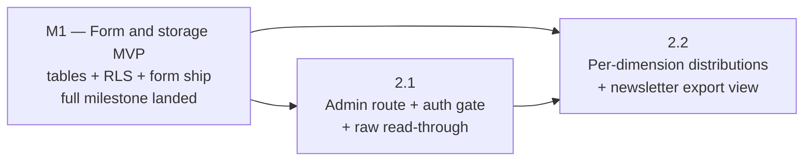

# M2 — Organizer-Readable Surface

## Status

**Deferred — non-prescriptive draft.** M2 is the **final
milestone of this epic**, sequenced after every other milestone
(including any milestones the epic adds later between M1 and M2).
Active drafting on this milestone is paused as of 2026-05-06; the
content below is preserved as historical research, **not as a
binding contract**. Future milestone planning re-derives every
goal, sequence, invariant, decision, risk, and doc-currency entry
in this doc against the actually-merged code at the time M2
becomes the next milestone, and is **explicitly not bound** by
the choices recorded below. Treat this doc as a starting set of
inputs for a future milestone session, not as a settled plan.

The "research is non-prescriptive" framing means: do not cite
the decisions below as settled when scoping any other milestone
or phase; do not rely on the Phase Status table's 2.1 / 2.2
split as the canonical shape; do not use the Cross-Phase
Invariants below as binding constraints on intervening
milestones. The data-layer choices in M1 (FK-enforced registry,
RLS read predicate, read-path index, consent-record column
shape) DO bind, because they ship in M1's migration; the M2
content below is downstream consumer reasoning that may shift
substantially when M2 actually plans.

Original drafting context preserved below for reference. The
original (pre-defer) framing is what follows; everything in
this doc was written under the now-superseded assumption that
M2 was the immediate next milestone after M1. Re-read with
that framing in mind.

---

In draft. This milestone doc is the durable coordination artifact
for M2 of the
[Madrona feedback child epic](/docs/plans/epics/madrona-feedback/epic.md):
restated milestone goal, phase sequencing, cross-phase invariants,
cross-phase decisions (settled-by-default and deferred-to-phase-time),
milestone-level risks, and the doc-currency map M2 must
collectively land. Per-phase implementation contracts live in the
phase plan(s) drafted by the phase planning session(s) that follow
this milestone session.

Per
[`docs/agents/planning/milestone.md`](/docs/agents/planning/milestone.md)
"Anti-goal: do not scope any phase in this session," nothing below
resolves a per-phase contract, file inventory, validation procedure,
or self-review audit set; those re-derive at phase planning time
against the actually-merged code at phase-start.

Status stays `In draft` until the inputs listed in
[Pending Inputs From M1](#pending-inputs-from-m1) settle, per the
[`docs/agents/planning/shared.md`](/docs/agents/planning/shared.md)
`In draft` → `Proposed` promotion gate. The relaxation that allows
this milestone doc to draft in parallel with M1 is the AGENTS.md
"Phase Planning Sessions" opening paragraph (the M1 phase pairs
permitted next-phase drafting under explicit citation requirements);
extending the same posture to milestone pairs is reasonable here
because every load-bearing M2 input is named in an M1 surface
(milestone doc Deferred section, phase 1.1 plan Contracts, or a
future phase 1.2 plan), not in implementation diff.

## Goal

Build the organizer-readable surface such that the Madrona '26
organizer reads ratings and free text through a UI rather than
Supabase Studio, including the email and newsletter opt-in columns
needed for manual newsletter export. The surface shows what the
M1 form collected for one event slug at a time; it does not
moderate, aggregate across events, or summarize free text. The
per-dimension rating distribution view phase 2.2 lands is a
numeric aggregation across submissions for one event, not a
free-text summary — the trade epic Out Of Scope draws is between
"organizer reads the responses themselves" and "automated
sentiment / LLM summary of the prose," and the distribution view
sits on the reads-the-responses side because the prose itself is
listed verbatim by phase 2.1, not summarized.
(`Verified by:`
[docs/plans/epics/madrona-feedback/epic.md:99-101](/docs/plans/epics/madrona-feedback/epic.md)
for the epic's "Sentiment analysis or LLM summarization of free
text" Out Of Scope entry this distinction tracks)

After M2:

- A new admin route `/event/<slug>/admin/feedback` lives in
  apps/web, gated on sign-in plus the organizer-or-admin role
  using the existing `useOrganizerForEvent` flow that
  `EventAdminPage` already uses for `/event/<slug>/admin`.
  (`Verified by:`
  [apps/web/src/pages/EventAdminPage.tsx:135-189](/apps/web/src/pages/EventAdminPage.tsx)
  for the auth-gate flow this M2 surface reuses;
  [apps/web/src/pages/EventAdminPage.tsx:287](/apps/web/src/pages/EventAdminPage.tsx)
  for the doc comment naming the gate;
  [shared/auth/useOrganizerForEvent.ts:1-50](/shared/auth/useOrganizerForEvent.ts)
  for the hook's contract — `loading` / `authorized` /
  `role_gate` / `transient_error` states M2 inherits)
- The route reads `feedback_submissions` for the slug ordered by
  `submitted_at desc` under the existing organizer-or-admin RLS
  predicate the M1 phase 1.1 migration installs. No new RLS
  policy lands; M2 ships zero schema changes.
  (`Verified by:` the M1 phase 1.1 plan's Contracts section at
  [docs/plans/epics/madrona-feedback/m1-phase-1-1-plan.md:149-216](/docs/plans/epics/madrona-feedback/m1-phase-1-1-plan.md)
  for the policy `"organizers and admins can read event feedback"`
  and the read-path index this M2 query uses)
- The page renders three views over the same row set: a
  per-dimension rating distribution summary, a free-text list in
  submission order, and a filterable / exportable view of the
  rows that opted into the newsletter (email +
  submitted_at). The exact UI compositions, column rendering,
  and copy-shape of "export" are phase-time concerns; the
  capability set is the milestone contract.
- The Vercel infra is already in place: the
  `/event/:slug/admin/:path*` rewrite to apps/web's `/index.html`
  delivers the SPA shell to `/event/<slug>/admin/feedback`
  without any vercel.json change. (`Verified by:`
  [apps/web/vercel.json:11-18](/apps/web/vercel.json) for the
  admin rewrite that already covers the new sub-path)
- The existing madrona `X-Robots-Tag: noindex, nofollow`
  header on `/event/madrona/:path*` already covers
  `/event/madrona/admin/feedback`. M2 ships no vercel.json
  change. (`Verified by:`
  [apps/web/vercel.json:60-64](/apps/web/vercel.json))

M2 does **not** edit or delete submissions, does **not** moderate
free-text content, does **not** aggregate across events, does
**not** summarize free text, does **not** push notifications or
emails to attendees, and does **not** introduce a server-side CSV
download endpoint (newsletter export is a copy-from-table flow on
the rendered surface — see Cross-Phase Decisions). All of those
are explicitly out of scope per the parent epic.
(`Verified by:` epic Out Of Scope at
[docs/plans/epics/madrona-feedback/epic.md:77-104](/docs/plans/epics/madrona-feedback/epic.md))

## Phase Status

This table is the milestone-session estimate of phase shape per
[`docs/agents/planning/shared.md`](/docs/agents/planning/shared.md)
"Plan content is a mix of rules and estimates" and
[`docs/agents/planning/milestone.md`](/docs/agents/planning/milestone.md)
"PR-count predictions are not contracts." The phase planning
session for each phase re-derives the actual shape against merged
code at phase-start.

| Phase | Title | Plan | Status | PR |
| --- | --- | --- | --- | --- |
| 2.1 | Admin route + auth gate + raw read-through (per-row ratings + free text in submission order) | — | Not started | — |
| 2.2 | Per-dimension rating distributions + newsletter opt-in filter / export view | — | Not started | — |

The 2-phase split is the estimate; the milestone doc authorizes
both a 2.1 / 2.2 collapse and a 2.1 sub-split if either falls out
of the
[`docs/agents/planning/phase.md`](/docs/agents/planning/phase.md)
"PR-count predictions need a branch test" rule at phase-start, recorded as
an Estimate Deviation in the absorbing phase's plan and PR. The
seam between 2.1 and 2.2 is "raw read-through" vs.
"derived views" (aggregations + filtered export); 2.1 ships a
working organizer surface that already replaces Studio for the
"read every response" workflow, and 2.2 layers the
post-event-analysis affordances.

The collapse case is plausible because both phases touch only
apps/web, both consume the same fetched row set, and the
aggregation + filter logic could fall under
[`docs/agents/planning/phase.md`](/docs/agents/planning/phase.md)
PR-size thresholds without triggering a split. The sub-split case
is plausible if 2.1's auth-gate plumbing turns out to need a new
shared route-matcher or page-shell extraction that itself
warrants its own PR (see Deferred Decisions on the SPA-routing
shape).

## Sequencing

Phase dependencies (`A --> B` means A blocks B / B depends on A):

**Why M1 (full milestone) is the prerequisite, not just M1 phase
1.1.** M2 reads the tables M1 phase 1.1 creates, but the dimension
labels M2's distribution view renders depend on the
`EventContent.feedback?` shape M1 phase 1.2 lands (see Pending
Inputs From M1). Until both are merged, M2's data path is
incompletely specified. Drafting both M2 phase plans before M1
ships is permitted under the same parallel-drafting posture this
milestone doc itself adopts; ship order is what the dependency
graph constrains.

**Why 2.1 blocks 2.2.** The aggregation views and newsletter
filter render on top of the same fetched row set 2.1 wires up;
landing 2.2 first would either duplicate the fetch path or invert
the natural review order (the raw list is the falsifier for the
aggregation — if the per-dimension averages disagree with the raw
rows, the raw rows are right). Reversing the order also breaks
2.1's coherent state: a half-built admin surface that exposes
aggregations without a backing list view.

**Why no broken intermediate state at any 2.x boundary.** Each
phase ships a coherent state of the world:

- After 2.1: an organizer signed-in plus role-gated reaches
  `/event/madrona/admin/feedback` and sees every submission for
  `madrona` ordered by `submitted_at desc`, with each row's
  ratings and free text rendered raw. No aggregations are shown.
  No newsletter filter is offered. The capability is "read every
  response," which is the M1-Studio-replacement value the epic
  names.
- After 2.2: the same surface adds a per-dimension distribution
  panel (e.g. "Music choice: 4.2 average across 38 responses,
  3 N/A") and a filter/view that narrows the row list to
  `newsletter_opt_in = true` rows with the email column rendered
  for copy-paste export. The raw list view from 2.1 remains
  available as the falsifier.

**Independence from sibling milestones.** M2 has no sibling
milestones in this epic. Future Madrona-launch work (a separate
epic) inherits the abuse-posture decision points the parent
epic's Risk Register names; M2 does not pre-empt those.

**Independence from the parent demo-build epic.** This child
epic's M2 sequences after this child epic's M1, not against the
parent demo-build epic's milestones. The parent epic's M3 (the
sibling demo-build milestone the feedback child epic's M1
sequenced parallel with) does not gate M2.

## Cross-Phase Invariants

M2 binds the six cross-cutting invariants from the
[parent feedback epic](/docs/plans/epics/madrona-feedback/epic.md)
verbatim by reference; self-review at every phase walks each
against that phase's diff.

(`Verified by:`
[docs/plans/epics/madrona-feedback/epic.md:106-177](/docs/plans/epics/madrona-feedback/epic.md))

The invariants this milestone's diff actually moves on are
Invariants 1 (generic by event slug), 3 (rating questions are
content, not code), and 4 (submissions are durable and
analyzable — M2 is the analyzability surface). Invariant 6
(DB-level integrity from the first write) is satisfied by
M1's migration; M2 does not weaken it because M2 ships no
schema changes.

M2 also binds the following milestone-level invariants — rules
that thread through more than one M2 phase or that surface only
when multiple phases interact:

- **Read-only from the application surface across all M2 phases.**
  No phase ships an UPDATE, DELETE, or INSERT path against
  `feedback_submissions` or `feedback_enabled_events`. The
  organizer's read-through is sufficient for the demo phase per
  the epic Risk Register's accepted posture (organizer can purge
  garbage rows post-event via service-role tooling, not via a
  user-facing surface). Editing or deleting via UI would require
  RLS write-broadening that M1 deliberately does not ship.
  (`Verified by:` epic Risk Register at
  [docs/plans/epics/madrona-feedback/epic.md:392-450](/docs/plans/epics/madrona-feedback/epic.md);
  M1 phase 1.1 plan's "no update / delete policies" decision at
  [docs/plans/epics/madrona-feedback/m1-phase-1-1-plan.md:211-216](/docs/plans/epics/madrona-feedback/m1-phase-1-1-plan.md))
- **Auth gate reuses the existing `useOrganizerForEvent` flow
  verbatim.** No new auth predicate, no new role, no new RPC.
  Both M2 phases authorize through the same pattern
  `EventAdminPage` uses today: `useAuthSession` resolves the
  signed-in state, `useOrganizerForEvent(slug)` resolves
  organizer-or-admin authorization, and the
  `loading` / `role_gate` / `transient_error` / `authorized`
  branches map to the same shell states. Introducing a parallel
  auth predicate for the feedback admin surface would drift from
  the broadened-RLS migration's pattern and the M1 phase 1.1
  RLS posture.
  (`Verified by:`
  [shared/auth/useOrganizerForEvent.ts:1-50](/shared/auth/useOrganizerForEvent.ts)
  for the hook contract M2 inherits;
  [apps/web/src/pages/EventAdminPage.tsx:135-189](/apps/web/src/pages/EventAdminPage.tsx)
  for the per-state branching this M2 surface reuses;
  [supabase/migrations/20260427010000_broaden_event_scoped_rls.sql:31-32](/supabase/migrations/20260427010000_broaden_event_scoped_rls.sql)
  for the canonical predicate shape;
  [supabase/migrations/20260421000200_add_event_role_helpers.sql:23-37](/supabase/migrations/20260421000200_add_event_role_helpers.sql)
  for the helper definitions)
- **Generic by event slug, not Madrona-specific.** The route
  matcher, fetch path, and rendering accept any event slug; the
  RLS predicate (set by M1) gates which slug returns rows. A
  hypothetical second event opted into feedback under the
  registry would render at `/event/<other-slug>/admin/feedback`
  without code changes. Hardcoding `madrona` anywhere in the M2
  surface would re-foreclose epic Invariant 1 (generic by event
  slug).
- **Distribution view degrades gracefully when dimension labels
  drift.** The aggregation view (phase 2.2) renders rating
  dimensions using the labels from the event's
  `EventContent.feedback?` shape (M1 phase 1.2 territory). If a
  submitted row carries a `ratings` jsonb key that no longer
  exists on the current `EventContent` (e.g. the organizer
  retired a dimension), the row's other ratings still render and
  the unmatched key surfaces under its raw key with a "no
  current label" treatment, not a hard error. The exact rendering
  is a phase 2.2 plan detail; the no-hard-error contract binds
  here. This invariant is the analyzability shape epic
  Invariant 4 promises: per-event aggregation survives the
  dimension set evolving across years.
- **Newsletter export is copy-from-table, not a server endpoint.**
  Phase 2.2's "export" affordance is a rendered table the
  organizer copies from (or uses the browser's table-select +
  paste flow); no server-side CSV download endpoint, no
  authenticated export RPC, no scheduled mailout. Building a
  download endpoint would either require an Edge Function or a
  signed-URL flow, both of which add an authorization surface
  M2 does not need — the organizer is already inside an
  authorized React session. The trade is named here so phase 2.2
  doesn't drift into building an endpoint.
  (`Verified by:` epic Resolved Decisions
  "Newsletter delivery pipeline: manual export by the organizer
  post-event. No automated sync to a newsletter tool from this
  epic." at
  [docs/plans/epics/madrona-feedback/epic.md:477-479](/docs/plans/epics/madrona-feedback/epic.md))

**Inherited from upstream invariants.** M2 inherits the ThemeScope
wrapping pattern from `App.tsx`'s route dispatch (the existing
event-admin route already wraps `EventAdminPage` in `ThemeScope`
keyed by slug); M2's feedback admin route does the same. M2
inherits the URL contract / theme route scoping invariants from
the predecessor event-platform epic. (`Verified by:`
[apps/web/src/App.tsx:57-68](/apps/web/src/App.tsx) for the
ThemeScope wrap on the existing event-admin route this M2 surface
mirrors)

## Cross-Phase Decisions

### Settled by default

Decisions with a clear default that no scoping pressure disputes.
Recorded so phase planning sessions do not re-derive.

- **Admin route lives in apps/web at
  `/event/<slug>/admin/feedback`.** The `/event/:slug/admin/:path*`
  rewrite to apps/web's `/index.html` already delivers the SPA
  shell; M2 ships no vercel.json change. The route is an SPA
  route, not a Next.js page. (`Verified by:`
  [apps/web/vercel.json:11-18](/apps/web/vercel.json) for the
  admin rewrite;
  [docs/plans/epics/madrona-feedback/epic.md:230-252](/docs/plans/epics/madrona-feedback/epic.md)
  for the epic Organizer Path's apps/web ownership claim)
- **Reads use the M1-installed RLS predicate without
  modification — M2 ships no new RLS policy, helper, or
  service-role escalation.** This is what binds at the milestone
  level: M2 is a read-side consumer of whatever predicate M1
  phase 1.1 lands, not a co-author of it. The M1 phase 1.1
  plan's current Decision 1 outcome (JOIN through `game_events`
  inside the policy, no new helper, no denormalized `event_id`
  column on `feedback_submissions`) is the planned shape M2's
  fetch path is sized for, but the implementation review for M1
  phase 1.1 hasn't happened yet — see Pending Inputs From M1 for
  the verification step that walks the actually-merged SQL at
  M2 phase-start. The settled-at-this-doc commitment is "consume
  whatever shape merges, don't introduce a parallel one,"
  not "the JOIN-through-`game_events` shape is final."
  (`Verified by:`
  [docs/plans/epics/madrona-feedback/m1-phase-1-1-plan.md:149-216](/docs/plans/epics/madrona-feedback/m1-phase-1-1-plan.md)
  for the M1 phase 1.1 plan's Contracts section naming the
  planned policy;
  [docs/plans/epics/madrona-feedback/scoping/m1-phase-1-1.md:44-86](/docs/plans/epics/madrona-feedback/scoping/m1-phase-1-1.md)
  for Decision 1's planned JOIN-through-`game_events` rationale,
  recorded as the M1 phase 1.1 plan's intent and not a merged
  contract)
- **Read-path index already exists for the M2 query shape.** M1
  phase 1.1 lands
  `feedback_submissions_event_slug_submitted_at_idx` precisely
  because M2 reads per-event in `submitted_at desc` order. M2
  does not introduce a second index. (`Verified by:`
  [docs/plans/epics/madrona-feedback/scoping/m1-phase-1-1.md:203-212](/docs/plans/epics/madrona-feedback/scoping/m1-phase-1-1.md))
- **Auth gate reuses `useOrganizerForEvent` and the
  `EventAdminPage`-style state-branching shell.** Per the
  Cross-Phase Invariant above. The state branching is "loading
  → checking access → role_gate / transient_error / authorized,"
  and the rendered shell wraps the gated content in the same
  page-chrome shape. Phase 2.1 owns the exact component
  factoring (extract a shared shell vs. inline the four states
  in the new page); the milestone-level commitment is "same
  flow, same predicate."
- **Page lives under apps/web's existing routing convention.** A
  new pathname matcher (modeled on `matchEventAdminPath`) plus a
  new page component, dispatched from `App.tsx`'s
  `getPageContent` switch, is the working precedent. The exact
  matcher shape and dispatch wiring are phase 2.1 details; the
  convention binds here. (`Verified by:`
  [shared/urls/routes.ts:95-130](/shared/urls/routes.ts) for the
  `matchEventAdminPath` precedent;
  [shared/urls/routes.ts:2-10](/shared/urls/routes.ts) for the
  `AppPath` literal-union extension pattern;
  [apps/web/src/App.tsx:57-68](/apps/web/src/App.tsx) for the
  dispatch precedent the new matcher slots into)
- **No edits, deletes, or moderation surfaces.** Per the
  Cross-Phase Invariant above. Service-role tooling handles row
  purges if abuse surfaces; that's an operations workflow, not a
  user-facing surface. Splitting moderation into its own future
  milestone is the explicit deferral.
- **No CSV download endpoint.** Newsletter export is rendered
  in-page; the organizer copy-pastes from the rendered table.
  Phase 2.2 owns the table shape (column order, row formatting);
  the endpoint-vs-render decision is fixed here.
- **Single fetch path per page render.** Both phases consume the
  same per-event submission read — filtered by `event_slug` for
  the requested event and ordered by `submitted_at desc` to
  match the M1-installed read-path index. Phase 2.2's
  aggregations derive client-side from the fetched rows rather
  than running a second query against a derived view. The trade
  is named so phase 2.2 doesn't drift into building a server-side
  aggregation view that adds a second auth surface and a second
  cache; the demo audience is small enough that client-side
  aggregation across at most a few hundred rows is fine, and the
  raw list M2 already shows is the falsifier the aggregation
  must agree with. The launch epic may revisit if real volume
  changes the trade.
- **`X-Robots-Tag` already covers the feedback admin path.** The
  existing madrona-scoped header on `/event/madrona/:path*`
  applies to `/event/madrona/admin/feedback` without
  modification. M2 ships no vercel.json change. (`Verified by:`
  [apps/web/vercel.json:60-64](/apps/web/vercel.json))
- **ThemeScope wrap mirrors the existing event-admin route.** The
  new route's dispatch arm wraps the page in `ThemeScope theme={getThemeForSlug(slug)}`,
  matching the existing event-admin arm. (`Verified by:`
  [apps/web/src/App.tsx:57-68](/apps/web/src/App.tsx))

### Deferred to phase-time

Decisions deferrable to phase planning per
[`docs/agents/planning/milestone.md`](/docs/agents/planning/milestone.md)
"Defer rather than over-resolve." Each is named here so phase
planning finds them, with the constraints that bound resolution.

- **SPA-routing shape: new top-level matcher vs. nested under
  EventAdminPage.** Phase 2.1 owns. Constraints: the
  `matchEventAdminPath` precedent matches paths whose suffix is
  exactly `/admin`; a new matcher
  (`matchEventFeedbackAdminPath`) for paths ending in
  `/admin/feedback` is the cleanest extension, but a nested
  conditional inside `EventAdminPage` is also tenable if the
  shared shell + auth gate logic warrants the lift. The route
  must continue to wrap in `ThemeScope` and resolve the slug
  the same way (URI-decoded, no leading/trailing-slash
  ambiguity); whichever approach lands must not regress the
  existing `/event/<slug>/admin` route's behavior.
- **Component factoring of the auth-gate shell.** Phase 2.1
  owns. Constraints: the auth-gate rendering across loading /
  role_gate / transient_error / authorized states is identical
  in shape to `EventAdminPage`'s
  [SignedInEventAdminFlow](/apps/web/src/pages/EventAdminPage.tsx)
  and `EventAdminShell` pair; phase 2.1 chooses among
  (a) inline the four-branch render in the new page;
  (b) extract a shared `<EventScopedAdminShell>` wrapper that
  both `EventAdminPage` and the feedback admin page consume;
  (c) restructure `EventAdminPage` first as a precursor PR. The
  precursor approach is authorized as a 2.1 sub-split if the
  inline branch turns out to copy a meaningful amount of code.
- **Per-dimension distribution rendering shape.** Phase 2.2
  owns. The aggregation logic operates on the same fetched
  row set from 2.1; the visualization is open (text summary
  with average + N/A count, sparkline, distribution bar). The
  milestone-level invariant binds the no-hard-error-on-stale-key
  contract; phase 2.2 owns the visual.
- **Newsletter filter and export-table shape.** Phase 2.2 owns
  the column order, row formatting, sort order, and copy-paste
  affordances. The milestone invariant binds the
  copy-from-table-not-endpoint posture; phase 2.2 picks the
  table.
- **Empty / loading / error states for the data fetch.** Phase
  2.1 owns. Constraints: empty-state copy is friendly ("No
  feedback submitted yet"); loading state matches the shell's
  existing `<button className="secondary-button" disabled>`
  pattern; transient-error state offers a retry button mirroring
  `useOrganizerForEvent`'s `transient_error` shape.
- **Per-PR commit shape.** Phase plans own commit boundaries per
  [`docs/agents/planning/shared.md`](/docs/agents/planning/shared.md)
  "Plan content is a mix of rules and estimates." The
  milestone doc commits only to phase boundaries.
- **2.1 / 2.2 collapse and 2.1 sub-split.** Phase planning owns
  the call against actual scope at phase-start. The Phase
  Status table authorizes both moves as Estimate Deviations.

## Pending Inputs From M1

These are the load-bearing decisions M2 plan-drafting needs from
M1. Each is recorded with a citation to the surface where the
decision is being (or has been) made. M2 plans must verify
against the merged code at phase-start, not against this
milestone doc; this section names what to verify, not what to
assume. Status flips `In draft` → `Proposed` once every entry
below resolves to a merged surface.

- **Final column names and types on `feedback_submissions`.**
  M2 reads the columns and renders them; the phase 2.1 fetch
  type and the phase 2.2 aggregation key strategy depend on the
  exact spelling. **Concrete surface:** the M1 phase 1.1 plan's
  Contracts section
  ([docs/plans/epics/madrona-feedback/m1-phase-1-1-plan.md:175-216](/docs/plans/epics/madrona-feedback/m1-phase-1-1-plan.md)).
  **Settles when:** the M1 phase 1.1 implementing PR merges
  and `shared/db/types.ts` regenerates. Both M2 phase plans
  read `shared/db/types.ts` for the row type rather than
  hardcoding column names from this milestone doc.
- **RLS read-predicate shape (slug → event_id resolution).** M2
  reads under this predicate; if the resolution shape shifts in
  M1 phase 1.1 implementation review (e.g. a slug-keyed helper
  is introduced after all), the auth posture M2's fetch relies on
  shifts. **Concrete surface:** the M1 phase 1.1 scoping
  Decision 1 at
  [docs/plans/epics/madrona-feedback/scoping/m1-phase-1-1.md:44-86](/docs/plans/epics/madrona-feedback/scoping/m1-phase-1-1.md)
  and the resulting policy SQL in the phase 1.1 plan. **Settles
  when:** M1 phase 1.1 implementing PR merges.
- **`EventContent.feedback?` shape — specifically the
  rating-dimension key + label structure.** Phase 2.2's
  per-dimension distribution renders labels, not raw keys; the
  field shape M1 phase 1.2 lands determines how M2 looks up
  the label for a given key. **Concrete surface:** the M1
  milestone doc Deferred Decisions entry "`EventContent.feedback`
  exact field shape" at
  [docs/plans/epics/madrona-feedback/m1-form-and-storage-mvp.md:423-432](/docs/plans/epics/madrona-feedback/m1-form-and-storage-mvp.md),
  which routes the call to the M1 phase 1.2 plan. **Settles
  when:** the M1 phase 1.2 implementing PR merges. Open
  sub-question for phase 2.2 to surface in scoping: **how does
  apps/web reach the apps/site-owned content for label
  lookup?** (apps/web admin currently has no precedent for
  reading apps/site `EventContent` modules; options include a
  shared content-export package, duplicating the label set in a
  shared module, or storing labels alongside the dimension keys
  in the submission's `ratings` jsonb. Phase 2.2 plans the
  resolution against M1 phase 1.2's actual shape, not against
  speculation.)
- **Initial rating-dimension keys for `madrona`.** Phase 2.2's
  empty-state and validation tooling reference these keys.
  **Concrete surface:** the M1 milestone doc Deferred entry
  "Initial rating-dimension set" at
  [docs/plans/epics/madrona-feedback/m1-form-and-storage-mvp.md:433-439](/docs/plans/epics/madrona-feedback/m1-form-and-storage-mvp.md),
  which routes to M1 phase 1.3. **Settles when:** the M1 phase
  1.3 implementing PR merges.

Inputs that are **not** pending because they are already settled
at the milestone level:

- The two table names (`feedback_enabled_events`,
  `feedback_submissions`) — fixed in M1 milestone doc and phase
  1.1 plan.
- The RLS posture's *shape* (anon insert allowed; authenticated
  organizer-or-admin SELECT; everything else default-deny) —
  fixed in M1 milestone doc.
- The read-path index shape — fixed in M1 phase 1.1.

## Cross-Phase Risks

Risks that span the milestone or surface only at the milestone
level. Phase-level risks live in each phase plan's Risk Register;
the parent epic's Risk Register also binds.

- **Studio-query-shape leak from M1 demo phase becomes M2's UI
  contract.** During M1 between ship and M2 ship, the organizer
  reads via Supabase Studio; whichever queries the organizer
  writes (filters, sort orders, columns surfaced) become the
  ad-hoc reading model. If M2 mirrors those queries verbatim
  rather than re-deriving the UI from the epic's
  organizer-path description, M2 risks scope creep toward
  Studio-as-spec. Mitigation: M2 plan-drafting reads the epic's
  organizer-path description
  ([docs/plans/epics/madrona-feedback/epic.md:230-252](/docs/plans/epics/madrona-feedback/epic.md))
  as its source-of-truth, not the organizer's Studio history.
  This is the M1 doc's own risk re-stated from M2's side; M1's
  doc names it from above, this doc names it from below so the
  M2 phase plans walk it in self-review.
  (`Verified by:`
  [docs/plans/epics/madrona-feedback/m1-form-and-storage-mvp.md:539-546](/docs/plans/epics/madrona-feedback/m1-form-and-storage-mvp.md)
  for the upstream framing of the same risk)
- **Rating-dimension drift at year boundaries breaks the
  aggregation view.** If Madrona '27 retires, renames, or
  re-keys dimensions, the phase 2.2 distribution view either
  hard-errors on stale keys, silently drops them, or surfaces
  them as "no current label." The Cross-Phase Invariant binds
  the no-hard-error contract; the visual treatment is phase 2.2.
  Risk surfaces at the milestone level because the epic
  explicitly accepts cross-year aggregation as manual / human-read
  (epic Risk Register
  [docs/plans/epics/madrona-feedback/epic.md:410-417](/docs/plans/epics/madrona-feedback/epic.md)),
  and M2 must not silently re-litigate that decision by building
  comparison UI.
- **PII in free text surfaces in an admin view that grows
  read-access over time.** The M2 audience today is the
  organizer-or-admin role set; nothing public. If the role set
  later widens (e.g. agents gain feedback read), the existing
  RLS policy
  `is_organizer_for_event(<id>) OR is_root_admin()` would not
  automatically include them, but a future RLS broadening
  migration could change that posture. The risk is that an M2
  rendering choice (e.g. surfacing email + free text together
  in an export view that's easy to misuse) makes a future
  broadening more dangerous than it would be with a more
  cautious rendering. Mitigation: phase 2.2's plan walks the
  newsletter-export rendering against this risk and constrains
  the export view's row-set scope (newsletter-opted-in rows
  only, not the full submission set with email).
- **Aggregation derives from a fetch that may paginate in the
  future.** M2 fetches the full row set per render, which is
  fine at the demo's ~hundreds-of-rows ceiling but won't be
  fine if the launch epic ships an opt-in to a larger event.
  Building pagination today is premature; the risk is that the
  aggregation view's correctness assumes "we have all the rows
  in memory" without that assumption being named. Mitigation:
  phase 2.2's plan surfaces this assumption as an explicit
  constraint, and adds a backlog entry the launch epic
  inherits if real volume warrants pagination + server-side
  aggregation.
- **Cross-app boundary for label lookup widens accidentally.**
  Phase 2.2's distribution view needs rating-dimension labels
  that live in apps/site `EventContent`; the resolution
  approach (see Pending Inputs From M1) might tempt a broader
  apps/web → apps/site content import that opens the door to
  more cross-app coupling than M2 needs. Mitigation: phase 2.2
  scopes the label-import surface to exactly the
  `feedback.ratingDimensions` shape (or whatever name M1 phase
  1.2 lands), not the full `EventContent` module; the phase
  plan's self-review walks the import boundary against this
  constraint.
- **Auth-gate shell duplication between
  `/event/<slug>/admin` and `/event/<slug>/admin/feedback`.**
  If phase 2.1 inlines the four-state auth-gate render rather
  than extracting a shared shell, future per-event admin
  surfaces (donation-epic admin, abuse-moderation admin if it
  ever ships) each duplicate the same render. The risk is
  divergence over time. Mitigation: phase 2.1's plan walks the
  duplication question as an explicit Deferred Decision
  resolution; the milestone-level invariant binds "same flow,
  same predicate," not "same component," so inline-then-extract
  is acceptable, but a conscious choice. The 2.1 sub-split
  authorization above accommodates an extraction-precursor PR
  if phase 2.1 chooses that path.

## Documentation Currency

The doc updates the M2 set must collectively make. Each is
owned by the phase named below; any phase that lands a partial
update records the remainder under its plan's Documentation
Currency PR Gate. M2 is not complete until all are landed across
the M2 PR set.

- [`docs/architecture.md`](/docs/architecture.md) — any
  organizer-surface or admin-route paragraph that named the
  feedback admin as deferred extends to reflect what M2 ships.
  Phase 2.1 plan-drafting re-verifies by grep at phase-start.
  **Owned by 2.1.**
- [`docs/product.md`](/docs/product.md) — any organizer-feedback
  reference that named the read-through surface as deferred
  extends to reflect M2's ship. Phase 2.1 plan-drafting
  re-verifies. **Owned by 2.1; verification may produce no edit.**
- [`apps/web/src/pages/EventAdminPage.tsx`](/apps/web/src/pages/EventAdminPage.tsx)
  — the doc comment on `EventAdminPage` may need a sibling-route
  reference if phase 2.1 extracts a shared shell. **Owned by
  2.1; verification may produce no edit.**
- [`docs/backlog.md`](/docs/backlog.md) — phases that surface
  follow-up work (server-side aggregation triggers under real
  volume; abuse-purge UI if the demo audience surfaces it;
  pagination for larger events the launch epic might enable;
  label-lookup cross-app coupling cleanup) add backlog entries
  with rationale. **Owned by whichever phase surfaces the
  follow-up.**
- [`docs/plans/epics/madrona-feedback/epic.md`](/docs/plans/epics/madrona-feedback/epic.md)
  — the M2 paragraph in Milestone Structure stays prose-form;
  no Milestone Status table exists on this epic to flip. The
  terminal M2 PR (whichever ships last) reconciles the epic's
  Milestone Structure paragraph with the actual phase count
  per the
  [`docs/agents/planning/shared.md`](/docs/agents/planning/shared.md)
  "Estimate Deviations" rule if the count differs. **Owned by
  the terminal M2 PR.**
- This milestone doc — Status flips `In draft` → `Proposed`
  once every Pending Inputs From M1 entry resolves; Status flips
  `Proposed` → `Landed` in the terminal M2 PR; Phase Status
  rows update as each phase plan drafts and as each phase PR
  merges. **Owned by the M2-phase-2.1 plan-drafting PR for the
  promotion flip; owned by the terminal M2 PR for the Landed
  flip.**

[`docs/dev.md`](/docs/dev.md),
[`docs/operations.md`](/docs/operations.md),
[`docs/experience.md`](/docs/experience.md),
[`docs/styling.md`](/docs/styling.md), and
[`README.md`](/README.md) are not knowingly touched by M2; each
phase's plan-drafting re-verifies by grep at phase-start. M2
introduces no new local-dev workflow, no new operational concern
(the SPA is already deployed), and no new styling discipline (the
admin shell already established the `admin-state-stack` /
`admin-layout` patterns this surface inherits).

[`docs/open-questions.md`](/docs/open-questions.md) — the epic
has no Open Questions at the epic level. Phase plans log new
open questions surfaced during planning into
`docs/open-questions.md` per AGENTS.md doc-currency rules, and
elevate to the epic's Open Questions section any question that
turns out to be load-bearing across milestones.

## Backlog Impact

- **Closed by M2.** Nothing in
  [`docs/backlog.md`](/docs/backlog.md). The epic's Backlog
  Impact already established that no attendee-feedback or
  organizer-feedback-readthrough items live in the backlog
  (`Verified by:`
  [docs/plans/epics/madrona-feedback/epic.md:374-388](/docs/plans/epics/madrona-feedback/epic.md)).
- **Unblocked by M2.** Whatever follow-on Madrona-feedback work
  the launch epic inherits (broader rollout, pagination,
  abuse-posture revisit) finds the read-through surface
  already in place rather than building it from Studio-only
  history. Future Madrona-launch epic work that wants to widen
  the role set with read access to feedback inherits the auth
  predicate M2 reuses; widening flows through the same
  predicate, not through an M2-specific exception.
- **Opened by M2.** Phase plans surface follow-ups via
  `docs/backlog.md` entries with rationale. Anticipated
  candidates: server-side aggregation views if real volume
  changes the read shape; pagination for larger events; cross-app
  content-import cleanup if phase 2.2's label-lookup approach
  introduces shared-package debt; abuse-purge UI if the demo's
  organizer-purge-via-Studio escalates to a real workflow.

## Related Docs

- [`docs/plans/epics/madrona-feedback/epic.md`](/docs/plans/epics/madrona-feedback/epic.md)
  — parent epic. M2 paragraph in Milestone Structure
  ([epic.md:362-372](/docs/plans/epics/madrona-feedback/epic.md));
  Cross-Cutting Invariants this milestone binds; Resolved
  Decisions this milestone inherits; Risk Register this
  milestone's risks layer onto.
- [`docs/plans/epics/madrona-feedback/m1-form-and-storage-mvp.md`](/docs/plans/epics/madrona-feedback/m1-form-and-storage-mvp.md)
  — sibling milestone doc. M1 is the upstream prerequisite
  this M2 reads from; M1's Deferred Decisions are this doc's
  Pending Inputs From M1 sources.
- [`docs/plans/epics/madrona-feedback/m1-phase-1-1-plan.md`](/docs/plans/epics/madrona-feedback/m1-phase-1-1-plan.md)
  — M1 phase 1.1 plan. Names the columns, RLS policies, and
  read-path index this M2 surface consumes; the surface this
  milestone doc cites for "column names settle when 1.1
  merges."
- [`docs/plans/epics/madrona-demo-build/m2-stubbed-attendee-journey.md`](/docs/plans/epics/madrona-demo-build/m2-stubbed-attendee-journey.md)
  — sibling parent-epic milestone doc. Working precedent for
  milestone-doc shape in this epic family (Phase Status table
  format, Sequencing mermaid + prose, Cross-Phase Invariants /
  Decisions / Risks structure, Documentation Currency map).
- [`docs/agents/planning/milestone.md`](/docs/agents/planning/milestone.md)
  — milestone planning rules this session ran under;
  anti-goal of phase scoping; cross-phase decision verification
  rule.
- [`docs/agents/planning/shared.md`](/docs/agents/planning/shared.md)
  — cross-level rules; `In draft` → `Proposed` promotion gate
  this doc's Status field walks; Estimate Deviations rule the
  phase status table inherits.
- [`AGENTS.md`](/AGENTS.md) — agent behavior; "Phase Planning
  Sessions" opening that authorizes the parallel-drafting
  posture this doc adopts at the milestone level.
