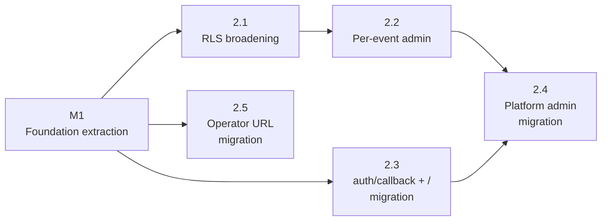

# M2 — Admin Restructuring And Authorization Broadening

## Status

Proposed. Status mirrors the
[epic milestone row](./event-platform-epic.md). Flips to `Landed`
when M2's last-merging phase PR also flips the epic's M2 row.

This milestone doc is the durable coordination artifact for M2:
restated goal, phase sequencing, cross-phase invariants, locked
cross-phase decisions, and milestone-level risks. Per-phase
implementation contracts live in the per-phase plan docs; trade-off
deliberation for cross-phase decisions lives below in
"Cross-Phase Decisions."

## Goal

Split the existing `/admin` into platform-admin (apps/site) and
per-event admin (apps/web), broaden RLS so organizers can write any
event-scoped data for events they organize, and migrate operator
URLs into the `/event/:slug/game/*` namespace. After M2:

- the trust boundary supports per-event authoring without
  root-admin involvement, gated at the database layer
- apps/site owns `/`, `/admin*`, `/auth/callback`, and every
  event-scoped path not carved out for apps/web
- apps/web's URL footprint is purely event-scoped:
  `/event/:slug/game/*` (attendee + operator) and
  `/event/:slug/admin` (organizer authoring)
- the post-MVP authoring-ownership open question is resolved with
  organizer RLS in place

The milestone is a precondition for M3 (rendering pipeline against
data, with test events) and M4 (Madrona launch). M2 itself ships
no user-visible Madrona content; per-event Theme registration and
apps/web event-route `<ThemeScope>` wiring are deferred to M4
phase 4.1 per the epic's "Deferred ThemeScope wiring" invariant.

## Phase Status

| Phase | Title | Plan | Status | PR |
| --- | --- | --- | --- | --- |
| 2.1 | RLS broadening with pgTAP coverage | [m2-phase-2-1-plan.md](./m2-phase-2-1-plan.md) | Proposed | — |
| 2.2 | Per-event admin route shell at `/event/:slug/admin` | [m2-phase-2-2-plan.md](./m2-phase-2-2-plan.md) | Landed | [#113](https://github.com/kcrobinson-1/neighborly-events/pull/113), [#114](https://github.com/kcrobinson-1/neighborly-events/pull/114) |
| 2.3 | `/auth/callback` and `/` migration to apps/site | [m2-phase-2-3-plan.md](./m2-phase-2-3-plan.md) | Landed | [#118](https://github.com/kcrobinson-1/neighborly-events/pull/118), [#120](https://github.com/kcrobinson-1/neighborly-events/pull/120) |
| 2.4 | Platform admin migration to apps/site at `/admin` | [m2-phase-2-4-plan.md](./m2-phase-2-4-plan.md) | Landed | [#126](https://github.com/kcrobinson-1/neighborly-events/pull/126) |
| 2.5 | `/game/*` URL migration for operator routes | [m2-phase-2-5-plan.md](./m2-phase-2-5-plan.md) | Proposed | — |

Each row updates as the phase's plan drafts and as its PR merges.
2.5 ships as three sub-phases (2.5.1 code rename, 2.5.2 Vercel
cutover, 2.5.3 cleanup + M2 closure) under the umbrella plan
linked above; 2.5.3's PR also flips the epic's M2 row to `Landed`
per the sequencing below.

Per-phase scoping docs at `docs/plans/scoping/m2-phase-2-1.md`
through `docs/plans/scoping/m2-phase-2-5.md` deleted in batch in
M2 phase 2.5.3 (all five M2 plans existed at that point; the
durable cross-phase content this doc absorbs lives in
"Cross-Phase Decisions," "Cross-Phase Invariants," and
"Cross-Phase Risks" below). See git history for the pre-deletion
content.

## Sequencing

Phase dependencies (`A --> B` means A blocks B / B depends on A):



Phase numbering reflects intended ship order, **not** strict
dependency. 2.3 and 2.5 are independent of every M2 sibling phase
and could draft / implement in parallel with 2.1 or 2.2 if
separate attention is available; the numbering puts them later
in the sequence because their PRs are convenient closers (2.4
inherits from 2.3, and 2.5 carries the M2-row flip).

The recommended implementation order, with the dependency rationale
behind it:

```
1. 2.1 (RLS broadening + Edge Function helper)        ← M2's first phase; depends only on M1
2. 2.2 (per-event admin UI)                           ← depends hard on 2.1
3. 2.3 (apps/site /auth/callback + /)                 ← depends only on M1; establishes apps/site auth idiom
4. 2.4 (platform admin migration)                     ← depends on 2.2 (deep editor) + 2.3 (apps/site adapter)
5. 2.5 (operator URL migration; flips M2 row)         ← independent; sequences last so its PR carries the M2-row flip
```

**Hard dependencies.** 2.2 cannot ship until 2.1 lands (organizer
writes return 401/403 from the function layer + 0-row writes from
RLS otherwise). 2.4 cannot ship until 2.2 (deep-editor preserved at
`/event/:slug/admin`) and 2.3 (apps/site adapter pattern + bootstrap
seam) are both in main. 2.3 and 2.5 are independent of all sibling
M2 phases and can sequence anywhere; the order above puts 2.3 before
2.4 because 2.4 inherits from 2.3, and 2.5 last so its PR also flips
the epic's M2 row in one terminal change.

**Plan-drafting cadence.** Each phase's plan drafts just-in-time
before its implementation, not in batch. Plans drafted against
not-yet-merged code stale fast; just-in-time drafting has access to
actual merged shapes. Exception: 2.3 and 2.5 are 2.1-independent and
can plan-draft in parallel with 2.1 implementation if separate
attention is available.

## Cross-Phase Invariants

These rules thread through multiple phase diffs and break silently
when one phase drifts. Self-review walks each one against every
phase's actual changes.

- **Broadening predicate uniformity.** Every policy added or
  replaced in 2.1 uses
  `is_organizer_for_event(<event-id-column>) OR is_root_admin()`
  (the `event_role_assignments` SELECT policy keeps its self-read
  branch alongside). Same helper signatures (both take
  `event_id text`, the `game_events.id` PK), same OR-shape, same
  case ordering. No table, helper, or RPC invents its own variant.
  Phase 2.1 ships this; no other M2 phase changes it.
- **Agent posture preserved.** Agents do not gain direct table
  writes during M2 and do not gain authoring-table reads
  (drafts/versions). The only agent-reachable write path stays the
  existing `redeem_entitlement_by_code` SECURITY DEFINER RPC; its
  `is_agent_for_event OR is_root_admin` gate is unchanged across all
  five phases. (See Cross-Phase Decision §2 for the deferred
  organizer-redeem broadening.)
- **Audit-log + versions invariant preserved via the existing
  privilege-layer setup.** `game_event_audit_log` and
  `game_event_versions` keep direct INSERT denied to non-service-role
  callers. Organizer publish and unpublish writes those rows
  transitively through `publish_game_event_draft()` /
  `unpublish_game_event()` exactly as root-admin writes do today —
  the broadened Edge Function gate authorizes the caller, then
  invokes the RPC under service_role. The RPC bodies are not
  modified in 2.1; the load-bearing guard is `GRANT EXECUTE →
  service_role` plus the Edge Function authorization, not an
  in-RPC predicate. (See §1 below.)
- **Edge Function authorization centralized.** The four authoring
  functions (`save-draft`, `publish-draft`, `unpublish-event`,
  `generate-event-code`) consume the new shared helper
  `authenticateEventOrganizerOrAdmin(...)` ; no per-function inline
  predicate composition. Phase 2.1 ships the helper; phases 2.2-2.4
  reuse it without contract changes.
- **apps/site auth idiom: client-component gate + dedicated
  bootstrap.** Authenticated apps/site routes are `'use client'`
  pages that render a skeleton on first paint, then call
  `useAuthSession` + the relevant role RPC on hydration. The
  `<SharedClientBootstrap>` component (created in 2.3) wraps the
  `(authenticated)` route group so `configureSharedAuth(...)` runs
  before any consumer mounts. `shared/auth/` stays browser-only
  through M2; no server-side variant added. Phase 2.3 establishes;
  2.4 inherits; future M3/M4 organizer surfaces inherit.
- **ThemeScope wrapping discipline.** Routes under `/event/:slug/*`
  wrap in `<ThemeScope>`; everything else renders against host-app
  `:root` defaults. Phase 2.2's per-event admin wraps; 2.3's
  apps/site `/` and `/auth/callback` do not (not event-scoped); 2.4's
  apps/site `/admin` does not (not event-scoped); 2.5's renamed
  operator routes still do not wrap (their wiring stays deferred to
  M4 phase 4.1 per the epic's "Deferred ThemeScope wiring"
  invariant). Through M3, `getThemeForSlug` returns the platform
  Sage Civic Theme for any slug; per-event Themes apply only after
  M4 phase 4.1 registers them.
- **URL contract progression.** apps/web's URL footprint shrinks in
  three steps: 2.3 removes `/` and `/auth/callback`, 2.4 removes
  `/admin*`, 2.5 retires the bare-path operator URLs. After 2.5,
  apps/web owns only `/event/:slug/game/*` and `/event/:slug/admin`.
  No M2 phase changes any URL outside these explicit moves.
- **In-place auth.** Every protected route renders its
  unauthenticated state inline within the route's themed shell. No
  M2 phase introduces a `/signin` page. `/auth/callback` remains
  the only auth-distinct URL and migrates as a transport-only
  client component in 2.3.

## Cross-Phase Decisions

Every decision below was deliberated during the scoping cascade.
The "Resolved" subsection of each entry is the load-bearing record;
the "Options" / "Pros / cons" / "Comes down to" subsections are
preserved so a future change pressure-testing a decision has the
trade-off analysis to read against.

### 1. `game_event_audit_log` and `game_event_versions` write policy [Resolved → Option 3]

**What was decided.** Whether 2.1's RLS broadening adds a
direct-INSERT policy for organizers on the audit-log and versions
tables, or keeps them service-role-only with the publish/unpublish
RPCs broadened to accept organizer callers.

**Why it mattered.** This was the only cross-phase contract dispute
in M2. 2.2's scoping expected RLS broadening on both tables; 2.1's
recommended posture was the opposite (preserve the audit-log
invariant). Without resolution the plan docs would have contradicted
each other.

**Options considered.**

1. **Broaden direct INSERT** to match 2.2's expectation verbatim.
2. **Broaden read only, keep INSERT service-role** and update 2.2's
   expectation language.
3. **Broaden via the publish/unpublish path** (the resolved
   option, with mechanism corrected): the broadened Edge Function
   gate accepts organizer callers and invokes the publish/unpublish
   RPCs under service_role exactly as root-admin does today. Direct
   INSERT stays denied. Audit/version rows write transitively via
   the unchanged RPC bodies. The earlier "widen the RPC's
   authorization predicates" framing was a misreading — the RPCs
   have no internal predicate to widen and run under service_role
   without user-claim visibility.

**Pros / cons.**

- *Option 1.* Pro: simplest RLS shape; one predicate covers every
  event-scoped table. Con: organizers gain a path to insert
  arbitrary audit-log rows that don't correspond to a real publish
  or unpublish event, breaking the "rows reflect real state
  transitions" invariant the audit log exists to maintain.
- *Option 2.* Pro: preserves the invariant. Con: asymmetric RLS
  shape across the table set — three follow one rule, two follow
  another — and 2.2 still can't transitively write what it needs.
- *Option 3.* Pro: preserves the invariant **and** satisfies 2.2's
  effective need (organizers publish/unpublish, which writes the
  audit/version rows transitively). RLS shape is uniform at the
  table level (direct INSERT denied for both). The mechanism turned
  out to be even cleaner than originally framed: only the Edge
  Function gate changes (one surface in 2.1.2), because the RPCs
  already trust their service_role caller and have no internal
  predicate. The "two surfaces" con in earlier deliberation was
  based on a misreading of the existing security model.

**Came down to.** Whether the audit-log invariant ("rows reflect
real state transitions") is load-bearing. It is — reviewers and
post-incident investigators trust the audit log to be RPC-written.
Option 2 was dominated (option 3 minus the broadening organizers
need).

**Resolution.** **Option 3, with the scope significantly narrowed
during implementation.** The audit-log invariant matters more than
direct-write symmetry. Post-resolution implementation investigation
surfaced two facts that further narrowed the scope:

1. Neither `publish_game_event_draft()` nor `unpublish_game_event()`
   has an internal `is_admin()` gate today; `GRANT EXECUTE` is to
   `service_role` only; the Edge Functions invoke them under the
   service-role key with no user-JWT propagation. The "RPC widening"
   step in earlier drafts had nothing to widen.
2. PostgreSQL applies the SELECT policy during UPDATE and DELETE.
   The affected tables' existing SELECT policies exclude organizers
   (e.g., `game_event_drafts.SELECT = is_admin()`;
   `game_events.SELECT = published_at IS NOT NULL`), so direct
   UPDATE/DELETE broadening would have silently no-op'd for
   organizers. INSERT broadening had no UI consumer because writes
   flow through Edge Functions under `service_role`.

The corrected scope ships **read-broadening on the authoring surface
plus the staffing table's RLS**, not "every direct-table write
root-admin can perform." The actually-needed changes:

- Replace `game_event_drafts.SELECT` with a two-branch policy
  (organizer-or-root) so 2.2's per-event admin can read drafts
  via PostgREST.
- Replace `game_event_versions.SELECT` similarly so the
  `game_event_admin_status` security_invoker view computes correct
  status (`'live'` vs. `'live_with_draft_changes'` vs.
  `'draft_only'`) for organizer callers.
- Replace `event_role_assignments.SELECT` with a three-branch
  policy (self / organizer / root) and add INSERT/DELETE policies
  for the post-epic agent-assignment feature.

2.2's "Inputs From Siblings" describes the dual shape: organizer
authoring writes flow through Edge Functions (service_role bypasses
RLS); organizer authoring reads flow through PostgREST under
broadened SELECT. 2.1.1's migration ships only those changes;
2.1.2's Edge Function helper migration is the load-bearing change
for organizer write capability.

### 2. `redeem_entitlement_by_code` RPC organizer broadening [Resolved → Defer]

**What was decided.** Whether 2.1 broadens the redeem RPC's
`is_agent_for_event OR is_root_admin` gate to also accept
`is_organizer_for_event`, so an organizer can operate a redemption
booth in an agent's absence.

**Why it mattered.** The epic phrasing ("agents have read-only
access where required for redemption and no writes elsewhere")
implies organizers also do not directly redeem, but the broadening
spirit suggested they should. No M2 sibling phase needs the
broadening for its own scope.

**Options considered.**

1. Broaden in 2.1 alongside the rest of the authorization changes.
2. Defer; revisit if a real organizer-redeem need surfaces.

**Pros / cons.**

- *Option 1.* Pro: symmetry with the rest of the broadening;
  organizers gain operational flexibility. Con: organizers gain a
  mass-redeem capability with no UI consumer in M2, M3, or M4 —
  pure attack surface for zero in-epic feature value. The current
  operator-redeem UI is agent-only by route placement; organizers
  calling the RPC directly via PostgREST would be an undocumented
  path.
- *Option 2.* Pro: smallest blast radius; preserves least
  privilege. Con: a hypothetical organizer-without-an-agent
  scenario at a real event would require a same-day SQL change.
  Realistic mitigation: temporarily assign the organizer the agent
  role.

**Came down to.** Whether operational flexibility outweighs the
mass-redeem attack surface during M2. With no UI consumer and an
existing role-assignment workaround, deferral wins.

**Resolution.** **Option 2 (defer).** The RPC's gate stays
unchanged through M2; broadening is a one-line follow-up if a real
need surfaces.

### 3. apps/site auth idiom + bootstrap seam [Resolved → Client gate + dedicated wrapper]

**What was decided.** How authenticated apps/site routes
(`/auth/callback` in 2.3, `/admin` in 2.4, future M3/M4 organizer
surfaces) verify the viewer, and where `configureSharedAuth(...)`
runs in apps/site.

**Why it mattered.** Single highest-cascading decision in the M2
set. Determined whether `shared/auth/` would grow a server-side
variant during M2 (substantial scope expansion) or stay
browser-only. 2.4 could not draft until 2.3 picked.

**Options considered.**

For the gate shape:
1. Server component reads `cookies()`, verifies token + role
   server-side, renders SignInForm or workspace.
2. `'use client'` boundary with `useAuthSession` + role RPC on
   hydration.
3. Hybrid: server presence-check, client island restores session.

For the bootstrap seam:
1. Layout-level side-effect import.
2. Per-route `'use client'` side-effect imports.
3. Dedicated client-component bootstrap wrapper inside an
   authenticated route group.

**Pros / cons.** (Gate)

- *Server gate.* Pro: no flash of unauthenticated content; faster
  TTFB; aligns with Next.js framework intent. Con: requires
  `shared/auth/` server variant, violating the auth invariant or
  expanding M2 scope materially. Doesn't apply to `/auth/callback`
  (must be client because implicit-flow tokens arrive in URL
  fragment).
- *Client gate.* Pro: `shared/auth/` stays browser-only, invariant
  holds verbatim; matches `/auth/callback`'s necessary client shape;
  smallest M2 surface. Con: brief flash of skeleton before
  hydration; loses Next.js SSR benefits for authenticated content.
- *Hybrid.* Pro: avoids flash for unauthenticated case;
  `shared/auth/` stays browser-only. Con: two-state coordination
  for "session expired" UX; conceptual overhead vs. pure client.

**Pros / cons.** (Bootstrap)

- *Layout import.* Pro: single source of truth. Con: forces a
  client wrapper in the root layout; non-auth routes pay
  unnecessary cost.
- *Per-route imports.* Pro: pay only on routes that need it. Con:
  silent skip risk on a forgotten import.
- *Dedicated wrapper in a route group.* Pro: explicit, scoped,
  no silent-skip. Con: one more component file.

**Came down to.** The auth invariant ("only legal way to acquire a
Supabase session is through `shared/auth/`") is load-bearing.
Server gate forces a `shared/auth/` server variant into M2 — a
substantial scope expansion for a route (`/admin`) that isn't
SSR-sensitive. Client gate is the smallest commitment that resolves
the cascade.

**Resolution.** Client-component gate; dedicated
`<SharedClientBootstrap>` component inside an
`app/(authenticated)/layout.tsx` route group. 2.3 ships both;
2.4's `/admin` lives at
`app/(authenticated)/admin/page.tsx` and inherits the bootstrap.
Future SSR-heavy organizer surfaces can revisit when real value
emerges.

### 4. Local-dev story for `/auth/callback` fixtures [Resolved → local auth e2e proxy]

**What was decided.** How local Playwright fixtures
([admin-auth-fixture.ts](../../tests/e2e/admin-auth-fixture.ts),
[redeem-auth-fixture.ts](../../tests/e2e/redeem-auth-fixture.ts),
[redemptions-auth-fixture.ts](../../tests/e2e/redemptions-auth-fixture.ts))
exercise the auth round-trip after 2.3 removes `/auth/callback`
from apps/web's Vite dev origin.

**Why it mattered.** Cascades into 2.4 and 2.5 e2e validation. The
fixtures exercise a security boundary; production fidelity has
unusual weight.

**Options considered.**

1. Rewrite fixtures to apps/site dev origin.
2. Require `vercel dev` for local auth-flow runs; fixtures
   unchanged.
3. Retain a thin apps/web `/auth/callback` shim through end of M2.
4. Use a repo-owned local proxy for auth e2e: keep the browser
   origin at `127.0.0.1:4173`, route `/`, `/auth/callback`, and
   Next.js assets to branch-local apps/site, and route all other paths
   to branch-local apps/web.

**Pros / cons.**

- *Option 1.* Pro: no new local-dev tool requirement; fixtures
  stay fast. Con: apps/site dev cookie writer may not match
  production without proxy emulation; fixtures could pass locally
  but break in production.
- *Option 2.* Pro: highest production fidelity; fewest surprises.
  Con: `vercel dev` is materially slower; new prerequisite for a
  currently-fast loop; confusing failure mode without Vercel CLI
  installed.
- *Option 3.* Pro: fixtures unchanged through M2. Con: contradicts
  the "hard cutover" framing of 2.3; carries dead apps/web code
  into M3+; reads as indecision.
- *Option 4.* Pro: preserves the production-origin shape and
  exercises the branch-local apps/site callback without retaining
  apps/web callback code. Con: adds a small test-only proxy script.

**Came down to.** Production fidelity vs. local-dev speed. The
fixtures exercise a security boundary; option 3 is process loss
disguised as an option.

**Resolution.** **Option 4 (repo-owned local auth e2e proxy).**
Existing `npm run dev:web` flow stays for everything not touching
`/auth/callback`. The auth e2e Playwright configs start
`scripts/testing/run-auth-e2e-dev-server.cjs`, which preserves the
fixture redirect URLs while routing the moved root and callback routes
to apps/site. This keeps the hard cutover honest: apps/web does not
regain `/` or `/auth/callback` routes.

### 5. apps/site `/` landing-shape [Resolved → Subsume]

**What was decided.** Whether 2.3's new `/` ports the demo-events
list literally or ships a smaller platform landing that subsumes it.

**Why it mattered.** Affected 2.3's file inventory: literal port
required `setupEvents.ts` in apps/site (and SCSS migration); subsume
shrank the diff but kicked `featuredGameSlug`'s fate to a follow-up.

**Options considered.**

1. **Literal port** of demo-events list as a `'use client'` route.
2. **Subsume** into a static "Neighborly Events" landing with CTA
   to `/admin`; drop demo-events list; `setupEvents.ts` ships in
   2.4.
3. **Hybrid** static landing with hardcoded demo-event link below
   fold.

**Pros / cons.**

- *Option 1.* Pro: behavior-preserving for visitors who land on
  `/`. Con: pulls demo-events SCSS across framework boundary;
  expands diff; reads as "we ported the prototype."
- *Option 2.* Pro: smallest diff; clear platform signal; defers
  events-adapter to its real first consumer (2.4). Con: regresses
  demo-events discovery via `/`; demo events still reachable via
  direct URL.
- *Option 3.* Pro: platform-shaped without losing demo link. Con:
  hardcoded slug contradicts the per-event customization
  invariant; rots if demo event renames.

**Came down to.** Whether demo-events-via-`/` is a product
capability worth preserving across the framework boundary or a
prototype scaffold. The epic and M3/M4 milestones treat it as
scaffold.

**Resolution.** **Option 2 (subsume).** 2.3's File Inventory marks
`setupEvents.ts` as not created; 2.4 owns its creation alongside
`/admin`'s `listDraftEventSummaries` consumer.

### 6. `createStarterDraftContent` home [Resolved → `shared/events/`]

**What was decided.** Where the canonical-starter-draft helper
(currently at apps/web's `draftCreation.ts`) lives after 2.4 needs
the same helper from apps/site.

**Options considered.**

1. **Move to `shared/events/`.** Single source of truth.
2. **Duplicate in apps/site.** Smallest immediate diff.
3. **Inline minimal create form.** `save-draft` fills defaults
   server-side.

**Pros / cons.**

- *Option 1.* Pro: single source of truth; future evolution of
  `parseAuthoringGameDraftContent` can't drift between two
  helpers. Aligns with M1 phase 1.4's extraction philosophy. Con:
  expands `shared/events/` mid-M2.
- *Option 2.* Pro: smallest diff. Con: duplicated helpers silently
  drift when validators evolve; the kind of drift the shared layer
  exists to prevent.
- *Option 3.* Pro: smallest helper surface. Con: behavior change
  to a stable edge function; pushes authoring concern into trusted
  backend.

**Came down to.** Whether mid-M2 expansion of `shared/events/` is
a real cost. M1 phase 1.4's purpose was exactly this kind of
extraction; adding a small helper is consistent, not contradiction.

**Resolution.** **Option 1.** 2.4's File Inventory adds
`shared/events/draftCreation.ts` as a create item with a thin
re-export shim at apps/web's existing path, mirroring the
binding-module pattern from M1 phase 1.4.

### 7. Fate of `/admin/events/:eventId` [Resolved → 404 honestly]

**What was decided.** What happens when someone hits the legacy
`/admin/events/:eventId` URL after 2.2 makes `/event/:slug/admin`
the canonical deep editor and 2.4 removes apps/web `/admin`.

**Options considered.**

a. **404 honestly.** apps/site returns its 404 page.
b. **Slug-from-id redirect.** apps/site reads `game_events`,
   redirects to `/event/:slug/admin`. One Supabase read per dead
   hit.
c. **External-bookmark loss.** Same as (a) at the user surface;
   differs in whether `shared/urls/` retains historical matchers.

**Pros / cons.**

- *Option a.* Pro: zero new code; honest failure; cleanest
  `shared/urls/` cleanup. Con: small bookmark population may break.
- *Option b.* Pro: transparent for any external bookmark. Con:
  per-hit Supabase read; permanent slug-resolution surface in
  apps/site; carries `shared/urls/` matchers indefinitely. Net new
  code for vanishing population.
- *Option c.* Same observable behavior as (a); differs only in
  matcher-as-historical-comment retention.

**Came down to.** Whether the bookmark population justifies a
permanent slug-resolution path. The URL was admin-internal and
lived a single development cycle; bookmark risk is near-zero.

**Resolution.** **Option a (404 honestly).** 2.4's `shared/urls`
File Inventory records the matcher removal as unconditional. If
post-launch evidence surfaces a real bookmark population, option b
is a focused follow-up.

### Settled by default

These decisions had a clear default that no sibling phase disputed,
recorded for completeness so plan authors don't re-derive them:

- **Combined SQL helper RPC `is_admin_or_organizer_for_event(eventId)`**
  (2.1, 2.2). **No** — compose `is_root_admin()` +
  `is_organizer_for_event(eventId)` separately client-side. A third
  helper for one consumer is unjustified surface.
- **`event_role_assignments.created_by` capture on organizer
  insert** (2.1). **Defer** to the post-epic
  organizer-managed-agent-assignment follow-up.
- **`generate-event-code` payload contract** (2.4). **`eventId` in
  payload** — already in scope at every call site; mechanical
  signature change.
- **apps/site primary Vercel project promotion** (2.3, 2.4).
  **Defer** to post-epic per
  [site-scaffold-and-routing.md](./site-scaffold-and-routing.md)
  "Primary-project ownership flip." M2 stays on apps/web-primary
  proxy-rewrite.
- **`vercel.json` and architecture-table edit composition with 2.3
  and 2.4** (2.5). **Re-derive at plan-drafting** against
  merged-in state, not today's repo. Process note.
- **Cross-app smoke for bare-path retirement** (2.5). **Default**:
  let apps/site's ordinary unknown-route response handle the
  retired bare-path URLs. No per-URL handling.

## Cross-Phase Risks

Risks that span multiple phases or only surface at the milestone
level. Phase-level risks live in each plan's Risk Register.

- **Phase ordering violation.** Merging 2.2 before 2.1 ships a UI
  that *appears* organizer-authorized but every save/publish
  round-trip fails at the function layer. Mitigation: hard PR
  ordering, surfaced in 2.2's plan as an explicit dependency on
  2.1 already-in-main.
- **Cross-app cookie boundary regression.** 2.3's apps/site routes
  rely on Vercel's proxy-rewrite preserving the request host so
  `Set-Cookie` lands on apps/web's frontend domain (host-only,
  no `Domain=`). Any proxy implementation surprise breaks the
  signed-in shape across both apps. Mitigation: 2.3's validation
  gate runs the manual cookie-boundary round-trip on the deployed
  Vercel project; the existing cookie-boundary verification pattern
  from M1 phase 1.3.2 is the precedent.
- **ThemeScope deferred-wiring confusion.** Through M3,
  `getThemeForSlug` returns the platform Sage Civic Theme for any
  slug. 2.2's per-event admin renders Sage Civic-themed for every
  event (including `madrona`) until M4 phase 4.1 registers Madrona's
  Theme. Reviewers may flag the lack of brand customization as a
  bug. Mitigation: each affected phase's plan calls out the
  deferral explicitly so reviewers don't relitigate the decision.
- **Vercel rule-ordering misordering across 2.3, 2.4, 2.5.** Three
  separate phases edit
  [apps/web/vercel.json](../../apps/web/vercel.json). 2.3 adds
  `/auth/callback` and `/` proxies; 2.4 adds `/admin*` proxies and
  removes the `/admin/:path*` SPA fallback; 2.5 deletes the
  bare-path operator carve-outs. A misorder at any stage sends
  apps/web requests to apps/site or vice versa. Mitigation: each
  phase's plan re-derives the rule list against the merged-in state
  of prior phases, not today's repo; manual deployed-origin
  verification before each PR merges.
- **Per-event admin scope drift into post-MVP authoring.** 2.2's UI
  reuses apps/web's existing authoring components (deep-editor
  pieces from M1 phase 1.4). Reviewers may pressure 2.2 to fix
  unrelated authoring issues opportunistically. Mitigation: 2.2's
  plan names the deep-editor components as in-place reuse, not
  opportunistic refactor; AGENTS.md Scope Guardrails apply.
- **Function-test drift across the four authoring functions.**
  2.1's helper migration changes the auth surface every authoring
  function consumes; existing function tests may stub `is_admin`
  directly. Mitigation: 2.1's plan calls out the per-test fix
  pattern (pair the existing stub with `is_organizer_for_event →
  false`); `npm run test:functions` catches drift.
- **Plan-drafting cascade staleness.** Per-phase plans drafted in
  batch could stale on not-yet-merged code. Mitigation: the
  recommended sequencing (just-in-time plan-drafting) avoids this;
  the only acceptable parallel drafts are 2.3 and 2.5 (independent
  of 2.1).

## Documentation Currency

The doc updates the M2 set must collectively make. Each is owned by
the named phase; M2 is not complete until all are landed.

- [docs/architecture.md](../architecture.md) — touched by every
  phase. 2.1: organizer write capability + broadened
  authoring-function gates. 2.2: per-event admin route in the
  frontend route inventory + Vercel routing topology footnote.
  2.3: URL ownership shape + apps/site adapter modules. 2.4:
  apps/site `/admin` ownership + admin event workspace section
  rewritten. 2.5: URL prose + Vercel routing table renumbering.
- [docs/operations.md](../operations.md) — owned by 2.4 (admin URL
  contract + Vercel routing topology) and 2.5 (operator URL
  references). Other phases don't touch operations.md.
- [docs/product.md](../product.md) — owned by 2.5 (capability set
  after M2 completes). Other phases don't touch product.md.
- [docs/dev.md](../dev.md) — owned by 2.3 (apps/site adapter +
  local auth e2e proxy for auth-flow fixtures) and 2.5 (apps/web URL list
  + rule-precedence walk-through). Other phases don't touch dev.md.
- [docs/open-questions.md](../open-questions.md) — owned by 2.5
  (closes the post-MVP authoring-ownership entry per the epic's
  "Open Questions Resolved By This Epic"). Other phases don't
  touch open-questions.md.
- [docs/backlog.md](../backlog.md) — owned by 2.5 (marks
  "Organizer-managed agent assignment" unblocked). Other phases
  don't touch backlog.md.
- [README.md](../../README.md) — touched by 2.5 if URL references
  in the README mention bare-path operator URLs.
- [event-platform-epic.md](./event-platform-epic.md) — M2 row flips
  to `Landed` in 2.5's PR per the Plan-to-PR Completion Gate.
- This doc — Status flips to `Landed` in 2.5's PR; phase status
  table rows update as each plan drafts and as each PR merges.

## Backlog Impact

- **Closed by M2.** "Post-MVP authoring ownership and permission
  model" (per the epic's "Open Questions Resolved By This Epic")
  closes with M2's terminal PR. Permissive organizer RLS plus the
  recorded direction toward self-serve is the resolution.
- **Unblocked by M2.** "Organizer-managed agent assignment"
  becomes implementable on top of 2.1's RLS broadening with no
  further authorization work. Marked in
  [docs/backlog.md](../backlog.md) by M2's terminal PR (2.5);
  implementation lands as a focused post-epic follow-up.
- **Opened by M2.** None planned. The epic's "Open Questions Newly
  Opened" section commits to logging any unresolved decisions in
  [docs/open-questions.md](../open-questions.md) in the same PR
  that surfaces them; M2 is not knowingly opening any.

## Related Docs

- [event-platform-epic.md](./event-platform-epic.md) — parent
  epic; M2 paragraph at lines 544–669.
- [m2-phase-2-1-plan.md](./m2-phase-2-1-plan.md),
  [m2-phase-2-1-1-plan.md](./m2-phase-2-1-1-plan.md),
  [m2-phase-2-1-2-plan.md](./m2-phase-2-1-2-plan.md),
  [m2-phase-2-2-plan.md](./m2-phase-2-2-plan.md),
  [m2-phase-2-3-plan.md](./m2-phase-2-3-plan.md),
  [m2-phase-2-4-plan.md](./m2-phase-2-4-plan.md),
  [m2-phase-2-4-1-plan.md](./m2-phase-2-4-1-plan.md),
  [m2-phase-2-4-2-plan.md](./m2-phase-2-4-2-plan.md),
  [m2-phase-2-4-3-plan.md](./m2-phase-2-4-3-plan.md),
  [m2-phase-2-5-plan.md](./m2-phase-2-5-plan.md),
  [m2-phase-2-5-1-plan.md](./m2-phase-2-5-1-plan.md),
  [m2-phase-2-5-2-plan.md](./m2-phase-2-5-2-plan.md),
  [m2-phase-2-5-3-plan.md](./m2-phase-2-5-3-plan.md) — per-phase
  plans.
- `docs/plans/scoping/m2-phase-2-1.md` through
  `docs/plans/scoping/m2-phase-2-5.md` — transient scoping docs
  deleted in batch by M2 phase 2.5.3 (see git history for the
  pre-deletion content).
- [docs/self-review-catalog.md](../self-review-catalog.md) — audit
  name source for per-phase Self-Review Audits sections.
- [AGENTS.md](../../AGENTS.md) — workflow rules, Plan-to-PR
  Completion Gate, Doc Currency PR Gate.
