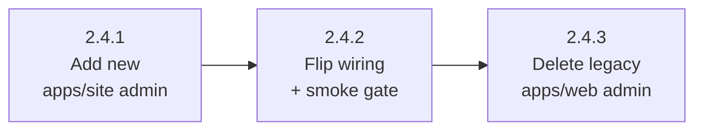

# M2 Phase 2.4 — Platform Admin Migration To apps/site (Umbrella)

## Status

Proposed (umbrella). Phase 2.4 ships as **three sequential
sub-phases**, each with its own plan doc, PR, and Status. The
umbrella's Status flips to `Landed` when all three sub-phase PRs
merge and their plans flip to `Landed`.

| Sub-phase | Plan | PR | Status |
| --- | --- | --- | --- |
| 2.4.1 — Add platform admin page on apps/site | [m2-phase-2-4-1-plan.md](./m2-phase-2-4-1-plan.md) | — | Proposed |
| 2.4.2 — Flip routing + retarget e2e to cross-app shape | [m2-phase-2-4-2-plan.md](./m2-phase-2-4-2-plan.md) | — | Proposed |
| 2.4.3 — Delete legacy apps/web platform admin | [m2-phase-2-4-3-plan.md](./m2-phase-2-4-3-plan.md) | — | Proposed |

Only sub-phase **2.4.2** ships under the two-phase **Plan-to-Landed
Gate For Plans That Touch Production Smoke** from
[`docs/testing-tiers.md`](../testing-tiers.md). Both 2.4.1 (purely
additive, production unchanged) and 2.4.3 (deletes already-unreachable
code) land under the regular Tier 1–4 gate.

**Parent epic:** [`event-platform-epic.md`](./event-platform-epic.md),
Milestone M2, Phase 2.4. Sibling phases: 2.1 RLS broadening — Landed
([`m2-phase-2-1-plan.md`](./m2-phase-2-1-plan.md),
[`m2-phase-2-1-1-plan.md`](./m2-phase-2-1-1-plan.md),
[`m2-phase-2-1-2-plan.md`](./m2-phase-2-1-2-plan.md)); 2.2 per-event
admin shell — Landed
([`m2-phase-2-2-plan.md`](./m2-phase-2-2-plan.md)); 2.3
`/auth/callback` and `/` migration — Landed
([`m2-phase-2-3-plan.md`](./m2-phase-2-3-plan.md)); 2.5 `/game/*`
URL migration — Proposed. The epic's M2 row stays `Proposed` until
2.5 also lands.

**Hard dependencies on landed siblings.** 2.2 (deep editor at
`/event/:slug/admin`) is the navigation target for `Open workspace`
post-cutover. 2.3 ships the apps/site adapter pair
([`apps/site/lib/setupAuth.ts`](../../apps/site/lib/setupAuth.ts),
[`apps/site/lib/supabaseBrowser.ts`](../../apps/site/lib/supabaseBrowser.ts)),
the [`(authenticated)`](../../apps/site/app/(authenticated)/layout.tsx)
route group with
[`SharedClientBootstrap`](../../apps/site/components/SharedClientBootstrap.tsx),
and the cross-app proxy pattern in
[`apps/web/vercel.json`](../../apps/web/vercel.json). 2.1.2 ships
[`authenticateEventOrganizerOrAdmin`](../../supabase/functions/_shared/event-organizer-auth.ts)
which the platform admin (root-only) passes through the
`is_root_admin()` branch.

**Scoping inputs:**
[`scoping/m2-phase-2-4.md`](./scoping/m2-phase-2-4.md) for the file
inventory and contracts walkthrough (transient; deletes in the M2
terminal cleanup);
[`m2-admin-restructuring.md`](./m2-admin-restructuring.md)
"Cross-Phase Decisions" §3 (apps/site auth idiom + bootstrap seam,
inherited from 2.3), §6 (`createStarterDraftContent` home →
`shared/events/`), §7 (fate of `/admin/events/:eventId` →
404 honestly), "Settled by default" (apps/site primary-domain
promotion deferred, combined SQL helper RPC declined,
`generate-event-code` payload contract).

## Context

This phase moves the platform admin — the page where root admins sign
in, see the list of game events, create new drafts, and publish or
unpublish events — from the prototype-era apps/web frontend to the
newer apps/site frontend. After it lands, apps/web stops owning any
URL that isn't event-scoped: the deep editor for an individual event
already moved to apps/web's `/event/:slug/admin` in phase 2.2, and the
sign-in callback already moved to apps/site in phase 2.3. The platform
admin (the list view) is the last loose end in the non-event namespace.

It's the right moment to do this because everything the move depends
on is already in production: broadened backend authorization for
organizers, the per-event deep editor, and the apps/site adapter
pattern for sign-in. Holding the platform admin on the older frontend
any longer means the platform's primary chrome — the public landing
page and the admin entry point — stays split across two frameworks
indefinitely, and future organizer-self-serve work would either build
against the older frontend by accident or pay the cost of this same
migration mid-feature. Finishing the move now also unlocks the option
to flip apps/site to be the primary Vercel project post-epic, since
apps/web's URL footprint will be small enough that the inversion is
cheap.

What this touches:

- The admin page on apps/site — a fresh client-component
  implementation, not a copy of the apps/web component (different
  framework idioms, different styling system, smaller-scope state
  hook because deep editing has already moved away).
- The apps/web admin module — the platform-admin scaffold (event
  list shell, sign-in form host, dashboard hook, lifecycle controls)
  deletes; the deep editor for an individual event stays exactly
  where it is.
- The Vercel same-origin proxy that routes top-level URLs between
  the two apps — gains rules sending `/admin*` to apps/site, loses
  the legacy SPA fallback for the same path.
- The starter-content helper that creates new drafts — moves from
  apps/web-local to a shared module so both apps consume from one
  place and can't drift.
- The end-to-end Playwright fixtures that walk the admin save /
  publish / unpublish flow — their URL assertions retarget to the
  new cross-app shape, but every page label, button name, and ARIA
  region stays stable so the rest of the locators don't need to
  move.
- The local auth e2e proxy that lets contributors run the same
  fixtures against branch-local code — its routing table widens to
  send `/admin*` to apps/site too.
- Documentation that names URL ownership: architecture, operations,
  dev, and the README.

What this doesn't touch: the database, the authoring backend Edge
Functions, the deep editor surface in apps/web, the sign-in callback
on apps/site (already moved), or per-event branding (deferred to M4).

## Goal

Move `/admin` from apps/web to apps/site as the root-admin platform
surface, splitting the work across three PRs to isolate the production
cutover from additive scaffolding and cleanup deletion. After the
phase, apps/web's URL footprint is purely event-scoped
(`/event/:slug/game/*` and `/event/:slug/admin`); apps/site owns
`/`, `/auth/callback`, and `/admin*`. Platform admin capability
(sign-in, event list, draft creation, publish, unpublish, navigation
to the per-event deep editor) is preserved verbatim — observable
behavior for a root-admin user is the framework change underneath,
not a feature change.

## Sequencing

Sub-phases are strictly serial — each sub-phase's PR cannot merge
until the prior sub-phase's PR is in main:

**Why three PRs (and not one).** The first draft of this plan bundled
all of 2.4 into one PR with internal commit boundaries. That shape
inherits the precedent from 2.3 but doesn't survive a branch-test
against the actual diff: 2.4 has more deletion surface than 2.3 (the
entire `apps/web/src/admin/` platform-admin module + its tests +
`shared/urls` deprecation), and the bundled shape would put the
production-smoke gate on a PR that also adds new code and deletes
legacy code. Splitting along the three verbs (add / flip / delete)
gives:

- **One PR per verb.** Reviewers context-switch once per PR rather
  than across additive, cutover, and cleanup mental models in one
  diff.
- **Smallest possible production-smoke gate.** Only 2.4.2 changes
  observable behavior; only 2.4.2 ships under the two-phase Plan-to-
  Landed Gate. 2.4.1 and 2.4.3 land under the regular Tier 1-4 gate.
- **Bisect-friendly cutover.** A regression after the cutover
  localizes to 2.4.2's PR unambiguously. In the bundled shape,
  the cutover is mixed with the new-page implementation and the
  legacy deletion in one diff.
- **Reversible intermediate state.** If 2.4.2 reveals a problem
  post-deploy, reverting 2.4.2 (without 2.4.3 having merged yet)
  restores the legacy `/admin` cleanly because apps/web's
  `AdminPage` is still in source.

The trade-off is three review rounds instead of one. The win is
materially smaller per-PR diffs and a scoped smoke gate. Per
[`AGENTS.md`](../../AGENTS.md) "Phase Planning Sessions" / "PR-count
predictions need a branch test," this is exactly the situation where
splitting wins.

**Just-in-time sub-phase drafting.** All three sub-phase plans are
drafted now (alongside the umbrella) so the cross-sub-phase
narrative is verifiable in one read, but each sub-phase plan's
reality-check gate re-runs against actually-merged sibling state
before its implementing PR opens. 2.4.2's plan re-checks against
merged 2.4.1; 2.4.3's plan re-checks against merged 2.4.2. The
sub-phase plans contain "Verified by:" annotations against the
merged shapes the implementing PR will read; if any annotation
drifts at re-check, the affected sub-phase plan updates before its
PR opens.

## Cross-Cutting Invariants

These rules thread two or more sub-phases. Sub-phase-local
invariants (e.g., bootstrap-seam idempotency, only relevant to
2.4.1) live in their respective sub-phase plans.

- **ARIA / copy stability across the cross-app port.** The new
  apps/site `/admin` event-list surface (built in 2.4.1) preserves
  the exact ARIA labels, role names, and visible copy that
  [`tests/e2e/admin-workflow.admin.spec.ts`](../../tests/e2e/admin-workflow.admin.spec.ts)
  and
  [`tests/e2e/admin-production-smoke.spec.ts`](../../tests/e2e/admin-production-smoke.spec.ts)
  assert against — `Game draft access` heading, `Event workspace
  summary` aria region, `${eventName} event` event-card label,
  `Open workspace` / `Open live game` / `Duplicate` buttons,
  `${liveCount} live` summary text, `Live v…` / `Draft only`
  status text, `aria-disabled="true"` + `aria-describedby` reason
  pattern with `Publish this event to open the live game.`
  reason text. 2.4.2's only e2e diff is **URL pattern** —
  `/admin/events/${eventId}` → `/event/${eventSlug}/admin` — and
  the proxy / fixture wiring; copy and ARIA do not change.
- **Deep-editor surface untouched.** apps/web's
  [`EventAdminPage`](../../apps/web/src/pages/EventAdminPage.tsx) and
  [`EventAdminWorkspace`](../../apps/web/src/admin/EventAdminWorkspace.tsx)
  (the 2.2 per-event admin) plus their dependency set
  (`AdminEventDetailsForm`, `AdminQuestionEditor`, `AdminQuestionList`,
  `AdminQuestionFields`, `AdminOptionEditor`, `AdminPublishPanel`,
  `useEventAdminWorkspace`, `useSelectedDraft`, `eventDetails.ts`,
  `publishChecklist.ts`, `questionBuilder.ts`,
  `questionFormMapping.ts`, `questionStructure.ts`) are not edited
  in any sub-phase. 2.4.1 reuses these files' types without
  modification; 2.4.2 retargets URLs to point at them; 2.4.3 must
  not delete them by accident (the platform-admin
  `AdminEventWorkspace` and the per-event `EventAdminWorkspace`
  differ by word order only). Self-review at every sub-phase
  walks this list against the diff.
- **URL contract progression.** Each sub-phase advances the
  contract:
  - 2.4.1 — no observable URL change. Both apps' `/admin*`
    surfaces coexist; production resolves the legacy one.
  - 2.4.2 — `/admin*` flips to apps/site in production via
    `apps/web/vercel.json`. Legacy apps/web `AdminPage` becomes
    dead code.
  - 2.4.3 — `routes.adminEvent`, `routes.adminEventsPrefix`, and
    `matchAdminEventPath` remove from `shared/urls`; the
    `/admin/events/${string}` `AppPath` branch removes; the
    legacy URL family 404s honestly per Cross-Phase Decisions §7.
    After 2.4.3, apps/web's URL footprint is purely event-scoped.
- **shared/urls / apps/web `App.tsx` build-sequencing constraint
  inside 2.4.3.** The
  [`shared/urls/routes.ts`](../../shared/urls/routes.ts) deprecation
  cannot land in a tip that still has apps/web `App.tsx` importing
  the deprecated symbols. Inside 2.4.3, the implementer locks the
  commit order at edit time so every commit's tip passes
  `npm run build:web`. Recommended order: delete apps/web admin
  handlers first (which removes the `matchAdminEventPath` import
  from `App.tsx`), then prune `shared/urls`. The inverse works if
  the apps/web `App.tsx` edit lands in the same commit as the
  shared deprecation.

## Cross-Cutting Invariants Touched (epic-level)

- **Auth integration.** Verified by:
  [`shared/auth/configure.ts:35`](../../shared/auth/configure.ts#L35).
  apps/site's adapter pair is wired by 2.3; 2.4.1 adds a
  `setupEvents` side-effect import alongside the existing
  `setupAuth` import in `<SharedClientBootstrap>`.
- **URL contract.** Already covered above.
- **Theme route scoping.** Verified by:
  [`apps/site/app/layout.tsx:46-60`](../../apps/site/app/layout.tsx#L46).
  The new `/admin` page is non-event-scoped, inherits the apps/site
  Sage Civic root-layout defaults, and does not wrap in
  `<ThemeScope>`. apps/web's `/event/:slug/admin` deep editor wraps
  as it already does in 2.2.
- **Trust boundary.** Verified by:
  [`supabase/functions/_shared/event-organizer-auth.ts:24-101`](../../supabase/functions/_shared/event-organizer-auth.ts#L24).
  Authoring writes flow through Edge Functions gated on
  `is_organizer_for_event(eventId) OR is_root_admin()`; the platform
  admin passes through the `is_root_admin()` branch. Observable
  behavior preserved.
- **In-place auth.** Verified by: 2.4.1's new `/admin` renders
  `<SignInForm>` inline within its shell when signed-out; no
  `/signin` page is introduced.
- **Token bucket discipline.** No new SCSS / CSS surface in any
  sub-phase. The platform admin reuses the existing apps/site
  `globals.css` typography (`next/font` Inter + Fraunces) and the
  brand color tokens emitted by
  [`shared/styles/themeToStyle.ts`](../../shared/styles/themeToStyle.ts)
  on `<html>`. 2.4.3's SCSS prune deletes apps/web platform-admin
  selectors only after grep-confirming zero surviving consumers.

## Out Of Scope

Phase-level decisions that apply across all three sub-phases. Each
entry references the resolution path so reviewer attention does not
relitigate them.

- **`/admin/events/:eventId` redirect.** Resolved in
  [`m2-admin-restructuring.md`](./m2-admin-restructuring.md)
  Cross-Phase Decisions §7 — 404 honestly. apps/site does not
  install a slug-from-id redirect; the URL was admin-internal and
  lived a single development cycle, so the bookmark population is
  near-zero. Deletion of the matchers lands in 2.4.3.
- **`is_admin_or_organizer_for_event(eventId)` combined SQL helper.**
  Resolved in
  [`m2-admin-restructuring.md`](./m2-admin-restructuring.md)
  "Settled by default" — declined. Compose `is_root_admin()` +
  `is_organizer_for_event(eventId)` separately client-side; a third
  helper for one consumer is unjustified surface.
- **apps/site Vercel project primary-domain promotion.** Resolved
  in [`m2-admin-restructuring.md`](./m2-admin-restructuring.md)
  "Settled by default": defer post-epic per
  [`site-scaffold-and-routing.md`](./site-scaffold-and-routing.md)
  "Primary-project ownership flip." M2 stays on apps/web-primary
  proxy-rewrite.
- **`generate-event-code` payload contract.** Already shipped by
  2.1.2 — `eventId` in payload. The shared
  `generateEventCode(eventId)` signature already takes the id; the
  Edge Function validates server-side. No work in 2.4.
- **`createStarterDraftContent` / `createDuplicatedDraftContent`
  duplicated in apps/site (without sharing).** Rejected in
  [`m2-admin-restructuring.md`](./m2-admin-restructuring.md)
  Cross-Phase Decisions §6. 2.4.1 owns the extraction to
  `shared/events/`.
- **Per-event Theme registration on the new `/admin` page.**
  Deferred to M4 phase 4.1 per the epic's "Deferred ThemeScope
  wiring" invariant. The new `/admin` is non-event-scoped.
- **Splitting the apps/site `/admin` page into per-component files.**
  2.4.1 ships a single `page.tsx`; per-component split is deferred
  to a focused follow-up if the file exceeds ~250 lines of
  substantive JSX during implementation.

## Risk Register

Cross-sub-phase risks. Sub-phase-local risks live in their
respective plan docs.

- **Cross-project proxy unverifiable pre-merge for `/admin*`.**
  [`apps/web/vercel.json`](../../apps/web/vercel.json) destinations
  are absolute production URLs, so any local `vercel dev` run for
  2.4.2 proxies `/admin` to *deployed* apps/site (still on main, no
  new `/admin` route at 2.4.2's pre-merge state — 2.4.1 will be
  merged by then so the route exists in apps/site source, but the
  prod deploy of apps/site won't have it until 2.4.2 itself
  deploys). End-to-end verification of the new proxy rules can only
  happen post-deploy. Mitigation: 2.4.2 ships under the two-phase
  Plan-to-Landed Gate; the post-release `Production Admin Smoke`
  run is the load-bearing verification; 2.4.1's local apps/site
  exercise + 2.4.2's local auth e2e exercise are the strongest
  pre-merge integration checks (the auth e2e proxy reproduces the
  cross-app routing on local origins).
- **ARIA / copy stability slip in 2.4.1 silently breaks 2.4.2's
  e2e specs.** A typo or simplification in the apps/site `/admin`
  port (2.4.1) silently fails the e2e specs after 2.4.2 retargets
  URLs. Mitigation: 2.4.1's local apps/site exercise includes an
  explicit ARIA / copy diff against
  [`apps/web/src/admin/AdminDashboardContent.tsx`](../../apps/web/src/admin/AdminDashboardContent.tsx);
  2.4.2's pre-merge auth e2e exercise runs the full
  `admin-workflow.admin.spec.ts` round-trip and catches any drift
  before the cutover ships.
- **Cross-app navigation client-side regression.** Using
  `useRouter().replace(href)` or `<Link href>` from
  `next/navigation` for the `Open workspace` / `Open live game`
  buttons in 2.4.1's new page would silently break in production:
  client-side navigation stays inside apps/site, never re-enters
  the apps/web Vercel proxy, lands on apps/site's 404 page. Same
  trap that bit 2.3's first draft. Mitigation: 2.4.1's plan locks
  the contract to `window.location.assign(path)` /
  `window.location.replace(path)`; the
  [`apps/site/app/(authenticated)/auth/callback/page.tsx`](../../apps/site/app/(authenticated)/auth/callback/page.tsx)
  precedent is the reviewer reference.
- **2.4.2 reverted but 2.4.3 already merged.** If 2.4.2 reveals a
  production issue and is reverted, but 2.4.3 has somehow merged
  in the meantime, the legacy apps/web `AdminPage` is gone and
  the cutover can't be reverted to the legacy state. Mitigation:
  the strict-serial sequencing is enforced at PR-open time; 2.4.3's
  PR cannot open until 2.4.2 has flipped to `Landed` (post-smoke
  green). The umbrella's Status table and the merge-order
  discipline catch this; the protective check is named in 2.4.3's
  Pre-Edit Gate.
- **SCSS prune over-deletion in 2.4.3.** apps/web platform-admin
  SCSS selectors may overlap with deep-editor selectors that survive
  in
  [`EventAdminWorkspace.tsx`](../../apps/web/src/admin/EventAdminWorkspace.tsx).
  Dropping a selector still consumed by the deep editor would
  silently regress the per-event admin page's appearance.
  Mitigation: 2.4.3's plan names the grep-audit procedure
  (`grep -rn "<selector>" apps/web/src` against the surviving file
  set) before any SCSS partial deletes.
- **Doc-currency drift across sub-phases.** Doc updates for
  architecture / operations / dev / README span 2.4.2 (URL ownership
  shape after the cutover) and 2.4.3 (apps/web admin module
  description after the deletion). A missed edit silently lies about
  the as-shipped state. Mitigation: each sub-phase plan names its
  doc edits explicitly; 2.4.2 owns URL-ownership shape edits;
  2.4.3 owns module-ownership edits.

## Backlog Impact

- "Organizer-managed agent assignment" stays *unblocked but not
  landed*. 2.4 does not change the unblock recorded by 2.1.1's
  `event_role_assignments` policies; the entry in
  [`docs/backlog.md`](../backlog.md) is updated with M2's terminal
  PR (2.5).
- No new backlog items expected. If the 2.4.2 post-release
  `Production Admin Smoke` run surfaces an issue with the
  cross-project `/admin*` proxy, that becomes a focused follow-up
  with explicit scope.

## Documentation Currency

Doc edits distribute across sub-phases per
[`AGENTS.md`](../../AGENTS.md) "Doc Currency Is a PR Gate":

- **2.4.1** — minimal doc surface. New shared/events module is
  internal; if the [`shared/events/README.md`](../../shared/events/README.md)
  documents the public surface, add the new helper there.
- **2.4.2** — URL ownership shape edits. The Vercel routing
  topology and the URL ownership entries in
  [`docs/architecture.md`](../architecture.md),
  [`docs/operations.md`](../operations.md),
  [`docs/dev.md`](../dev.md) update with the cutover. Auth e2e
  proxy `isSiteRequest` widening documented in
  [`docs/dev.md`](../dev.md). Plan Status flips to `In progress
  pending prod smoke` in 2.4.2's PR; flips to `Landed` in the
  doc-only follow-up commit.
- **2.4.3** — apps/web module ownership edits. The
  [`docs/architecture.md`](../architecture.md) apps/web admin
  module description rewrites to describe only the per-event deep
  editor. README route ownership currency-check.
- **Umbrella (this doc)** — Status flips to `Landed` after all
  three sub-phases land.
- **[`m2-admin-restructuring.md`](./m2-admin-restructuring.md)** —
  Phase Status table row for 2.4 updates as each sub-phase
  drafts and ships; final flip to `Landed` lands with 2.4.3's PR.

## Related Docs

- [`event-platform-epic.md`](./event-platform-epic.md) — parent
  epic; M2 paragraph at lines 544–669.
- [`m2-admin-restructuring.md`](./m2-admin-restructuring.md) — M2
  milestone doc; Cross-Phase Decisions §3 / §6 / §7 / "Settled by
  default" drive the resolved decisions this phase consumes.
- [`scoping/m2-phase-2-4.md`](./scoping/m2-phase-2-4.md) — scoping
  doc the umbrella + sub-phase plans compress; transient.
- [`m2-phase-2-4-1-plan.md`](./m2-phase-2-4-1-plan.md) — sub-phase
  2.4.1 plan (add new).
- [`m2-phase-2-4-2-plan.md`](./m2-phase-2-4-2-plan.md) — sub-phase
  2.4.2 plan (flip wiring; production smoke gate).
- [`m2-phase-2-4-3-plan.md`](./m2-phase-2-4-3-plan.md) — sub-phase
  2.4.3 plan (delete legacy).
- [`m2-phase-2-3-plan.md`](./m2-phase-2-3-plan.md) — sibling Landed
  plan; apps/site adapter pair, `(authenticated)` route group, and
  identity-fingerprint procedure for cross-app proxy rule-order
  checks all originated here.
- [`m2-phase-2-2-plan.md`](./m2-phase-2-2-plan.md) — sibling Landed
  plan; per-event admin deep editor at `/event/:slug/admin` is the
  navigation target for `Open workspace` post-cutover.
- [`m2-phase-2-1-2-plan.md`](./m2-phase-2-1-2-plan.md) — sibling
  Landed plan; the Edge Function helper migration the platform
  admin's writes pass through unchanged.
- [`docs/testing-tiers.md`](../testing-tiers.md) — Tier 5 production
  smoke and the two-phase Plan-to-Landed Gate; only 2.4.2 ships
  under this gate.
- [`docs/self-review-catalog.md`](../self-review-catalog.md) — audit
  name source for sub-phase Self-Review Audits sections.
- [`AGENTS.md`](../../AGENTS.md) — workflow rules; the new
  Phase-Planning context-preamble rule was added alongside this
  plan.
