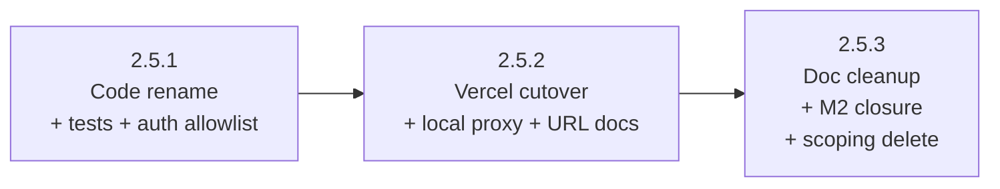

# M2 Phase 2.5 — `/game/*` URL Migration For Operator Routes (Umbrella)

## Status

Proposed (umbrella). Phase 2.5 ships as **three sequential
sub-phases**, each with its own plan doc, PR, and Status.

| Sub-phase | Plan | PR | Status |
| --- | --- | --- | --- |
| 2.5.1 — Code rename + tests + dashboard allow-list audit | [m2-phase-2-5-1-plan.md](./m2-phase-2-5-1-plan.md) | [#130](https://github.com/kcrobinson-1/neighborly-events/pull/130) | Landed |
| 2.5.2 — Vercel cutover + local proxy + URL-shape doc currency | [m2-phase-2-5-2-plan.md](./m2-phase-2-5-2-plan.md) | — | Proposed |
| 2.5.3 — Doc cleanup + M2 closure + scoping batch delete | not yet drafted | — | Proposed |

**Per-sub-phase plans draft just-in-time, not in batch.** Only
2.5.1's plan exists at umbrella-drafting time. 2.5.2's plan
drafts after 2.5.1 is `Landed` (against the merged
`shared/urls/` rename and the merged dispatcher); 2.5.3's plan
drafts after 2.5.2 is `Landed` and its post-deploy bare-path
retirement check ran green (against the merged vercel.json + the
URL-shape doc edits 2.5.2 already landed). Per AGENTS.md "Phase
Planning Sessions — Plan-drafting cadence":
"Plans drafted against not-yet-merged code stale fast;
just-in-time drafting has access to actual merged shapes." The
sub-phase rows above flip to plan-linked when their plan
drafts.

**No production-smoke fixture covers any sub-phase, but 2.5.2
ships under a two-phase Status pattern.** Unlike 2.4.2, the 2.5
cutover does not touch any production-smoke fixture: the existing
`Production Admin Smoke`
([`scripts/testing/run-production-admin-smoke.cjs`](../../scripts/testing/run-production-admin-smoke.cjs))
exercises `/auth/callback?next=/admin` and never reaches the
operator route family. The two-phase **Plan-to-Landed Gate For
Plans That Touch Production Smoke** from
[`docs/testing-tiers.md`](../testing-tiers.md) therefore does not
apply *as written* — that gate is keyed on a specific fixture run.

But 2.5.2's load-bearing verifier is a manual deployed-origin
check (the cross-app proxy can only be observed against the real
Vercel routing layer post-deploy;
[`apps/web/vercel.json`](../../apps/web/vercel.json) destinations
are absolute production URLs, so any local `vercel dev` run
proxies to *deployed* apps/site rather than the branch-local
instance — the same pre-merge unverifiability that bit 2.3 and
forced 2.4.2's two-phase pattern). A plan that flips Status to
`Landed` at merge while its load-bearing verifier hasn't yet run
asserts a verification claim it can't back. **2.5.2 therefore
ships under a two-phase Status flip, parallel to the
testing-tiers.md pattern but with a non-prod-smoke Status
string**:

1. The implementing PR merges with this plan's Status reading
   `In progress pending deployed-origin verification` (exact
   string; no paraphrase). Pre-merge gates that *can* run
   (rule-table review against the post-edit contract; the local
   auth-e2e wrapper run against the updated dev-server proxy;
   the apps/web local smoke confirming the dispatcher side of
   the contract) all pass before the merge button.
2. After deploy, the implementer runs the manual deployed-origin
   check (bare paths reach apps/site's unknown-route response;
   new operator URLs reach apps/web's operator pages). The
   evidence — response shells, headers, screenshots if useful —
   captures inline in the PR (a comment) or as a doc-only
   follow-up commit linked from the PR.
3. The Status flip from
   `In progress pending deployed-origin verification` to
   `Landed` happens in that doc-only follow-up commit (or the
   PR comment + a separate doc-only commit) — never in the
   implementing PR itself. Same shape as
   [`m2-phase-2-3-plan.md`](./m2-phase-2-3-plan.md)'s
   "Production verification evidence" section that landed
   2.3's terminal flip post-deploy.

This pattern keeps the load-bearing claim honest: the plan does
not assert verification it doesn't have. 2.5.3's pre-edit gate
("2.5.2 reverted but 2.5.3 already merged" risk in the Risk
Register) reads 2.5.2's Status as `Landed` only after the
deployed-origin check has been captured — the Status string is
the load-bearing signal that the cutover is verified, not just
merged.

**2.5.1 and 2.5.3 ship under the regular Tier 1–4 gate.** 2.5.1
is a pre-merge-verifiable code rename (no cross-project routing
change); 2.5.3 is doc-only + Status flips against an
already-verified cutover. Neither has a post-deploy verifier, so
the regular `Proposed` → `Landed` flip in the implementing PR
applies.

**Parent epic:** [`event-platform-epic.md`](./event-platform-epic.md),
Milestone M2, Phase 2.5. Sibling phases: 2.1 RLS broadening — Landed
([`m2-phase-2-1-plan.md`](./m2-phase-2-1-plan.md),
[`m2-phase-2-1-1-plan.md`](./m2-phase-2-1-1-plan.md),
[`m2-phase-2-1-2-plan.md`](./m2-phase-2-1-2-plan.md)); 2.2 per-event
admin shell — Landed
([`m2-phase-2-2-plan.md`](./m2-phase-2-2-plan.md)); 2.3
`/auth/callback` and `/` migration — Landed
([`m2-phase-2-3-plan.md`](./m2-phase-2-3-plan.md)); 2.4 platform
admin migration — Landed
([`m2-phase-2-4-plan.md`](./m2-phase-2-4-plan.md)). **This is M2's
terminal phase**: 2.5.3's PR flips the
[epic's M2 row](./event-platform-epic.md) from `Proposed` to
`Landed` and the
[M2 milestone doc](./m2-admin-restructuring.md)'s top-level Status
to `Landed`.

**Hard dependencies on landed siblings.** The
[`/event/:slug/game/*`](./site-scaffold-and-routing.md) apps/web
carve-out at
[`apps/web/vercel.json:8`](../../apps/web/vercel.json#L8) (M0 phase
0.3) is what makes 2.5.2's deletion of the bare-path carve-outs
safe — the migrated URLs already match rule 2 before reaching the
cross-app rule. The `routes.eventRedeem` /
`routes.eventRedemptions` builders + their matchers from M1 phase
1.2
([`shared/urls/routes.ts:35-38,132-206`](../../shared/urls/routes.ts#L35))
are the rename targets. The local auth-e2e dev-server proxy from
M2 phase 2.3
([`scripts/testing/run-auth-e2e-dev-server.cjs:47-59`](../../scripts/testing/run-auth-e2e-dev-server.cjs#L47))
is the fixture-side surface 2.5.2 widens.

**Scoping inputs:**
[`scoping/m2-phase-2-5.md`](./scoping/m2-phase-2-5.md) for the
single-PR file inventory and contracts walkthrough (transient;
deletes in 2.5.3's batch deletion);
[`m2-admin-restructuring.md`](./m2-admin-restructuring.md)
"Cross-Phase Decisions" "Settled by default" entries (cross-app
smoke for bare-path retirement: defer to apps/site's ordinary
unknown-route response; vercel.json composition with 2.3/2.4:
re-derive at plan-drafting against merged-in state) for the
deliberation behind the defaults this phase consumes.

## Context

This phase moves the two authenticated operator routes — the
booth-side redemption keypad and the organizer monitoring +
reversal list — from their bare `/event/:slug/redeem` and
`/event/:slug/redemptions` URLs into the apps/web `/game/*`
namespace, becoming `/event/:slug/game/redeem` and
`/event/:slug/game/redemptions`. After it lands, apps/web's URL
footprint is purely event-scoped under two clean namespaces
(`/event/:slug/game/*` and `/event/:slug/admin`); every URL outside
those carve-outs flows to apps/site through the cross-app proxy.

It's the right moment to do this because every prior M2 phase has
already shipped its piece of the URL contract progression: 2.3
moved `/` and `/auth/callback` to apps/site, 2.4 moved `/admin*`,
and the operator-route bare paths are the last apps/web URLs that
don't sit under the two intended namespaces. Holding the
inconsistency any longer means every contributor walking the
routing topology has to remember "and also these two transitional
URLs," and the M3/M4 work that depends on M2 being closed
(rendering pipeline gates, Madrona's apps/web event-route
ThemeScope wiring) keeps reading "M2 status: Proposed" against
otherwise-complete progress.

What this touches:

- The shared route module — the four builder/matcher names rename
  in lockstep with the URL change (the M1 phase 1.2 deferral that
  named this phase as the rename moment).
- The apps/web router dispatcher and the two operator page files —
  the dispatcher swaps matcher imports and dispatch branches; the
  page files only change JSDoc URL strings and the `routes.*`
  builder call the magic-link `next=` emits.
- The Vercel rewrite config — the two bare-path carve-outs delete
  because the `/event/:slug/game/*` carve-out from M0 phase 0.3
  already covers the new URLs.
- The e2e fixtures and mobile-smoke specs that exercise the
  routes — URL strings update; fixture interface stays verbatim.
- The local auth-e2e dev-server proxy + its unit test — keeps the
  local proxy production-faithful for the bare-path retirement.
- Documentation that names the operator URLs — architecture, dev,
  operations, product, README, the shared/urls README.
- The M2 milestone closure surface — open-questions and backlog
  entries the epic resolves in M2; epic and milestone Status
  flips.

What this doesn't touch: the database, the Edge Functions, the
operator page behavior (authorization, redemption, reversal), the
sign-in form, `shared/auth/`, `shared/db/`, `shared/events/`,
`shared/styles/`, apps/site source, or the per-event ThemeScope
wiring (deferred to M4 phase 4.1).

## Goal

Migrate the two operator routes into the `/event/:slug/game/*`
namespace as a hard cutover (no backward-compat redirects),
splitting the work across three PRs to isolate the production
routing cutover from additive code changes and from doc/closure
churn. After the phase, apps/web's URL footprint is purely
`/event/:slug/game/*` and `/event/:slug/admin`; bare-path operator
URLs serve apps/site's ordinary unknown-route response (per
[milestone doc](./m2-admin-restructuring.md) "Settled by default"
entry on cross-app smoke for bare-path retirement). The
`shared/urls/` `eventRedeem` / `eventRedemptions` builders and
their matchers rename to `gameRedeem` / `gameRedemptions` in
lockstep with the URL change so builder name and URL stay aligned
at every gate (closing the deferral M1 phase 1.2 explicitly named
2.5 as the resolution moment for). M2 closes — open-questions and
backlog entries flip per the epic's "Open Questions Resolved By
This Epic" subsection.

Operator behavior preserved verbatim: same sign-in surface, same
authorization model, same Edge Function calls
(`redeem-entitlement`, `reverse-entitlement-redemption`,
`get-redemption-status`), same page chrome. Only the URL family
changes.

## Sequencing

Sub-phases are strictly serial — each sub-phase's PR cannot merge
until the prior sub-phase's PR is in main:

**Why three PRs (and not one).** The single-PR draft sat at ~25
files / ~3 subsystems, well under AGENTS.md's >5-subsystem /
>300-LOC split threshold. The split is a deliberate review-coherence
choice, not a forced split, mirroring 2.4's three-verb shape:

- **Maximum reviewer focus on the high-risk surface.** 2.5.2's
  `apps/web/vercel.json` edit is the single load-bearing risk in
  the phase per the
  [milestone doc](./m2-admin-restructuring.md) "Cross-Phase Risks
  — Vercel rule-ordering misordering across 2.3, 2.4, 2.5." The
  cutover PR has ~4 substantive files (vercel.json, the local
  proxy, its unit test, operations.md) plus the URL-shape doc
  edits whose accuracy depends on the cutover. Reviewer attention
  isn't diluted by mechanical rename diff or M2-closure paperwork.
- **Bisect-friendly cutover.** A regression after the cutover
  localizes to 2.5.2's PR unambiguously. In the bundled shape,
  the cutover would be mixed with the rename diff and the doc
  pass.
- **Reversible intermediate state.** 2.5.1 leaves the bare-path
  vercel.json carve-outs in place; if 2.5.1 ships and 2.5.2 reveals
  a problem pre-merge, the bare paths still route to apps/web (just
  to its not-found page, since the dispatcher no longer matches
  them). Reverting 2.5.1 restores both the dispatcher and the
  fixture URLs to their pre-rename shape.
- **Cleanup PR isolates M2-row flip.** 2.5.3 only opens after
  2.5.2 is `Landed` *and* the post-deploy bare-path retirement
  check ran green. The M2 closure (epic row + milestone Status +
  open-questions + backlog) lands against a verified cutover, not
  against a "should be green" claim.

The trade-off is three review rounds instead of one. The win is
the load-bearing routing edit getting its own focused review and
the cleanup PR landing only after the cutover is observably
green. Per
[`AGENTS.md`](../../AGENTS.md) "Phase Planning Sessions" /
"PR-count predictions need a branch test," this is the kind of
deliberate split AGENTS.md welcomes when the high-risk surface is
small and isolating it pays for the coordination cost.

**Just-in-time sub-phase drafting.** Only 2.5.1's plan exists at
umbrella-drafting time. 2.5.2's plan drafts after 2.5.1 lands —
its file inventory and contracts re-check against the merged
`shared/urls/` rename and the merged dispatcher rather than against
this umbrella's predicted shape. 2.5.3's plan drafts after 2.5.2
lands and its post-deploy verification passes — its file inventory
re-checks against the post-edit `apps/web/vercel.json` rule order,
the URL-shape doc edits 2.5.2 already landed, and the actual
remaining doc-currency surface. Per AGENTS.md "Phase Planning
Sessions — Plan-drafting cadence" and the
[milestone doc](./m2-admin-restructuring.md) "Sequencing —
Plan-drafting cadence": plans drafted against not-yet-merged code
stale fast. The cross-sub-phase narrative below (invariants,
risks, doc-currency split) is umbrella-owned and gives 2.5.2's
and 2.5.3's eventual plan-drafters a stable contract to draft
against without pre-locking the per-file inventory.

## Cross-Cutting Invariants

These rules thread two or more sub-phases. Sub-phase-local
invariants (e.g., dispatcher build-coupling inside 2.5.1, vercel
rule-ordering inside 2.5.2) live in their respective sub-phase
plans — 2.5.1's already; 2.5.2's and 2.5.3's when they draft per
the just-in-time rule above.

- **No backward-compat redirect for the bare paths, ever.** The
  hard cutover framing is load-bearing across all three sub-phases:
  2.5.1 makes the dispatcher reject the bare paths; 2.5.2 removes
  the apps/web vercel.json carve-outs; 2.5.3 doesn't add a
  per-URL handler on apps/site. The bare paths serve apps/site's
  ordinary unknown-route response post-cutover. If post-launch
  evidence surfaces a real bookmark population, the response is a
  focused follow-up (apps/site per-URL handler), not a re-litigated
  in-phase decision. Resolved in
  [`m2-admin-restructuring.md`](./m2-admin-restructuring.md)
  "Settled by default" — cross-app smoke for bare-path retirement.
- **Builder name and URL stay aligned at every gate.** Per M1
  phase 1.2's deferral (`shared/urls/README.md:49-52`), the
  `routes.eventRedeem` / `routes.eventRedemptions` builders kept
  their today-shape names through M2 phases 2.1–2.4 because their
  URLs hadn't moved yet. The rename happens in the same sub-phase
  (2.5.1) as the URL change — never in a gap where the builder
  returns one shape and the name implies another. 2.5.2 and 2.5.3
  do not edit the rename surface; the builder names settle in
  2.5.1 and stay verbatim afterward.
- **No `<ThemeScope>` wrap added to operator route shells.** The
  M4 phase 4.1 deferral covers the entire phase: 2.5.1's
  dispatcher edit does not introduce a `<ThemeScope>` wrap around
  `EventRedeemPage` or `EventRedemptionsPage`; 2.5.2 and 2.5.3
  don't touch the dispatcher. The operator routes continue to
  render against apps/web's warm-cream `:root` defaults across
  every sub-phase. M4 phase 4.1's central
  [`App.tsx`](../../apps/web/src/App.tsx) wiring lands the wrap
  for all three apps/web event-route shells (`GameRoutePage`,
  `EventRedeemPage` at its `/game/redeem` URL,
  `EventRedemptionsPage` at its `/game/redemptions` URL) in the
  same change as Madrona's `Theme` registration.
- **Trust boundary unchanged.** No SQL migration, no RLS policy
  change, no Edge Function body change, no `shared/auth/` edit
  in any sub-phase. The operator routes continue to call
  [`redeem-entitlement`](../../supabase/functions/redeem-entitlement),
  [`reverse-entitlement-redemption`](../../supabase/functions/reverse-entitlement-redemption),
  and
  [`get-redemption-status`](../../supabase/functions/get-redemption-status)
  through the existing browser Supabase client under the same
  authorization model. Phase 2.5 is a URL contract change, not a
  trust-boundary change.
- **URL contract progression.** Each sub-phase advances the
  contract:
  - 2.5.1 — apps/web dispatcher answers the new URLs; the
    `shared/urls/` rename completes; e2e fixtures + magic-link
    `next=` emit the new URLs. vercel.json bare-path carve-outs
    still in place: bare URLs reach apps/web (still SPA-served
    via the carve-out), but the dispatcher renders the not-found
    page because no branch matches the bare suffix. New URLs are
    the canonical operator URLs from this point forward.
  - 2.5.2 — vercel.json bare-path carve-outs delete. Bare URLs
    flow through the cross-app `/event/:slug/:path*` rule to
    apps/site's unknown-route response. apps/web's URL footprint
    shrinks to its terminal shape:
    `/event/:slug/game/*` + `/event/:slug/admin`.
  - 2.5.3 — no URL contract change. Doc currency only.
- **Doc currency split across sub-phases.** Per AGENTS.md "Doc
  Currency Is a PR Gate," docs that describe URL ownership shape
  update with the cutover (2.5.2): the architecture topology
  table, the architecture URL ownership prose at the top-level
  layout section, the dev.md rule walkthrough, the
  Supabase Auth dashboard description in operations.md. Docs that
  describe page behavior or `shared/urls/` API shape update in
  the cleanup PR (2.5.3): architecture route inventory entries
  for the page files, architecture auth-flow narrative, dev.md
  routes builder list, product.md capability bullet, README
  operator-route refs, shared/urls/README routes/matcher list.
  See "Documentation Currency" below for the per-sub-phase split
  rationale.
- **Supabase Auth dashboard allow-list audited per environment
  before 2.5.1 merges.** 2.5.1 changes the magic-link `next=`
  emission from `/event/<slug>/redeem` to
  `/event/<slug>/game/redeem` (mirror for redemptions). The
  Supabase Auth dashboard redirect-URL allow-list per environment
  must admit the new URLs by the time 2.5.1 merges, otherwise
  every magic-link request from 2.5.1 onward falls back to
  `routes.home` per `validateNextPath`'s allow-list-miss branch.
  This is a 2.5.1 pre-merge gate (not 2.5.2) because the magic-link
  emission flips in 2.5.1, not at the vercel cutover.

## Cross-Cutting Invariants Touched (epic-level)

- **Auth integration.** Verified by:
  [`shared/urls/validateNextPath.ts:23-67`](../../shared/urls/validateNextPath.ts#L23).
  `validateNextPath`'s open-redirect defense continues to admit
  only the post-rename allow-list (the matchers' decoding-and-
  validation discipline preserves verbatim across the rename).
  The four matchers' empty-slug + embedded-slash rejection logic
  carries over.
- **URL contract.** Already covered above.
- **Theme route scoping.** Verified by:
  [`apps/web/src/App.tsx:41-63`](../../apps/web/src/App.tsx#L41).
  Today's redeem and redemptions branches do not wrap in
  `<ThemeScope>`; the rename swaps imports and matcher names
  but keeps the unwrapped JSX shape. M4 phase 4.1 owns the wrap.
- **Trust boundary.** Already covered above.
- **In-place auth.** Verified by:
  [`apps/web/src/pages/EventRedeemPage.tsx:358-384`](../../apps/web/src/pages/EventRedeemPage.tsx#L358)
  and the corresponding section in `EventRedemptionsPage.tsx`.
  Page-shell sign-in surface is unchanged; only the magic-link
  `next=` URL the page emits is rewritten.

## Out Of Scope

Phase-level decisions that apply across all three sub-phases.
Sub-phase-local exclusions live in their respective plan docs.

- **Backward-compat redirects for the bare paths.** Resolved in
  [`m2-admin-restructuring.md`](./m2-admin-restructuring.md)
  "Settled by default" — apps/site's ordinary unknown-route
  response handles the retired URLs; no per-URL handler on either
  side. Re-opening this decision in any sub-phase is out of scope.
- **Page-component file renames.** `EventRedeemPage` and
  `EventRedemptionsPage` keep their names, exports, and props
  across all three sub-phases. M4 phase 4.1 names them at the
  post-2.5 URLs verbatim, so no downstream rename is implied.
- **Edge Function URL paths.** `redeem-entitlement`,
  `reverse-entitlement-redemption`, and `get-redemption-status`
  paths are independent of frontend route URLs and stay where
  they are.
- **apps/site source edits.** No apps/site source change in any
  sub-phase. apps/site serves the bare paths through its ordinary
  unknown-route response post-cutover; no per-URL handler.
- **`<ThemeScope>` wrap on operator routes.** Deferred to M4
  phase 4.1 per the epic's "Deferred ThemeScope wiring" invariant.
- **Production-smoke fixture changes.** No sub-phase adds or
  modifies any production-smoke fixture; the existing
  `Production Admin Smoke` is independent of this phase.
- **Per-event Theme registration for any slug.** M4 phase 4.1
  owns Madrona's Theme registration; no Theme work in 2.5.
- **`shared/urls/` further restructuring.** Only the two
  operator-route renames in 2.5.1; the rest of the module stays
  as 2.4.3 left it.

## Risk Register

Cross-sub-phase risks. Sub-phase-local risks live in their
respective plan docs.

- **Vercel rule-ordering misorder breaks the new operator URLs.**
  Per
  [milestone doc](./m2-admin-restructuring.md) "Cross-Phase Risks
  — Vercel rule-ordering misordering across 2.3, 2.4, 2.5":
  2.5.2's deletion of `apps/web/vercel.json` rules 5–6 must not
  reorder the surviving rules in a way that puts the cross-app
  `/event/:slug/:path*` rule (current rule 8, becoming rule 6
  post-edit) above the
  `/event/:slug/game` / `/event/:slug/game/:path*` carve-outs
  (rules 1–2). Vercel honors source order; a careless reorder
  would proxy the new operator URLs to apps/site instead of
  apps/web. Mitigation: 2.5.2's plan-drafter pins the post-edit
  rule table in that sub-phase's Contracts section against the
  carve-out-order constraint named in this umbrella's
  "URL contract progression" invariant; pre-merge code review
  diffs vercel.json against the contracted shape; the post-deploy
  manual check exercises both the new operator URLs (must reach
  apps/web's operator pages) and the bare paths (must reach
  apps/site's unknown-route response). A misorder surfaces as the
  new operator URL landing on apps/site instead of the operator
  page.
- **Bare-path UX gap between 2.5.1 and 2.5.2 merges.** Between
  2.5.1 landing and 2.5.2 landing, bare URLs reach apps/web
  through the still-present carve-outs but the dispatcher no
  longer matches them, so they render apps/web's `NotFoundPage`.
  Functionally the URLs are 404s in both states (same as the
  post-2.5.2 cutover state's apps/site unknown-route response);
  the difference is response shell. Acceptable because the bare
  paths are documented as direct-entry-only with no nav link, and
  the gap is bounded by 2.5.2's merge cadence (the umbrella's
  strict-serial sequencing keeps the gap short). Sub-phase-local
  mitigation: 2.5.1's PR description names the gap explicitly so
  reviewers understand the transient apps/web 404 isn't a
  regression.
- **Stale `next=` in Supabase Auth Site URL between dashboard
  audit and 2.5.1 merge.** Magic-link redirects pointing at
  bare-path operator URLs land at apps/web post-2.5.1 (still
  carved out via vercel.json rules 5–6) and the dispatcher
  renders the not-found page; the operator never reaches the
  redeem page. Mitigation: per-env Supabase Auth dashboard audit
  in 2.5.1's pre-merge gate (per the dashboard-audit
  cross-cutting invariant); the audit must complete before 2.5.1
  merges so post-merge magic-link requests go to the new URL.
- **2.5.2 reverted but 2.5.3 already merged.** If 2.5.2 reveals
  a production-routing issue and is reverted, but 2.5.3 has
  somehow merged in the meantime, the M2 row is `Landed` but the
  cutover isn't actually deployed. Mitigation: strict-serial
  sequencing — 2.5.3's pre-edit gate confirms 2.5.2's Status reads
  `Landed` (which under 2.5.2's two-phase Status pattern from the
  Status section above is itself the load-bearing signal that
  the post-deploy deployed-origin check has been captured;
  intermediate `In progress pending deployed-origin verification`
  is *not* sufficient for 2.5.3 to open). Mirrors 2.4.3's
  protective gate against 2.4.2's `In progress pending prod
  smoke` state, with a different Status string for the
  manual-rather-than-fixture verifier. The protective check is
  named in 2.5.3's eventual Pre-Edit Gate.
- **M2-status-flip premature.** Per the
  [milestone doc](./m2-admin-restructuring.md) "Cross-Phase Risks
  — Plan-drafting cascade staleness" and the scoping doc's
  "Risks — M2-status-flip premature": 2.5.3 carries the M2-row
  flip, but the flip is wrong if any other M2 phase ever shows
  not-`Landed`. Mitigation: 2.5.3's pre-edit gate confirms 2.1,
  2.2, 2.3, 2.4 all show `Landed` in the milestone doc Phase
  Status table at PR-open time. As of plan-drafting (per the
  milestone doc's table read), all four siblings are `Landed`.
- **Doc-currency drift across sub-phases.** Doc updates split
  across 2.5.2 (URL ownership shape after the cutover) and
  2.5.3 (page-behavior + API-shape after the cutover). A missed
  edit silently lies about the as-shipped state. Mitigation:
  each sub-phase plan names its doc edits explicitly and
  enumerates the file:line targets; the umbrella's
  "Documentation Currency" subsection below names the per-sub-
  phase split rationale; 2.5.3's documentation pass walks every
  doc the umbrella names against grep results to catch any
  remaining bare-path URL strings.
- **Local auth-e2e proxy edit miscalibrated in 2.5.2.** The
  `scripts/testing/run-auth-e2e-dev-server.cjs` `isSiteRequest`
  branch added in 2.5.2 must route bare event-scoped paths to
  apps/site **except** for the apps/web carve-outs
  (`/event/<slug>/game(/...)?` and `/event/<slug>/admin(/...)?`).
  A loose pattern would also send `/event/<slug>/game/redeem` to
  apps/site, silently breaking the e2e fixtures. Mitigation:
  2.5.2's unit-test addition includes positive assertions for
  the new operator URLs (still apps/web) alongside the flipped
  bare-path assertions; 2.5.2's local auth e2e wrapper run is
  the integration-side catch.
- **Cross-environment dashboard drift.** Each Supabase environment
  has its own redirect-URL allow-list; missing one in 2.5.1's
  pre-merge audit leaves preview-origin organizers at a redirect-
  rejected error post-merge. Mitigation: per-env audit in 2.5.1's
  Validation Gate; the audit covers local, preview, production.

## Backlog Impact

- "Organizer-managed agent assignment" stays *unblocked but not
  landed*. 2.5 does not change the unblock recorded by 2.1.1's
  `event_role_assignments` policies; 2.5.3 updates
  [`docs/backlog.md`](../backlog.md) to mark the entry unblocked.
- "Post-MVP authoring ownership and permission model" closes per
  the epic's "Open Questions Resolved By This Epic"; 2.5.3 closes
  the entry in [`docs/backlog.md`](../backlog.md) and the
  corresponding [`docs/open-questions.md`](../open-questions.md)
  entry.
- No new backlog items expected. If the 2.5.2 post-deploy bare-path
  retirement check surfaces a Vercel-routing issue, that becomes a
  focused follow-up with explicit scope.

## Documentation Currency

Doc edits distribute across sub-phases per
[`AGENTS.md`](../../AGENTS.md) "Doc Currency Is a PR Gate":

- **2.5.1** — minimal doc surface.
  [`shared/urls/README.md`](../../shared/urls/README.md) `routes`
  builder list and matcher list update in lockstep with the rename
  (reads as part of the load-bearing module change). Plan Status
  flips to `Landed` in 2.5.1's PR.
- **2.5.2** — URL-ownership-shape edits.
  [`docs/architecture.md`](../architecture.md) URL ownership prose
  (top-level layout section) and the Vercel routing topology
  table. [`docs/dev.md`](../dev.md) apps/web URL list and
  rule-precedence walk-through. [`docs/operations.md`](../operations.md)
  Supabase Auth dashboard redirect-URL allow-list description.
  These are the doc surfaces whose accuracy depends on the
  cutover; landing them in 2.5.2 keeps doc state synchronous with
  vercel.json. Plan Status flips per the two-phase pattern in
  the Status section above:
  `Proposed` → `In progress pending deployed-origin verification`
  at merge → `Landed` in a doc-only follow-up commit after the
  post-deploy manual check is captured.
- **2.5.3** — page-behavior + API-shape doc edits.
  [`docs/architecture.md`](../architecture.md) route inventory
  entries for `EventRedeemPage` / `EventRedemptionsPage`,
  auth-flow narrative URL strings, `shared/urls` builder/matcher
  description. [`docs/dev.md`](../dev.md) routes builder list.
  [`docs/product.md`](../product.md) capability bullet URL
  strings. [`README.md`](../../README.md) operator-route URL
  refs and Repo Shape apps/web ownership prose.
  [`docs/open-questions.md`](../open-questions.md) close entry.
  [`docs/backlog.md`](../backlog.md) close + unblock.
  [`docs/plans/event-platform-epic.md`](./event-platform-epic.md)
  M2 row flip. [`docs/plans/m2-admin-restructuring.md`](./m2-admin-restructuring.md)
  Phase Status row + top-level Status flips. Umbrella (this doc)
  Status flips to `Landed`. Sub-phase 2.5.3 plan Status flips to
  `Landed`.
- **Umbrella (this doc)** — Status flips to `Landed` after all
  three sub-phases land (2.5.3's PR carries the flip).
- **[`m2-admin-restructuring.md`](./m2-admin-restructuring.md)**
  — Phase Status table row for 2.5 reflects sub-phase progress
  (umbrella Plan link landed at draft time per the milestone
  doc's "Each row updates as the phase's plan drafts" rule); the
  `Landed` Status + PR link land in 2.5.3.
- **Scoping doc batch deletion** lands in 2.5.3 per the milestone
  doc's "Phase Status" rule ("delete in batch when the milestone's
  full set of plans exists"). The five docs delete:
  [`scoping/m2-phase-2-1.md`](./scoping/m2-phase-2-1.md) through
  [`scoping/m2-phase-2-5.md`](./scoping/m2-phase-2-5.md). The
  milestone doc's stated reason for batch deletion is
  "this doc absorbing their durable cross-phase content" — i.e.,
  the deletion is correct only if every durable cross-phase claim
  the scoping docs held has been pulled into a surviving
  surface. **This means the deletion is a doc-currency action,
  not a file-system action: it has a link-rewrite contract
  attached.**

  **Pre-deletion link-rewrite contract.** Before any scoping
  doc deletes in 2.5.3, every surviving link to it from any
  surface — the M2 plan-doc family (each plan's "Scoping
  inputs:" preamble, in-text cross-decision citations, Related
  Docs entries — survey at draft time across
  `m2-phase-2-1-plan.md` through `m2-phase-2-5-plan.md` and the
  sub-phase plan files), the milestone doc itself
  ([`m2-admin-restructuring.md`](./m2-admin-restructuring.md)
  Phase Status notice + Related Docs entry), and any non-plan
  doc surface a draft-time grep surfaces — must be rewritten to
  one of three durable targets:

  1. **A milestone-doc section** when the linked claim has been
     absorbed into [`m2-admin-restructuring.md`](./m2-admin-restructuring.md)
     (Cross-Phase Decisions, Cross-Phase Invariants,
     Cross-Phase Risks). Most "Scoping inputs:" preamble
     references and cross-decision citations land here because
     the milestone doc owns the durable cross-phase narrative
     by design.
  2. **A sibling plan-doc section** when the linked claim was
     specific to one phase and the relevant plan now owns the
     durable contract.
  3. **A plain-text path reference (no link) with explanatory
     prose** when the linked content was draft-time scaffolding
     that the consuming plan has fully absorbed and no
     surviving doc owns it. Example replacement language:
     "the scoping doc this plan compressed from (deleted in M2
     phase 2.5.3 batch deletion per the
     [milestone doc's batch-deletion rule](./m2-admin-restructuring.md)
     — see git history for the pre-deletion content)."

  **Why the link-rewrite contract matters.** The milestone
  doc's batch-deletion rule exists to prevent doc state from
  diverging across redundant surfaces (scoping doc + plan doc
  + milestone doc all describing the same cross-phase contract
  drift independently); it does not exist to create permission
  to leave broken links in durable docs. Broken links in
  durable docs are themselves doc-state divergence (the link
  asserts the target exists; deleting the target without
  rewriting the link makes the assertion false). Treating the
  rewrite as "busywork without protective value" — as an
  earlier draft of this contract proposed — was wrong: the
  protective value is exactly the discipline of confirming
  every absorbed claim has a surviving home before the source
  deletes. If a claim has no surviving home, the rewrite step
  surfaces it and forces an explicit decision (absorb into the
  milestone doc, absorb into a plan, or accept the loss with
  prose acknowledgement) instead of letting it disappear
  silently behind a 404.

  **Sequencing.** 2.5.3's pre-deletion grep
  (`grep -rn "scoping/m2-phase-2-" --include="*.md"
  --exclude-dir=archive .`) lists every link to rewrite. The
  rewrite commit must precede the deletion commit so every
  intermediate tip leaves no broken link. The milestone doc's
  own two references update in the same rewrite commit.

## Related Docs

- [`event-platform-epic.md`](./event-platform-epic.md) — parent
  epic; M2 row flips to `Landed` in 2.5.3's PR.
- [`m2-admin-restructuring.md`](./m2-admin-restructuring.md) —
  M2 milestone doc; Phase Status row for 2.5 + top-level Status
  flip to `Landed` in 2.5.3.
- [`scoping/m2-phase-2-5.md`](./scoping/m2-phase-2-5.md) —
  scoping doc the umbrella + sub-phase plans compress; transient,
  deletes in 2.5.3's batch.
- [`m2-phase-2-5-1-plan.md`](./m2-phase-2-5-1-plan.md) — sub-phase
  2.5.1 plan (code rename + tests + dashboard allow-list audit).
- 2.5.2 sub-phase plan (vercel cutover + local proxy + URL-shape
  doc currency) — drafts after 2.5.1 lands; will live at
  `m2-phase-2-5-2-plan.md`.
- 2.5.3 sub-phase plan (doc cleanup + M2 closure + scoping batch
  delete) — drafts after 2.5.2 lands and its post-deploy
  verification passes; will live at `m2-phase-2-5-3-plan.md`.
- [`m2-phase-2-1-plan.md`](./m2-phase-2-1-plan.md),
  [`m2-phase-2-2-plan.md`](./m2-phase-2-2-plan.md),
  [`m2-phase-2-3-plan.md`](./m2-phase-2-3-plan.md),
  [`m2-phase-2-4-plan.md`](./m2-phase-2-4-plan.md) — Landed
  sibling phase plans.
- [`shared-urls-foundation.md`](./shared-urls-foundation.md) —
  M1 phase 1.2 plan; established the deferral of the
  `gameRedeem` / `gameRedemptions` rename to this phase.
- [`site-scaffold-and-routing.md`](./site-scaffold-and-routing.md)
  — M0 phase 0.3 plan; established the
  `/event/:slug/game/*` apps/web carve-out the migrated URLs sit
  inside.
- [`docs/self-review-catalog.md`](../self-review-catalog.md) —
  audit name source for sub-phase Self-Review Audits sections.
- [`docs/testing-tiers.md`](../testing-tiers.md) — production-smoke
  tier reference; the two-phase Plan-to-Landed Gate does not apply
  to any 2.5 sub-phase per Status above.
- [`AGENTS.md`](../../AGENTS.md) — workflow rules; Phase Planning
  Sessions, PR-count predictions, Doc Currency Is a PR Gate,
  Verified-by annotations.
