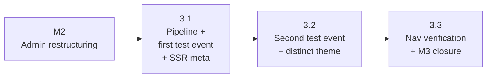

# M3 — Site Rendering Infrastructure With Test Events

## Status

Proposed. Status mirrors the
[epic milestone row](/docs/plans/event-platform-epic.md). Flipped to
`Landed` in M3 phase 3.3's PR alongside the epic M3-row flip.

This milestone doc is the durable coordination artifact for M3:
restated goal, phase sequencing, cross-phase invariants, locked
cross-phase decisions, and milestone-level risks. Per-phase
implementation contracts live in the per-phase plan docs;
trade-off deliberation for cross-phase decisions lives below in
"Cross-Phase Decisions."

This is the first milestone doc produced under the AGENTS.md
"Milestone Planning Sessions" rules. The session that produced
this doc surfaced two rule revisions, applied in the same PR:
(1) the milestone session output narrowed to milestone doc only
— first-phase scoping moved to phase planning, where it already
lived for subsequent phases — under the updated "Anti-goal" and
"Output set" bullets; (2) a new "Epic Drafting" rule recorded
that epics should not be prescriptive about per-milestone phase
shape, and a new "Scoping precedes plan drafting" check was
added to phase planning. The epic's M3/M4 phase paragraphs were
marked as pre-milestone-planning estimates accordingly. M3's
epic paragraphs (under the "### M3 — Site Rendering
Infrastructure With Test Events" subsection of
[event-platform-epic.md](/docs/plans/event-platform-epic.md))
are preserved as pre-milestone-planning historical estimate and
point to this milestone doc as canonical; the epic's Sizing
Summary line for M3 is updated similarly. Note: the epic's M3
paragraphs still describe the original 4-phase estimate including
a Phase 3.4 that no longer exists under this milestone doc's
3-phase canonical shape; treat those paragraphs as historical
context, not current phase ownership.

## Goal

Build apps/site's capacity to render any `/event/:slug` from data —
no event-specific code paths in the rendering layer — and prove the
platform shape with two test events on distinct themes. After M3:

- apps/site renders any event from a per-event TypeScript content
  module via a single rendering template
- the `EventContent` type covers everything M4 needs to author
  Madrona without changing the type
- two test events demonstrate that distinct themes plug into the
  same rendering pipeline through `<ThemeScope>` + the per-event
  Theme registry
- per-event SSR meta tags (`title`, `description`, `og:image`,
  `twitter:card`) populate from `EventContent` and unfurl correctly
  in at least one consumer client (Slack or iMessage)
- cross-app navigation between site CTAs and apps/web
  `/event/:slug/game` is verified, with the auth cookie preserved
  across the boundary

The milestone is a precondition for M4 (Madrona launch). M3 ships
no Madrona-specific content. Per-event Theme registration for
Madrona, apps/web event-route `<ThemeScope>` wiring, and cross-app
theme-continuity verification are all deferred to M4 phase 4.1 per
the epic's "Deferred ThemeScope wiring" invariant — M3's test
events render Sage-Civic-themed in apps/web (no apps/web wiring
yet) but render their registered Themes in apps/site. This
intentional asymmetry is acceptable for noindex'd test events; M4
collapses it for Madrona.

## Phase Status

| Phase | Title | Plan | Status | PR |
| --- | --- | --- | --- | --- |
| 3.1 | Rendering pipeline + first test event + SSR meta | [m3-phase-3-1-1-plan.md](/docs/plans/m3-phase-3-1-1-plan.md), [m3-phase-3-1-2-plan.md](/docs/plans/m3-phase-3-1-2-plan.md) | Landed | [#139](https://github.com/kcrobinson-1/neighborly-events/pull/139) (3.1.1) + 3.1.2 |
| 3.2 | Second test event with distinct theme | — | Proposed | — |
| 3.3 | Cross-app navigation verification + M3 closure | — | Proposed | — |

Each row updates as the phase's plan drafts and as its PR merges.
3.1 may split into 3.1.1 + 3.1.2 if scoping surfaces enough
SSR-meta scope (og:image generation, social-crawler quirks) to
deserve focused review attention; that call belongs to 3.1's
plan-drafting against merged-in code, not this session, per
AGENTS.md "PR-count predictions need a branch test."

Per-phase scoping docs at `docs/plans/scoping/m3-phase-3-1.md`
through `docs/plans/scoping/m3-phase-3-3.md` are produced by
their respective phase planning sessions per AGENTS.md
"Phase Planning Sessions" — scoping is the first artifact of
every phase planning session, gated by the
"Scoping precedes plan drafting" check. Each phase's scoping
doc lands at the start of that phase's planning session,
just-in-time against actually-merged earlier phases, and the
full set deletes in batch in M3 phase 3.3's PR when the
milestone's full set of plans exists. The durable cross-phase
content this doc absorbs lives below in "Cross-Phase
Invariants," "Cross-Phase Decisions," and "Cross-Phase Risks";
pre-deletion scoping content is recoverable via git history.

## Sequencing

Phase dependencies (`A --> B` means A blocks B / B depends on A):



Phase numbering reflects intended ship order. Unlike M2, M3 has
**no parallelizable phases**: 3.2 needs 3.1's `EventContent` type
and rendering template; 3.3 needs 3.2's multi-theme proof to
describe in `docs/architecture.md` and `README.md`. The
recommended order is the only viable order:

```
1. 3.1 (pipeline + first test event + SSR meta)   ← M3's first phase; depends on M2
2. 3.2 (second test event + distinct theme)       ← inherits 3.1's type and template
3. 3.3 (cross-app nav + closure; flips M3 row)    ← inherits 3.2's multi-theme proof
```

**Hard dependencies.** 3.2 cannot ship until 3.1 lands the
`EventContent` type and the rendering template (3.2's content
module imports the type; 3.2's theme registers against the same
registry 3.1 first populates). 3.3 cannot ship until 3.2 lands
because the multi-theme proof is what 3.3's docs/architecture.md
update describes as the new platform capability — drafting the
doc speculatively before 3.2 merges would record a contract that
might not match what shipped.

**3.1 ships the first test event with its theme registered**, not
a "pipeline-only" PR awaiting 3.2 for a real consumer. Otherwise
3.1's test event would render against the platform Sage Civic
defaults — which is also apps/site's `:root` theme — making the
end-to-end rendering contract visually unprovable inside 3.1's
PR. 3.2 then adds the second event and second theme to prove
multi-theme variety.

**Plan-drafting cadence.** Each phase's plan drafts just-in-time
before its implementation, not in batch. Each phase's scoping
doc lands at the start of that phase's planning session as the
first artifact per AGENTS.md "Phase Planning Sessions";
plan-drafting cannot start until the scoping doc has substantive
content (file inventory, contracts, validation surface, named
risks). Drafting 3.2's plan against not-yet-merged 3.1 code
stales fast; against actually-merged 3.1 code it has access to
the real `EventContent` shape, the real lookup module, and the
real rendering template.

## Cross-Phase Invariants

These rules thread through multiple M3 phase diffs and break
silently when one phase drifts. Self-review walks each one
against every phase's actual changes.

- **`EventContent` type stability.** 3.1 defines `EventContent`;
  3.2's second event module and M4 phase 4.2's `madrona.ts`
  consume the same type without contract changes. If 3.2 surfaces
  a content-shape gap (e.g., a sponsor-grouping field the type
  can't express), the type evolves in 3.2's PR and 3.1's first
  event module updates accordingly — but the change must be
  backwards-shape-compatible for M4 to inherit cleanly. The plan
  for 3.1 drafts the type against a Madrona-shaped sketch
  (multi-day schedule, lineup with set times, sponsors with logos
  + links, FAQ blocks, CTA copy), not against minimal placeholder
  content, to reduce the chance of late evolution.
- **`apps/site/events/` is the directory of record for event
  content modules.** Every test event TS module ships at
  `apps/site/events/<slug>.ts`. No event content modules outside
  this directory. M4 phase 4.2's `madrona.ts` follows the same
  convention.
- **Test event noindex + disclaimer banner.** Every test event
  ships server-rendered `<meta name="robots" content="noindex">`
  (not client-rendered after hydration — crawlers miss late
  meta) and a "demo event for platform testing" disclaimer
  banner component. 3.1 ships the disclaimer banner component
  and the noindex meta pattern; 3.2 reuses both verbatim. The
  banner component lives in apps/site (not shared/) because no
  apps/web consumer exists.
- **ThemeScope wrapping discipline.** Apps/site routes under
  `/event/:slug/*` wrap in
  `<ThemeScope theme={getThemeForSlug(slug)}>`. 3.1 establishes
  the wrap on the new event landing route; 3.2 inherits without
  re-wiring. Apps/web event routes (`/event/:slug/game/*`,
  `/event/:slug/admin`) follow the epic's "Deferred ThemeScope
  wiring" invariant — game routes wrap in M4 phase 4.1, the
  per-event admin already wraps from M2 phase 2.2. M3 changes
  nothing in apps/web *source code*; the
  [`<ThemeScope>` source comment](/shared/styles/ThemeScope.tsx)
  already records "apps/site event landing wraps in M3 phase
  3.1" as the M3 wiring site. **One side effect to name:** the
  shared theme registry that 3.1 and 3.2 populate is consumed
  by both apps via
  [`getThemeForSlug`](/shared/styles/getThemeForSlug.ts), so a
  test slug registered for apps/site visibility also resolves
  in apps/web's per-event admin ThemeScope. This is harmless
  in practice — test events live as TS modules under
  `apps/site/events/<slug>.ts` with no `game_events` DB row, so
  apps/web admin's `is_organizer_for_event` check returns false
  for any test slug and the route never resolves to a real
  authoring shell. The epic's "no per-event Theme until M4"
  framing in "Deferred ThemeScope wiring" is technically
  narrowed by M3's test-theme registrations, but the practical
  deferral for apps/web event-route shells (game, redeem,
  redemptions — none of which wrap until M4 phase 4.1) is
  unchanged. If a future apps/web admin consumer needs to
  guarantee Sage-Civic-themed rendering for test slugs (e.g.,
  for a contributor demo of admin-without-Madrona), that's a
  separate registry-partitioning decision deferred to that
  consumer's plan, not an M3 concern.
- **Per-event SSR meta from one resolver.** 3.1's metadata
  generation reads from `EventContent` and produces title,
  description, og:image, twitter:card. 3.2's second test event
  inherits the metadata pipeline without per-event wiring; the
  resolver looks up `EventContent` by slug. M4's Madrona event
  inherits identically. No phase adds a per-event metadata
  override mechanism — if Madrona needs richer metadata than
  `EventContent` carries, the type evolves once.
- **Cross-app CTA: hard navigation from site to web event
  routes.** Site CTAs into `/event/:slug/game` use
  `window.location.assign()` (or framework-equivalent hard
  navigation that exits the SPA), not client-side navigation.
  The pattern is established in apps/site `/admin` from M2
  phase 2.4 — see
  [apps/site/app/(authenticated)/admin/page.tsx](/apps/site/app/(authenticated)/admin/page.tsx)
  for the precedent. 3.1's CTA inherits it; 3.3 documents it in
  architecture.md. Cross-app theme-continuity is **not** an M3
  gate per the epic's "Deferred ThemeScope wiring" invariant —
  it lands at M4 phase 4.1 with Madrona's brand transition.
- **Server-rendered first paint.** The route page renders
  server-side; client interactivity (e.g., FAQ
  expand/collapse) ships as scoped client islands inside the
  server-rendered page, not by hoisting the route to a
  fully-client component. Specific framework idioms
  (component-type annotations, metadata API names) are verified
  at phase-plan time per
  [apps/site/AGENTS.md](/apps/site/AGENTS.md) — Next.js 16 has
  breaking changes from common training data, so phase plans
  read `node_modules/next/dist/docs/` before locking API names.

## Cross-Phase Decisions

M3 has materially fewer load-bearing cross-phase trade-offs than
M2. No DB shape changes hands across phases, no URL contracts
move, no trust-boundary rules shift, and no cross-app idiom is
being established for the first time (M2 already locked the
apps/site auth idiom + bootstrap seam). Decisions that deserved
milestone-level deliberation are recorded below; everything else
is settled by default or deferred to phase-time.

### Settled by default

These had a clear default that no phase disputed; recorded for
completeness so plan authors don't re-derive them:

- **Event content modules ship as TypeScript modules under
  `apps/site/events/`** (not JSON, not Supabase rows). The epic
  explicitly scopes Supabase-stored content as post-epic; TS
  modules at `apps/site/events/<slug>.ts` carry the content for
  M3 test events and M4's Madrona. This is restated rather than
  litigated — see the epic's "Out Of Scope" section.
- **Test event slugs are descriptive, not generic.** Test event
  slugs appear in URLs and unfurl previews. 3.1 picks a
  descriptive slug (e.g., a season-flavor or location-flavor
  name) rather than `test-event-a`. 3.2 follows the same
  convention. Generic slugs would land in production unfurl
  caches as "Test Event A" titles, which is worse than a
  descriptive demo identity.
- **Server-rendered route page; client islands for
  interactivity.** Per the framework-decision in M0 and SSR/SSG
  goal in the epic, the route page renders server-side. Any
  interactive subcomponent (FAQ accordion, sponsor carousel)
  ships as a client island inside the server tree. No
  competing option was raised.

### Deferred to phase-time

These decisions can be made later by the affected phase's
planner without blocking earlier phases. Recording the deferral
so phase planners don't re-litigate whether to defer:

- **`EventContent` type location** — `shared/events/` vs.
  `apps/site/`-internal types directory. Today
  [shared/events/index.ts](/shared/events/index.ts) exports
  DB-touching shapes only (`PublishedGameSummary`,
  `DraftEventSummary`, etc.); `EventContent` would be the first
  TS-module-loaded shape in shared/events/. Argument for
  shared/: M1 phase 1.4's extraction precedent, optionality if
  apps/web ever needs to introspect a slug's content (e.g., a
  back-to-landing CTA in apps/web rendering the event title).
  Argument against: today only apps/site reads `EventContent`,
  shared/events/ is otherwise DB-touching, and apps/site-internal
  placement keeps the type colocated with the consumer. Decide
  at 3.1 plan-drafting after reading the actual current
  shared/events/ shape and the consumer pattern in
  apps/site/app/event/[slug]/page.tsx. 3.2 just imports from
  wherever 3.1 puts it; no cross-phase blocker.
- **og:image generation strategy** — static asset per event
  (e.g., `apps/site/events/<slug>.og.png`) vs. Next.js
  `opengraph-image.tsx` file convention vs. dynamic OG image
  route. The choice is internal to 3.1's diff; 3.2 inherits
  whichever 3.1 picks. Decide at 3.1 plan-drafting against the
  actual `EventContent` shape and apps/site's deployment
  posture, after reading
  [apps/site/AGENTS.md](/apps/site/AGENTS.md) and the relevant
  Next.js 16 docs.
- **Test event content depth** — minimal placeholder content
  vs. fully populated content (real-feeling schedule, lineup,
  sponsors). Decide per-phase. The 3.1 invariant ("type sketched
  against Madrona shape") implies the first test event carries
  enough structure to exercise every `EventContent` field;
  beyond that, depth is judgment.
- **Whether 3.1 splits into 3.1.1 + 3.1.2** — bundling the
  rendering pipeline + first test event + SSR meta into one PR
  vs. splitting SSR meta into a focused 3.1.2 PR. Decide at 3.1
  plan-drafting per AGENTS.md "PR-count predictions need a
  branch test." If og:image generation surfaces enough scope
  (dynamic image route, per-platform image dimensions, social
  crawler caching quirks) to dilute review attention if
  bundled, split. Otherwise ship as one PR.
- **Disclaimer banner placement and copy** — header vs. footer,
  exact wording, dismissibility. Decide at 3.1 plan-drafting.
  3.2 inherits the component verbatim.

## Cross-Phase Risks

Risks that span multiple M3 phases or only surface at the
milestone level. Phase-level risks live in each plan's Risk
Register.

- **`EventContent` type underfit for Madrona.** 3.1 defines the
  type before Madrona content has been authored. If M4 phase
  4.2 surfaces a content shape the type can't express (e.g.,
  multi-stage stages with overlapping sets, sponsor tiering),
  the type evolves and 3.1 + 3.2 test events update — review
  churn for what should have been a one-time type definition.
  Mitigation: 3.1 drafts the type against a Madrona-shaped
  content sketch from the epic's M4 phase 4.2 description (real
  schedule with set times, sponsor records with logos and
  links, FAQ, CTA copy), not against minimal placeholder
  content. The type is reviewed for Madrona-fit at 3.1 plan
  time, not deferred to M4 surprise.
- **Test event noindex regression.** If
  `<meta name="robots" content="noindex">` is wrong (typo in
  meta key, only client-rendered after hydration so crawlers
  miss it, or set on the route but not propagated to social
  crawler responses), test events leak into search indexes and
  unfurl caches. Mitigation: 3.1's validation gate inspects raw
  HTML output (`curl` against the deployed route, not browser
  DOM after hydration) to confirm the noindex meta is present
  pre-hydration. 3.2 runs the same check on its event. Per
  AGENTS.md "Bans on surface require rendering the
  consequence," this is exercised once per test event, not
  asserted by code reasoning.
- **Cross-app visual jump on test events surprises reviewers.**
  Test events on apps/site render with their registered Theme;
  the same slug on apps/web `/event/:slug/game` renders
  against apps/web's warm-cream `:root` defaults until M4
  phase 4.1 wires apps/web event-route ThemeScope. Reviewers
  may flag this as a bug. Mitigation: each phase's plan calls
  out the deferral explicitly; the disclaimer banner from the
  invariant set already signals "demo event for platform
  testing" to a human visitor; cross-app continuity verification
  is M4's job per the epic's "Deferred ThemeScope wiring"
  invariant. 3.3's docs/architecture.md update names the
  asymmetry directly so the next reader doesn't have to
  reconstruct it from invariants.
- **Unfurl validation depends on third-party crawler caches.**
  Slack and iMessage cache unfurl previews aggressively;
  verifying a fix can take hours or require cache-busting
  tricks (Slack supports re-unfurling via the
  "Refresh preview" affordance; iMessage caches per-URL with no
  user-facing bust). Mitigation: 3.1's unfurl validation
  procedure documents the cache-bust pattern (e.g., add a
  `?v=` query param during validation iterations) so future
  repeat checks are reproducible. The validation gate exercises
  one client end-to-end, not "all major clients" — that
  scope-creeps M3 into platform-by-platform compatibility work.
- **Plan-drafting cascade staleness.** If M3 phase plans were
  drafted in batch with this milestone doc, they'd stale on
  not-yet-merged code (especially 3.2's plan against 3.1's
  not-yet-shipped `EventContent` shape). Mitigation: no phase
  scopes in this milestone session per AGENTS.md "Milestone
  Planning Sessions" anti-goal; each phase's scoping and
  plan-drafting wait for its phase planning session,
  just-in-time after predecessors merge. The
  "Scoping precedes plan drafting" check in the phase planning
  rule guards against the most common procedural skip (drafting
  the plan first and back-filling scoping). This is the same
  mitigation the M2 milestone doc records; it worked there.
- **og:image asset bloat.** If test events ship hand-authored
  og:image files committed to the repo, the apps/site repo
  grows. If dynamic generation, the deploy surface gains a new
  image route with its own runtime cost. Mitigation: 3.1's
  og:image strategy decision (deferred above) is made against
  this trade-off. 3.2 inherits whichever shape 3.1 picks; no
  cross-phase divergence.

## Documentation Currency

The doc updates the M3 set must collectively make. Each is owned
by the named phase; M3 is not complete until all are landed.

- [docs/architecture.md](/docs/architecture.md) — owned by 3.3
  (rendering pipeline, apps/site responsibilities,
  `EventContent` shape, test event posture, the cross-app
  ThemeScope asymmetry through M4). 3.1 may also touch
  architecture.md if the rendering pipeline introduces a new
  trust or persistence boundary; none expected because
  `EventContent` ships as TS modules with no DB or auth
  surface. 3.2 doesn't touch architecture.md — multi-theme
  proof is a 3.3 description concern.
- [README.md](/README.md) — owned by 3.3 (current capabilities:
  multi-event rendering, test events as platform validation).
- [docs/dev.md](/docs/dev.md) — owned by 3.3 only if the M3 set
  introduces new validation commands or workflow changes; none
  expected because `npm run build:site` already covers SSR
  validation, and unfurl validation is a manual one-off
  procedure documented inline in 3.1's plan rather than as a
  standing dev.md command.
- [docs/open-questions.md](/docs/open-questions.md) — owned by
  3.3. The epic's "Open Questions Resolved By This Epic"
  scopes the "Event landing route model" question to M3
  (infrastructure) + M4 (Madrona content) jointly. M3 closes
  the infrastructure half: the rendering pipeline exists and
  is proven on test events. The full close in
  open-questions.md happens when M4 lands; M3's contribution
  is recorded as in-progress against the entry, not a final
  close.
- [docs/backlog.md](/docs/backlog.md) — touched by 3.3 only if
  any backlog item becomes unblocked by M3's work. The
  "Event landing page for /event/:slug" entry closes with M4
  phase 4.2 (Madrona content), not M3 — M3 ships
  infrastructure only. No backlog status changes expected
  inside M3.
- [event-platform-epic.md](/docs/plans/event-platform-epic.md) —
  the milestone doc PR (this PR) marks the epic's M3 phase
  paragraphs as pre-milestone-planning historical estimate
  (preserved as-is, not rewritten to match the new 3-phase
  shape) and points readers to this milestone doc as canonical
  for M3. The pre-existing paragraphs in the epic still describe
  an original 4-phase estimate including a Phase 3.4 that no
  longer exists in the canonical shape — treat them as
  historical context, not current ownership. The Sizing Summary
  line for M3 is updated similarly to flag estimate status. The
  M3 row in the epic's "Milestone Status" table flips to
  `Landed` in 3.3's PR per the Plan-to-PR Completion Gate.
- **Cross-doc references to the original M3 phase shape** —
  this PR updates references that named the old shape in
  [docs/architecture.md](/docs/architecture.md),
  [docs/styling.md](/docs/styling.md),
  [docs/open-questions.md](/docs/open-questions.md), the
  shared-registry source comments at
  [shared/styles/themes/index.ts](/shared/styles/themes/index.ts) and
  [shared/styles/getThemeForSlug.ts](/shared/styles/getThemeForSlug.ts),
  and the broken `M3 phase 3.4` references in
  [docs/plans/framework-decision.md](/docs/plans/framework-decision.md)
  and [docs/plans/site-scaffold-and-routing.md](/docs/plans/site-scaffold-and-routing.md).
  These are forward-looking guidance and code comments that
  must be current. Landed plan docs that reference M3's phase
  numbering for behavior whose ownership did not move (e.g.,
  references to M3 phase 3.3 for cross-app navigation) are not
  retroactively rewritten — git history preserves the original
  numbering and those references remain accurate under the new
  3-phase shape where 3.3 still owns cross-app navigation.
- This doc — Status flips to `Landed` in 3.3's PR; phase status
  table rows update as each plan drafts and as each PR merges.

## Backlog Impact

- **Closed by M3.** None directly. The epic's "Event landing
  page for /event/:slug" backlog item closes with M4 phase 4.2
  (Madrona content), not M3 — M3 ships infrastructure only.
- **Unblocked by M3.** M4 phases 4.1 and 4.2 become
  implementable on top of 3.1's `EventContent` type and
  rendering template. No backlog tracking change required —
  M4 is the next epic milestone, not a separately-tracked
  backlog item.
- **Opened by M3.** None planned. The epic's "Open Questions
  Newly Opened" section commits to logging any unresolved
  decisions in
  [docs/open-questions.md](/docs/open-questions.md) in the
  same PR that surfaces them; M3 is not knowingly opening any.

## Related Docs

- [event-platform-epic.md](/docs/plans/event-platform-epic.md) —
  parent epic; M3 phase paragraphs (under the
  "### M3 — Site Rendering Infrastructure With Test Events"
  subsection) are preserved as pre-milestone-planning estimate
  in this PR and point to this milestone doc as canonical, not
  rewritten to the new 3-phase shape.
- `docs/plans/scoping/m3-phase-3-1.md` — first phase scoping
  doc, produced by 3.1's phase planning session (not by this
  milestone session per AGENTS.md "Milestone Planning Sessions"
  anti-goal); deletes in batch with M3 phase 3.3's PR.
- [docs/self-review-catalog.md](/docs/self-review-catalog.md) —
  audit name source for per-phase Self-Review Audits sections
  in the per-phase plans.
- [shared/styles/ThemeScope.tsx](/shared/styles/ThemeScope.tsx) —
  ThemeScope component already documents "apps/site event
  landing wraps in M3 phase 3.1" as the M3 wiring site.
- [shared/events/index.ts](/shared/events/index.ts) — current
  shared/events/ public exports; 3.1's `EventContent` location
  decision is made against this shape.
- [apps/site/AGENTS.md](/apps/site/AGENTS.md) — Next.js 16
  breaking-change reminder; phase plans read
  `node_modules/next/dist/docs/` before locking framework
  API names.
- [AGENTS.md](/AGENTS.md) — workflow rules, milestone planning
  session rules, Plan-to-PR Completion Gate, Doc Currency PR
  Gate.
